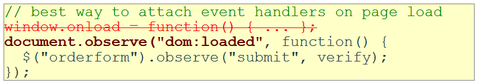
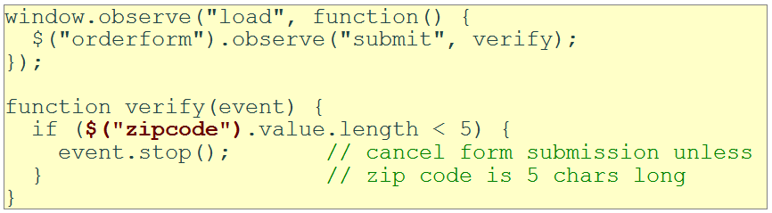
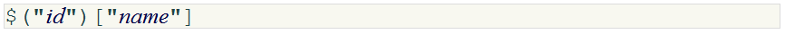
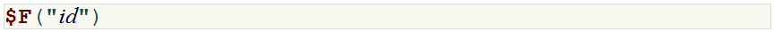
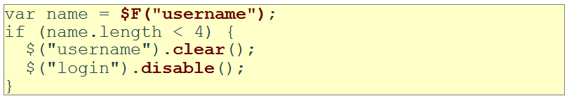
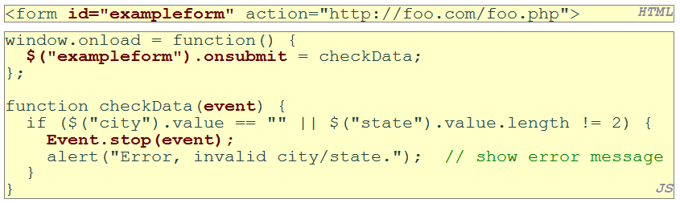

# Lecture 12 Advanced+Events+and+Client+Side+Validations(中文版)

<!-- slide: 1 -->

## Lecture 12 高级事件和客户端验证

<!-- slide: 2 -->

## 概要

- 高级事件
- 客户端验证

<!-- slide: 3 -->

## 页面/窗口  事件

- 以上的事件可以在全局的 window 对象中调用. 也可以按照:

| 名称 | 描述 |
|---|---|
| load | 浏览器加载网页 |
| unload | 浏览器卸掉该网页 |
| resize | 调整浏览器窗口大小 |
| contextmenu | 用户单击右键弹出的菜单 |
| error | 当加载文档或图片失败时出现的错误 |

<!-- slide: 4 -->

## 表单事件

| 事件名 | 描述 |
|---|---|
| submit | 表单被提交 |
| reset | 表单被重置 |
| change | 表单控件的文本或者状态被改变 |

<!-- slide: 5 -->

## Prototype 和表单

- 从给定id和name属性的表单中获取参数
- $F 返回指定id的表单控件的值
- 其他表单控件方法:

| activate | clear | disable | enable |
|---|---|---|---|
| focus | getValue | present | select |

<!-- slide: 6 -->

## 键盘/文本 事件

- 焦点: 用户键盘的关注点(每次只能赋给一个元素)

| 名称 | 描述 |
|---|---|
| keydown | 用户按下某个键时，这个元素获得键盘焦点 |
| keyup | 用户释放某个键时，这个元素获得键盘焦点 |
| keypress | 用户按下并释放某个键时，这个元素获得键盘焦点 |
| focus | 获取键盘焦点 |
| blur | 移除键盘焦点 |
| select | 选中/取消选中元素的文本 |

<!-- slide: 7 -->

## 按键事件 对象

- 问题: 如果你给监听器绑定的事件没有获得焦点, 你将监听不到该事件
- 可能的解决方案: 绑定监听器到整个网页的body部分,或者更外层的元素,等等.

| 属性名 | 描述 |
|---|---|
| keyCode | ASCII 整数值代表那个被按下的键(用String.fromCharCode 转换为char类型) |
| altKey, ctrlKey, shiftKey | 如果Alt/Ctrl/Shift 键被按住则为真 |

| Event.KEY_BACKSPACE | Event.KEY_DELETE | Event.KEY_DOWN | Event.KEY_END |
|---|---|---|---|
| Event.KEY_ESC | Event.KEY_HOME | Event.KEY_LEFT | Event.KEY_PAGEDOWN |
| Event.KEY_PAGEUP | Event.KEY_RETURN | Event.KEY_RIGHT | Event.KEY_TAB |
| Event.KEY_UP |  |  |  |

- Prototype中的键码常量

<!-- slide: 8 -->

## 概要

- 高级事件
- 客户端验证

<!-- slide: 9 -->

## 客户端验证

- 表单触发 onsubmit 和 onreset 事件
- 若想停止表单的提交, 可在该事件中调用Prototype的 Event.stop 函数

<!-- slide: 10 -->

## 正则表达式

- 正则表达式可以用形式化语言理论的方式来表达。正则表达式由常量和算子组成，它们分别指示字符串的集合和在这些集合上的运算。给定有限字母表Σ定义了下列常量：
  - (“空集”) ∅指示集合∅
  - (“空串”) ε指示集合{ε}
  - (“文字字符”)在Σ中的a指示集合{a}

<!-- slide: 11 -->

## 正则表达式

- 定义了下列运算：
  - (“串接”) RS指示集合{ αβ | α ∈ R，β ∈ S }。例如：{"ab","c"}{"d","ef"} = {"abd", "abef", "cd", "cef"}。
  - (“选择”) R|S指示R和S的并集。例如：{"ab", "c"}|{"ab", "d", "ef"}= {"ab", "c", "d", "ef"}
  - (“Kleene星号”) R* 指示包含ε并且闭包在字符串串接下的R的最小超集。这是可以通过R中的零或多个字符串的串接得到所有字符串的集合。例如，{"ab", "c"}* = {ε, "ab", "c", "abab", "abc", "cab", "cc", "ababab", ... }。
- 上述常量和算子形成了克莱尼代数。
- 很多课本使用对选择使用符号∪, +或∨替代竖杠。
- 为了避免括号，假定Kleene星号有最高优先级，接着是串接，接着是并集。如果没有歧义则可以省略括号。例如，(ab)c可以写为abc而a|(b(c*))可以写为a|bc*。

<!-- slide: 12 -->

## 正则表达式

- 例子：
  - a|b*指示{ε, a, b, bb, bbb, ...}。
  - (a|b)*指示由包括空串、任意数目个a或b字符组成的所有字符串的集合。
  - ab*(c|ε)指示开始于一个a接着零或多个b和最终可选的一个c的字符串的集合。

<!-- slide: 13 -->

## JavaScript中的正则表达式

- string.match(regex)
  - 如果字符串 匹配给定的表达式,返回匹配的文本; 否则返回null
  - 能用来作为布尔真/假的检测  :var name = $("name").value;if (name.match(/[a-z]+/)) { ... }
- 在一个正则表达式最后面添加 i ，则设置为大小写不敏感的匹配
  - name.match(/Eric/i) 将匹配 “eric", “ERic", ...

<!-- slide: 14 -->

## 使用正则表达式替换文本

- string.replace(regex, "text")
  - 在字符串中，用给定的文本替换首次匹配正则表达式的地方
  - var str = "Wang Qing";str.replace(/[a-z]/, "x"); //returns “Wxng Qing"
  - 返回改变的字符串作为结果，必须被保存。 str = str.replace(/[a-z]/, "x")
- 在正则表达式 后面加上g可以用于全局匹配 (替换所有出现的匹配项)
  - str.replace(/[a-z]/g, "x"); //returns “Wxxx Qxxx"
- 使用正则表达式作为过滤器
  - str = str.replace(/[^A-Z]+/g, “”); // 将字符串变为"WQ"

<!-- slide: 15 -->

## 总结

- 高级事件
  - 页面/窗口 事件
  - 表单事件
  - 键盘/文本 事件
  - 按键 事件
  - Prototype 表单函数
- 客户端验证
  - JavaScript中的正则表达式

<!-- slide: 16 -->

## 练习

- 在一个网页中写一个简单的待办事项列表的应用 .
  - 一个 

 元素包含该待办事项列表的所有html元素
  - 一个表单，带有文本区域(对要添加的待办事项进行说明)和一个“添加”按钮（用来将该新的待办事项加入到列表中 ）
  - 一个当前待办事项的列表
  - 每个事项有一个复选框
  - 按钮“选择全部”, “删除全部”, “删除” (用来删除列表中选中的项目)
  - 当点击“添加”按钮 时，新的待办事项将被插入到列表的底部
  - 使用学过的非侵入的JavaScript技巧
  - 为该待办事项列表添加热键
    - “↑” 和“↓”键用来在该列表中上下移动
    - “Enter” 键用于 选中/取消选中 当前待办事项列表

<!-- slide: 17 -->

## 进阶阅读

- W3C DOM  说明文档	           http://www.w3.org/TR/DOM-Level-2-Events/events.html
- W3School DOM 事件索引 http://www.w3school.com/dom/dom_events.asp/
- W3School DOM 教程  http://www.w3schools.com/htmldom/
- Quirksmode DOM 教程 http://www.quirksmode.org/dom/intro.html
- Prototype 学习中心	    http://www.prototypejs.org/learn
- prototype.js开发者笔记 http://www.sergiopereira.com/articles/prototype.js.html

<!-- slide: 18 -->

- Thank you!
