# Lecture 13 Asynchronous JavaScript and XML (AJAX)(C)

<!-- slide: 1 -->

## 第13讲 异步JavaScript和XML (AJAX)

<!-- slide: 2 -->

## 概要

- 同步 vs. 异步
- XMLHttpRequest
- Prototype中的Ajax
- Ajax的局限
- 调试 Ajax

<!-- slide: 3 -->

## 服务器与浏览器的交互

- 浏览器如何与用户交互?
- 它什么时候发送一个请求?
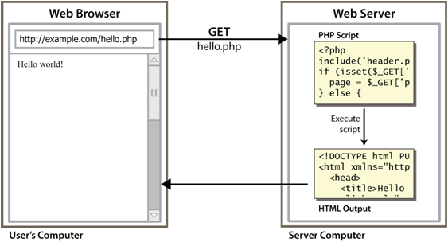

<!-- slide: 4 -->

## 同步网络通信

- 同步: 用户必须等待新的页面加载完毕
  - 在网页中使用传统的通信模式(点击, 等待, 刷新)
- 几乎所有带有新数据的变化都会导致页面刷新
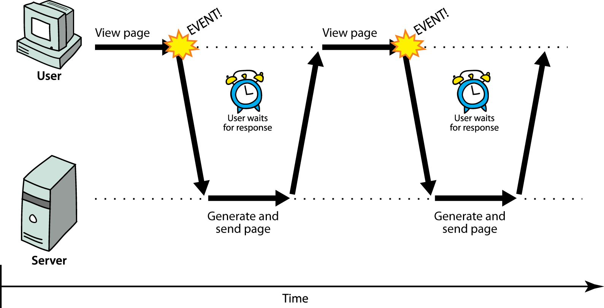

<!-- slide: 5 -->

## Web应用 与 Ajax

- Web应用: 一个类似桌面应用的动态网站
  - 一种连续的用户体验而不是分离的页面
  - 例如: Gmail, Google Maps, Google Docs and Spreadsheets, Flickr
- Ajax: 异步JavaScript和XML
  - 不是一种编程语言; 而是使用JavaScript的一种特别途径
  - 在后台从服务器获取数据
  - 允许动态更新一个页面
  - 避免“点击-等待-刷新” 模式
  - 例子:  Google Suggest
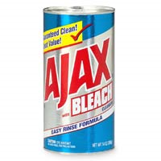

<!-- slide: 6 -->

- 什么是 AJAX ？
  - AJAX = 异步 JavaScript 和 XML。
  - AJAX 是一种用于创建快速动态网页的技术。
  - 通过在后台与服务器进行少量数据交换，AJAX 可以使网页实现异步更新。这意味着可以在不重新加载整个网页的情况下，对网页的某部分进行更新。
  - 传统的网页（不使用 AJAX）如果需要更新内容，必需重载整个网页面。
  - 有很多使用 AJAX 的应用程序案例：新浪微博、Google 地图、开心网等等。

<!-- slide: 7 -->

- Google Suggest
  - 在 2005 年，Google 通过其 Google Suggest 使 AJAX 变得流行起来。
  - Google Suggest 使用 AJAX 创造出动态性极强的 web 界面：当您在谷歌的搜索框输入关键字时，JavaScript 会把这些字符发送到服务器，然后服务器会返回一个搜索建议的列表。

<!-- slide: 8 -->

## 异步网络通信

- 异步: 当页面装载数据的时候, 用户仍然能够保持交互
  - 通信模式因为Ajax而成为可能
- 更新数据而网页不用刷新
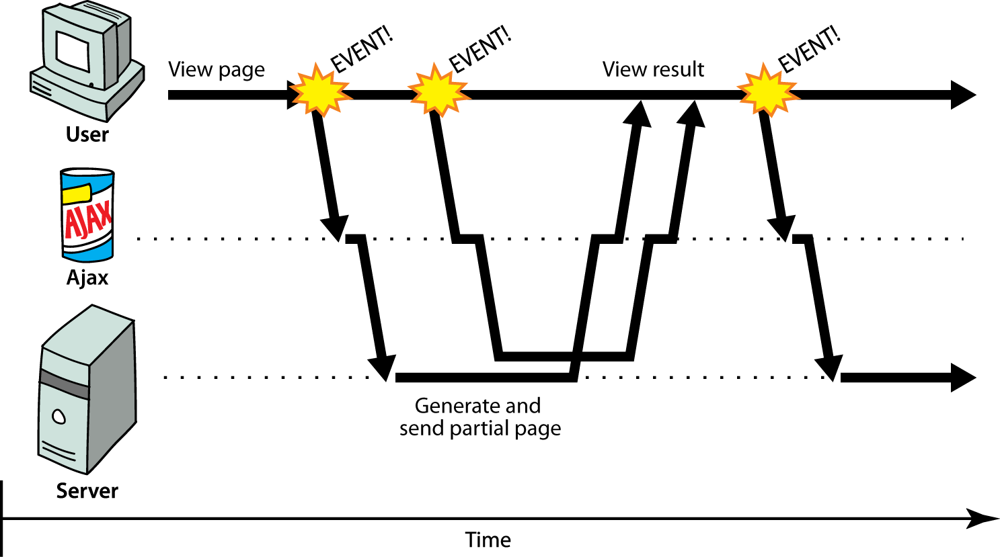

<!-- slide: 9 -->

## XML实现Ajax的原理

- AJAX 全称Asynchronous Javascript And XML 就是异步js和XML。通过AJAX可以在浏览器中向服务器发送异步请求，最大的优势：无刷新全部页面，而是获取需要的数据。
- XML (Extensible Maekup Language)可扩展标记语言被设计用来传输和存储数据。
- HTML被设计用来描述网页上的内容，是网页内容的载体
- XML被设计用来传输和存储数据，是数据的载体
- 然后再更新页面中需要更新的数据即可。
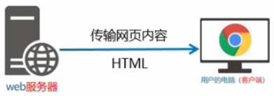

<!-- slide: 10 -->

## AJAX如何工作

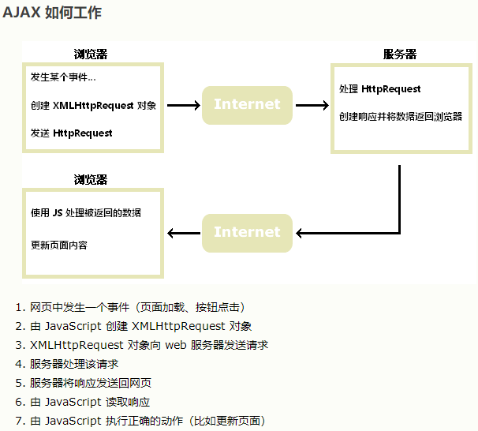

<!-- slide: 11 -->

## 概要

- 同步 vs. 异步
- XMLHttpRequest
- Prototype中的Ajax
- Ajax的局限
- 调试 Ajax

<!-- slide: 12 -->

## XMLHttpRequest

- JavaScript 包含一个能够从网络服务器上获取文件的 XMLHttpRequest对象
  - IE5+, Safari, Firefox, Opera, Chrome, 等浏览器支持 (有少量的兼容性问题)
- 可以 异步地 完成这些 (在后台中, 对用户透明)
- 使用 DOM 把获取的文件内容放进当前页面中
- 听起来很好!...
- ... 但它用起来很繁重, 而且有各种各样的浏览器兼容问题
- Prototype提供一种更好的对Ajax的封装, 因此我们将使用Prototype代替它

<!-- slide: 13 -->

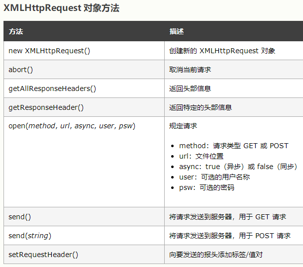
- XMLHttpRequest

<!-- slide: 14 -->

## 一个典型的Ajax请求

- 用户点击, 调用一个事件句柄
- 句柄代码创建一个XMLHttpRequest 对象
- XMLHttpRequest 对象从服务器请求页面
- 服务器检索合适的数据并返回
- 当数据到达时XMLHttpRequest 触发一个 event
  - 这事件通常叫做 callback
  - 你能够对这个事件附加一个句柄函数
- 你能够调用事件句柄处理并显示这些数据
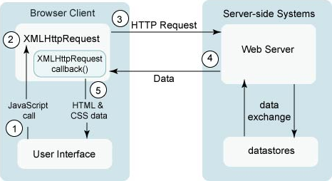

<!-- slide: 15 -->

## 概要

- 同步 vs. 异步
- XMLHttpRequest
- Prototype中的Ajax
- Ajax的局限
- 调试 Ajax

<!-- slide: 16 -->

## Prototype 的 Ajax 模型

- 构造一个Prototype的Ajax.Request对象使用Ajax向服务器请求一个页面
- 构造器接受2个参数:
  - 需要获取的URL, 以字符串的形式,
  - 一系列的选项, 以 key : value 配对的形式组成一个数组放在 {} 括号中 (一个匿名JS对象)
- 把粗糙的XMLHttpRequest中的难看的细节隐藏起来; 在所有的浏览器中都能运行得很好
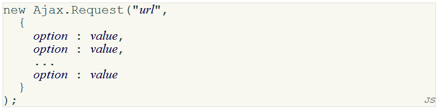

<!-- slide: 17 -->

## Prototype 的 Ajax 方法和属性

- 传递给Ajax.Request构造器的选项
- 在Ajax.Request对象中你能够处理的事件

| 选项 | 描述 |
|---|---|
| method | 如何从服务器上获取请求(默认使用"post") |
| parameters | 需要传回服务器的查询参数(如果有的话) |
| asynchronous (默认为true), contentType, encoding, requestHeaders |  |

| 事件 | 描述 |
|---|---|
| onSuccess | 成功地完成请求 |
| onFailure | 请求失败 |
| onException | 请求含有语法错误, 安全错误等 |
| onCreate, onComplete, on### (HTTP错误码###) |  |

<!-- slide: 18 -->

## Prototype的Ajax模板

- 课程中大部分Ajax的请求都是GET请求
- 附加一个句柄去处理onSuccess事件
- 这个句柄接受一个Ajax response对象作为参数, 我们把它命名为ajax
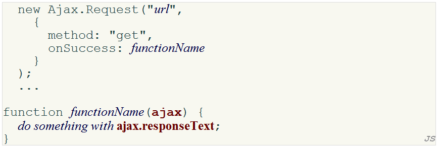

<!-- slide: 19 -->

## Ajax response 对象

- 最常用来访问获取的数据的属性是 responseText

| 属性 | 描述 |
|---|---|
| status | 请求的HTTP错误码(200 = OK, 等等.) |
| statusText | HTTP错误码文本 |
| responseText | 以String的形式获取页面的全部文本, |
| responseXML | 以XML的DOM树形式获取页面的全部文本内容,(稍后将会看到) |

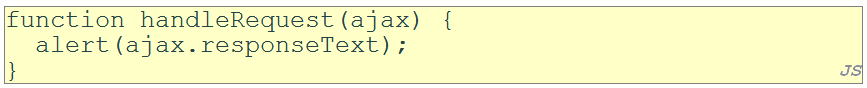

<!-- slide: 20 -->

## Prototype 的 Ajax Updater

- Ajax.Updater 获取一个文件并把它的内容注入到一个元素的innerHTML中
- 第一个参数指定需要注入的元素的id
- 不需要onSuccess句柄(但onFailure, onException 句柄仍可能有用)
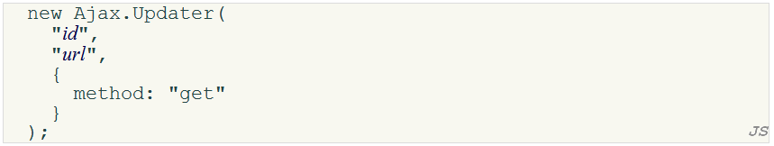

<!-- slide: 21 -->

## 创建POST请求

- Ajax.Request 也可以用于提交数据给服务器
- method 应该改为 “post” (或者省略; post 是默认值)
- 任何一个查询参数应该置于 parameters 参数中传递
  - 以一系列 name : value 配对放在{}括号之中(又一种匿名对象)
  - get 请求的参数也可以以这种方式传递
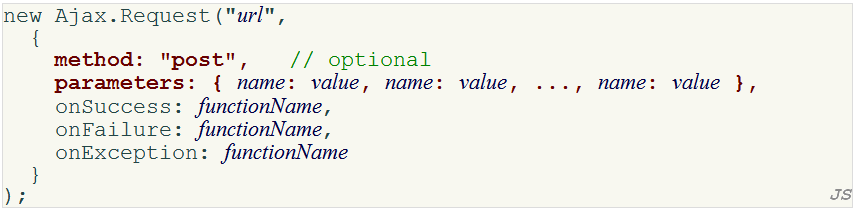

<!-- slide: 22 -->

## 概要

- 同步 vs. 异步
- XMLHttpRequest
- Prototype中的Ajax
- Ajax的局限
- 调试 Ajax

<!-- slide: 23 -->

## XMLHttpRequest 安全约束

- 不能在你硬盘上存储的网页中运行
- 只能运行于储存在服务器上的网页
- SOP
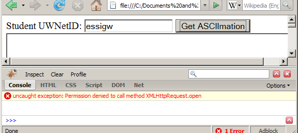

<!-- slide: 24 -->

## 同源策略

- 同源策略(SOP) 限制了浏览器只能从同一个来源网站上获取内容.
  - 除了资源: 图片, 脚本, 视频, 等等.
- 同源策略(SOP) 不允许Ajax请求访问它们运行的页面以外的另一个 完整的域名 .
  - 甚至是相同域名的其它端口!
- SOP 完全是为了防范 XSS (跨站脚本)

<!-- slide: 25 -->

## 限制同时最多2条请求

- HTTP 1.1 (RFC 2616) 指出单一用户不应该维持与服务器或者代理器超过2条的请求.
- 大部分浏览器 (包括IE) 遵守这条规则
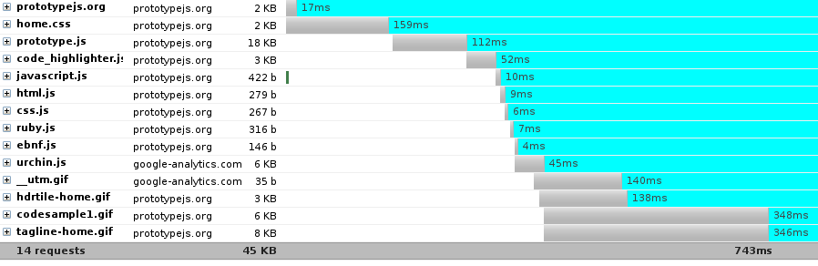

<!-- slide: 26 -->

## 概要

- 同步 vs. 异步
- XMLHttpRequest
- Prototype中的Ajax
- Ajax的局限
- 调试 Ajax

<!-- slide: 27 -->

## 处理Ajax错误

- 为了用户(和开发者)的利益, 当请求失败之后应该显示一条错误信息.
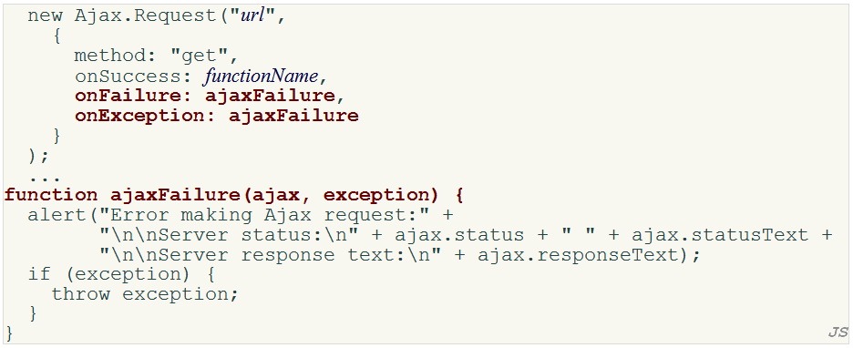

<!-- slide: 28 -->

## 调试Ajax代码

- Net 标签展示每个请求, 和它的参数, 反馈和任何错误.
- 使用 + 展开一个请求并通过 Response 标签去查看 Ajax 的结果
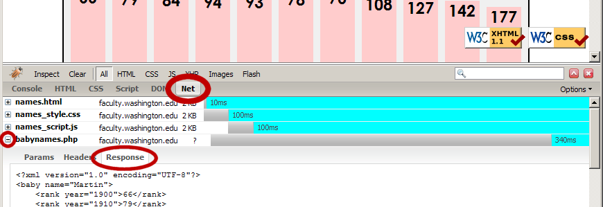

<!-- slide: 29 -->

## 总结

- 同步 vs. 异步
- XMLHttpRequest
- Prototype 的 Ajax
  - Ajax.Request, Ajax.Updater
- Ajax 的限制
  - SOP, 最多同时2条请求
- 调试 Ajax

<!-- slide: 30 -->

## 练习

- 在单个页面上编写一个简单的 Ajax 待办事项列表应用.
  - 使用 

 元素封装所有的HTML元素
  - 一个用于添加新项目的表单和一个展示所有项目的列表
  - “select all”, “deselect all”, “remove”的按钮
  - 当点击“add”按钮时, 新的待办事项会使用Ajax的技术加入到列表的最底部
    - 创建一个php脚本生成新待办事项的html碎片 (类似<li>YOUR_NEW_TO-DO_ITEM</li> )
    - 修改onclick 句柄使用prototype.js中的Ajax.Request发送一个XMLHttpRequest
      - 该使用哪个“method”, “GET” 还是“POST”?
      - “onSuccess”, “onFailure”, “onException”
    - 使用Ajax.Updater重写这个句柄

<!-- slide: 31 -->

## 阅读材料

- W3C XMLHttpRequest 规范http://www.w3.org/TR/XMLHttpRequest
- W3School XMLHttpRequest 参考http://www.w3schools.com/dom/dom_http.asp
- W3School Ajax 指南http://www.w3schools.com/ajax/default.asp
- Google Code University Ajax 指南http://code.google.com/edu/ajax/tutorials/ajax-tutorial.html
- Prototype Learning Center http://www.prototypejs.org/learn
- Developer Notes for prototype.js http://www.sergiopereira.com/articles/prototype.js.html

<!-- slide: 32 -->

- 谢谢!
