# Lecture 14+Pragmatic+XML

<!-- slide: 1 -->

## Lecture 14 实用的XML

<!-- slide: 2 -->

## 概要

- XML 基础
- XML 和  Ajax
- XML编程

<!-- slide: 3 -->

## 什么是XML?

- XML(可扩展标记语言 ): 一个创造标记语言的“骨架”
- 其实你已经见识过了!
  - 语法与XHTML的相同:
- XML编写说明:
  - 标签名 		在 XHTML中: h1, div, img, 等等.
  - 属性名 		在XHTML中: id/class, src, href, 等等 .
  - 它们协调配合的规则			在XHTML中:  如内联和 块级元素
- 以人们可读的格式来显示复杂的数据
  - “自我描述的数据"

<!-- slide: 4 -->

## 剖析XML 文件

- 以首标签<?xml ... ?>开始 (“开头")
- 有一个简单的根元素 (在这个例子中是 note)
- 标签,属性,和注释的语法类似 XHTML
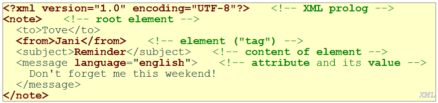

<!-- slide: 5 -->

## XML基础 - 简介

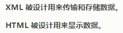
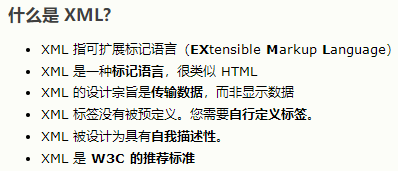
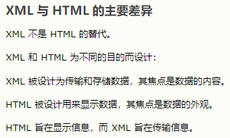
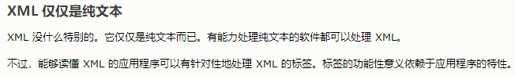
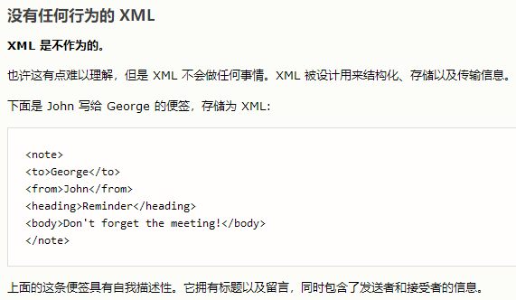
- 但是，这个 XML 文档仍然没有做任何事情。它仅仅是包装在 XML 标签中的纯粹的信息。我们需要编写软件或者程序，才能传送、接收和显示出这个文档。

<!-- slide: 6 -->

## XML基础 - 简介

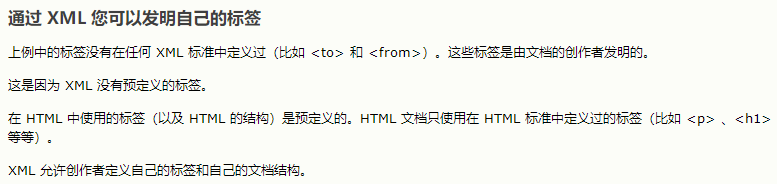
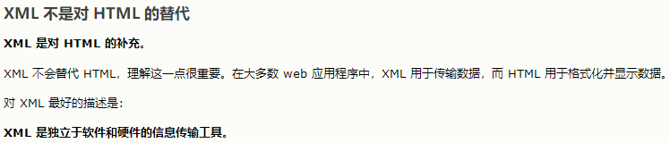
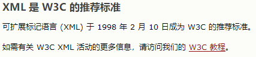
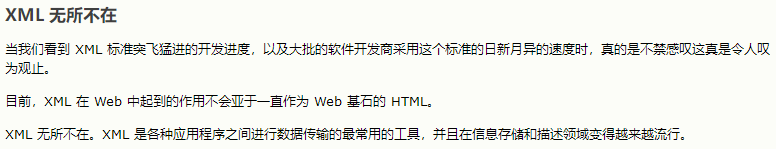

<!-- slide: 7 -->

## 使用XML

- XML 的数据可以来自网络上的许多资源:
  - Web服务器 以XML 文件的形式保存数据
  - 数据库有时以XML的形式返回查询字符串
  - 网络服务 使用XML进行通信
- XML 事实上是交换数据的通用格式
- XML 语言被用于 音乐 ,  数学 , 向量图  等方面
- 广泛使用 : RSS，用于新闻订阅& 传播

<!-- slide: 8 -->

## XML基础 - 用途

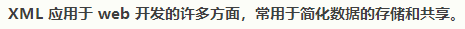
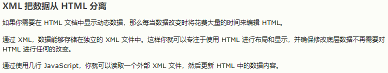
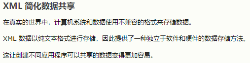
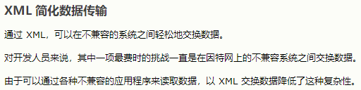
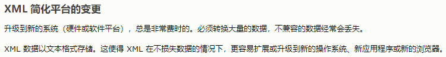

<!-- slide: 9 -->

## XML基础 - 用途

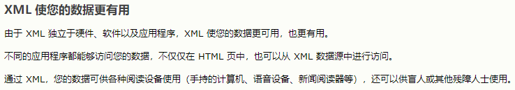
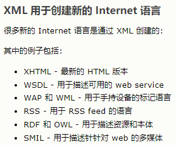
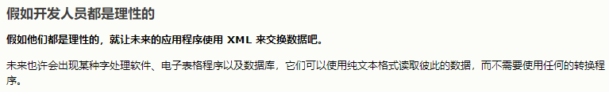

<!-- slide: 10 -->

## XML的利弊

- 优点 :
  - 容易阅读(对人类跟计算机)
  - 标准的格式使自动化操作变得简单
  - 不用为新类型的数据白费力气重复做工
  - 国际化的, 作业平台独立的, 开源／免费标准
  - 能表示几乎所有常见数据类型(记录, 表, 树tree)
- 缺点　:
  - 庞大的 语法/结构使存储文件变得很大; 可能会降低性能
    - 例子: 　MathML语言中的二次公式
  - 在一个好的XML格式中插入数据可能会很困难

<!-- slide: 11 -->

## 在XML中，什么是合法标签?

- 你想要的任何标签!
- 例子:
  - 一条邮件信息可能用到名字叫to, from, subject的标签
  - 图书馆可能用到叫book, title, author的标签
- 当设计XML文件时, 你要自己选择能最好地表示数据的标签和属性
- 经验法则: 数据=标签, 　元数据= 属性

<!-- slide: 12 -->

## Doctype和Schema

- 个人特色的XML “规则说明书 "
  - 列出哪些标签跟属性在语言中是有效的, 以及它们如何一起使用
- 用来验证XML 文件，以确保它们遵守你的规则
  - W3C HTML 验证器使用XHTML 文档类型来验证你的 HTML代码
- 获取更多信息:
  - 文档类型描述(DTD) (“文档类型")
  - W3C XML Schema
- 可选的 — 如果你没定义的话 , 在现有的标准的XML语法之外，就没有其它规则了

<!-- slide: 13 -->

## 概要

- XML基础
- XML 和 Ajax
- 使用XML编程

<!-- slide: 14 -->

## XML基础 - 树结构

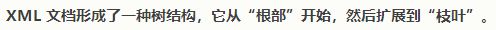
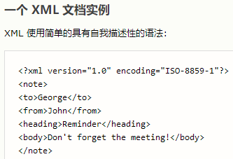
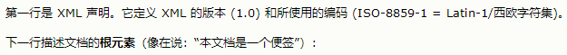
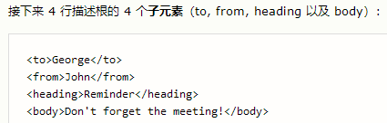
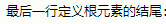
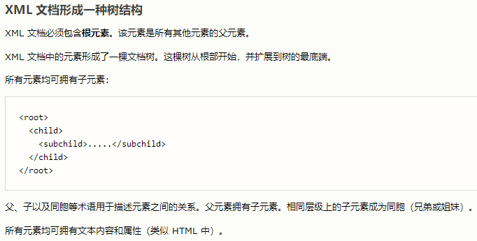

<!-- slide: 15 -->

## XML DOM 树状结构

- <?xml version="1.0" encoding="UTF-8"?> <categories> 	<category>children</category> 			<category>computers</category> ... </categories>
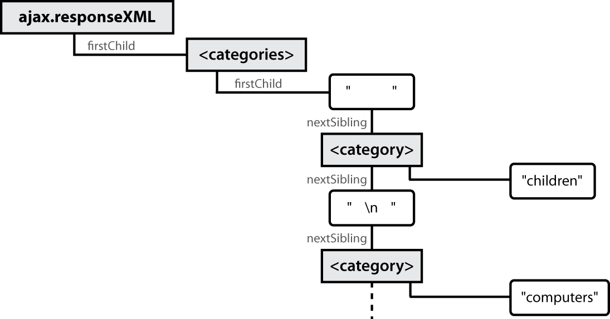
- XML标签有一个树结构
- DOM 节点有父节点，子节点，兄弟节点

<!-- slide: 16 -->

## XML基础 - 树结构

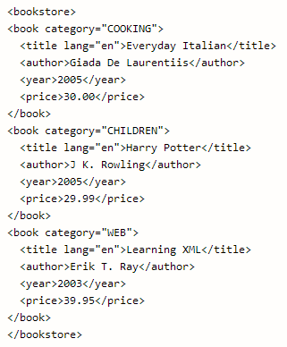

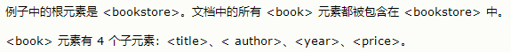

<!-- slide: 17 -->

## XML基础 - 语法规则

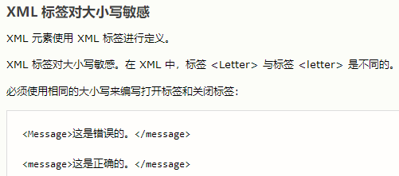

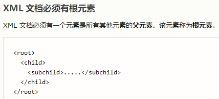

<!-- slide: 18 -->

## XML基础 - 语法规则

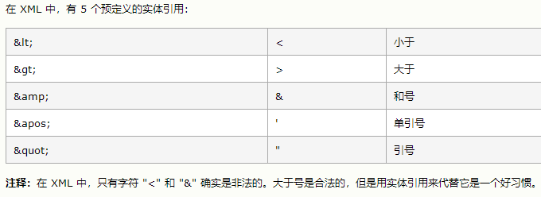

<!-- slide: 19 -->

## XML基础 - 语法规则

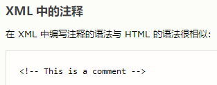

<!-- slide: 20 -->

## XML基础 - 元素

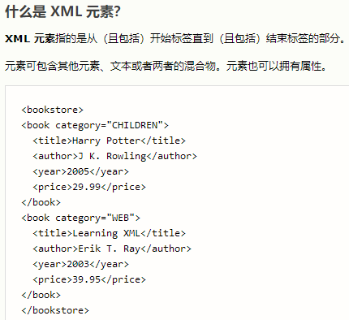
- 在上例中，<bookstore> 和 <book> 都拥有元素内容，因为它们包含了其他元素。<author> 只有文本内容，因为它仅包含文本。
- 在上例中，只有 <book> 元素拥有属性 (category="CHILDREN")。

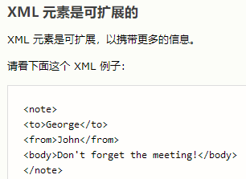
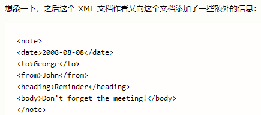

<!-- slide: 21 -->

## XML基础 - 元素

<!-- slide: 22 -->

## XML基础 - 属性

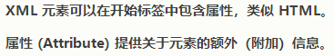
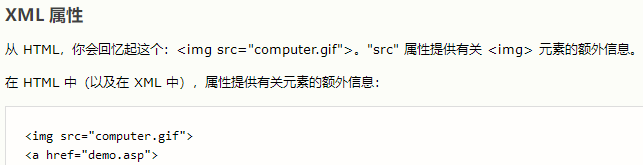
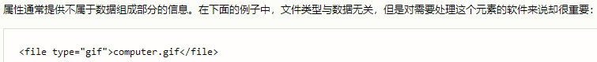
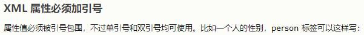
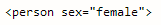

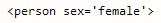
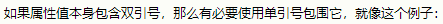
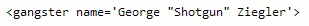

<!-- slide: 23 -->

## XML基础 - 属性

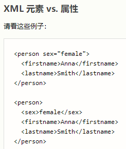
- 在第一个例子中，sex 是一个属性。在第二个例子中，sex 则是一个子元素。两个例子均可提供相同的信息。
- 没有什么规矩可以告诉我们什么时候该使用属性，而什么时候该使用子元素。我的经验是在 HTML 中，属性用起来很便利，但是在 XML 中，您应该尽量避免使用属性。如果信息感觉起来很像数据，那么请使用子元素吧。
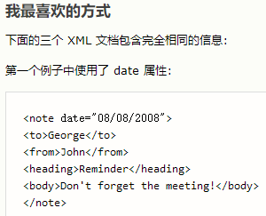
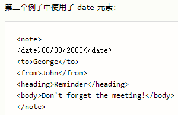
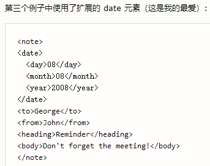

<!-- slide: 24 -->

## XML基础 - 属性

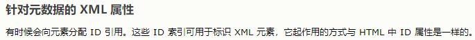

- 上面的 ID 仅仅是一个标识符，用于标识不同的便签。它并不是便签数据的组成部分。
- 在此我们极力向您传递的理念是：元数据（有关数据的数据）应当存储为属性，而数据本身应当存储为元素。

<!-- slide: 25 -->

## XML基础 - 树结构

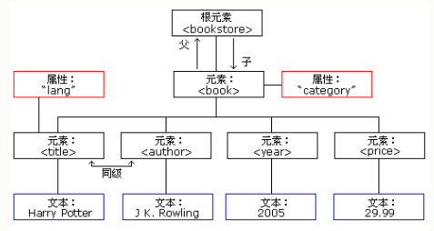

<!-- slide: 26 -->

## XML基础 - 语法规则

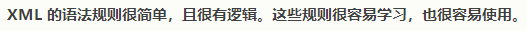
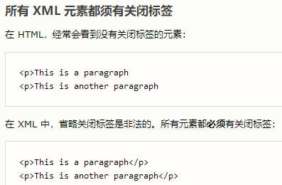

<!-- slide: 27 -->

## XML基础 - 语法规则

<!-- slide: 28 -->

## XML基础 - 语法规则

<!-- slide: 29 -->

## XML基础 - 元素

- 在上例中，<bookstore> 和 <book> 都拥有元素内容，因为它们包含了其他元素。<author> 只有文本内容，因为它仅包含文本。
- 在上例中，只有 <book> 元素拥有属性 (category="CHILDREN")。

<!-- slide: 30 -->

## XML基础 - 元素

<!-- slide: 31 -->

## XML基础 - 属性

<!-- slide: 32 -->

## XML基础 - 属性

- 在第一个例子中，sex 是一个属性。在第二个例子中，sex 则是一个子元素。两个例子均可提供相同的信息。
- 没有什么规矩可以告诉我们什么时候该使用属性，而什么时候该使用子元素。我的经验是在 HTML 中，属性用起来很便利，但是在 XML 中，您应该尽量避免使用属性。如果信息感觉起来很像数据，那么请使用子元素吧。

<!-- slide: 33 -->

## XML基础 - 属性

- 上面的 ID 仅仅是一个标识符，用于标识不同的便签。它并不是便签数据的组成部分。
- 在此我们极力向您传递的理念是：元数据（有关数据的数据）应当存储为属性，而数据本身应当存储为元素。

<!-- slide: 34 -->

## XML JavaScript

<!-- slide: 35 -->

## XML JavaScript

- onreadystatechange 是一个事件句柄。它的值 (state_Change) 是一个函数的名称，当 XMLHttpRequest 对象的状态发生改变时，会触发此函数。状态从 0 (uninitialized) 到 4 (complete) 进行变化。仅在状态为 4 时，我们才执行代码。

<!-- slide: 36 -->

## 回顾: Javascript XML (XHTML) DOM

- 我们已经知道的DOM 属性和方法 * 也能用在 XML节点上:
- 属性:
  - firstChild, lastChild, childNodes, nextSibling, previousSibling, parentNode
  - nodeName, nodeType, nodeValue, attributes
- 方法:
  - appendChild, insertBefore, removeChild, replaceChild
  - getElementsByTagName, getAttribute, hasAttributes, hasChildNodes
- 警告:  在 XML DOM中不能使用HTML特有的属性，例如innerHTML!
- * (不是Prototype中的,例如up, down, ancestors, childElements, descendants, 或 siblings等等)

<!-- slide: 37 -->

## 操纵节点树

- 警告 :在XML DOM 中只能用标准的DOM 方法和属性 ，HTML DOM 拥有Prototype的方法  , 但XML 没有!
- 警告 : 不能使用id 或class属性来获取特定的节点
  - id 和class并不一定要作为属性被定义在你自己的XML中
- 警告 : firstChild/nextSibling 属性是不可靠的
  - 令人厌烦的空白文本节点!
- 遍寻XML 树最好的方法:
  - 对于一个给定的标签名，以数组 的形式返回其所有节点的子节点
  - 获取一个元素的属性

<!-- slide: 38 -->

## 概要

- XML 基础
- XML 和 Ajax
- XML编程

<!-- slide: 39 -->

## 在网页中使用XML 数据

- 步骤:
- 使用Ajax获取数据
- 用DOM方法检查XML:
  - XMLnode.getElementsByTagName()
- 从XML中提取我们需要的数据:
  - XMLelement.getAttribute(), XMLelement.firstChild.nodeValue, 等等.
- 创造新的HTML节点并装入提取的数据:
  - document.createElement(), HTMLelement.innerHTML
- 将新创建的HTML节点加入网页中
  - HTMLelement.appendChild()

<!-- slide: 40 -->

## 使用Ajax (模板)提取XML

- ajax.responseText 以纯文本存放XML数据
- ajax.responseXML  是一个事先解析过的 XML DOM对象

<!-- slide: 41 -->

## 使用DOM分析一个被提取的 XML 文件

- 我们可以在ajax.responseXML上，使用DOM的属性和方法:

<!-- slide: 42 -->

## 回顾: DOM里面的陷阱

- DOM里面的陷阱 :

<!-- slide: 43 -->

## 更大的XML 文件示例

<!-- slide: 44 -->

## 操纵节点树示例

<!-- slide: 45 -->

## 历史的插曲: 为什么是XHTML?

- 在 XML中, 不同的 “特性”可以组合放在一个文件里
- 理论上包含其他XML数据在XHTML中有好处
  - 但没人这么做
- 大多数嵌入式数据都是非XML的格式数据 (例如, Flash)
  - 非XML的格式数据 都必须用其他方式来嵌入  (稍后讨论)
- XML的“特性”需要浏览器/插件的支持
  - 对以前不存在的东西的支持发展缓慢
  - 大多数XML “特性”是用于特定用途的

<!-- slide: 46 -->

## 在Firebug中调试 responseXML

- 我们可以检查整个XML 文件, 它的节点/树结构

<!-- slide: 47 -->

## 总结

- XML 基础
  - XML是一种特定的数据结构语言
  - 利与弊
  - 文档类型和结构
- XML 和Ajax
  - XML 和Ajax
  - XML DOM
  - 在网页中使用XML的数据
- XML编程
  - 操纵和调试XML

<!-- slide: 48 -->

## 练习

- 用XML描述下图

<!-- slide: 49 -->

## 阅读材料

- W3C XML 说明文档 http://www.w3.org/XML/
- W3Schools XML 教程http://www.w3schools.com/xml/default.asp
- W3Schools XML 例子http://www.w3schools.com/XML/xml_examples.asp
- Ajax/JavaScript XML 操作实例/教程http://www.captain.at/howto-ajax-process-xml.php
- prototype.js开发者笔记 http://www.sergiopereira.com/articles/prototype.js.html

<!-- slide: 50 -->

- Thank you!
