# Lecture 15 Cookies and Sessions(C)

<!-- slide: 1 -->

## 第15讲 Cookie与Session

<!-- slide: 2 -->

## 概要

- Cookie
- Session

<!-- slide: 3 -->

## 有状态的浏览器/服务器交互

- HTTP是无状态协议; 它只是简单地允许浏览器从服务器上请求一个单文档
- 在下面的幻灯片中, 我们会了解到用于解决这问题的cookie,  它同时也是客户端和服务端之间的高级session.
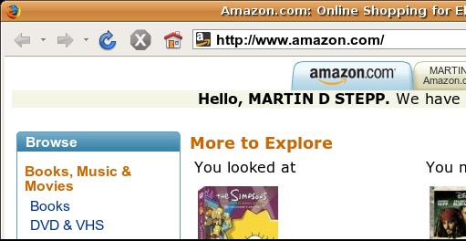
- 像amazon.com这样的网站似乎”知道我是谁”. 它们是如何做到的? 用户如何让服务器识别它自己?服务器又如何向每一个用户提供特定的内容?

<!-- slide: 4 -->

## Cookie是什么?

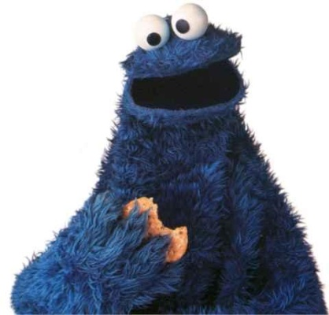
- cookie: 少量的由服务器发送给浏览器的信息,并且会在未来的页面请求时发送回服务器.
- cookie有很多用处:
  - 验证
  - 用户跟踪
  - 保存用户选择, 购物车, 等.
- 一个cookie的数据包含一个键/值对, 在用户的HTTP GET或者POST请求的header中传递

<!-- slide: 5 -->

## cookie是如何传递的

- 当浏览器请求页面时,服务器可能会同时返回一个cookie
- 如果服务器之前传递了cookie给浏览器,浏览器会在随后的请求中把它们传回去
- 可替换的模型: 客户端的JS代码能够设置/获取cookie
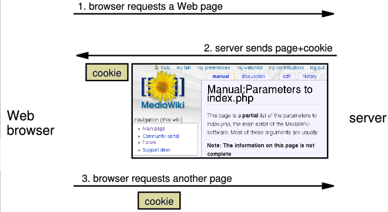

<!-- slide: 6 -->

## 关于cookie的传说

- 传说:
  - Cookie就像蠕虫/病毒,能够把用户硬盘上的数据删除掉.
  - Cookie是间谍软件的一种形式,并且能够盗窃你的个人信息.
  - Cookie能产生弹出窗口和垃圾邮件.
  - Cookie只能用于广告.
- 事实:
  - Cookie只是数据,而不是程序代码.
  - Cookie不能删除和读取用户电脑上的信息
  - Cookie通常是你匿名的(不包含个人信息)
  - Cookie能够用于跟踪你在某一特定网站的浏览习惯

<!-- slide: 7 -->

## 一个cookie能够存活多久?

- 会话cookie : 默认的类型; 一个临时保存在浏览器内存的cookie
  - 当浏览器关闭的时候,临时的cookie将会被删除
  - 不能用于追踪长期信息
  - 比较安全,因为除浏览器外没有程序能够访问它们
- 长期cookie : 能够在浏览器的电脑上储存在一个文件中
  - 能够跟踪长期信息
  - 潜在安全隐患,因为用户(或者他们运行的程序)能够打开cookie文件,并查看/修改cookie的值,等

<!-- slide: 8 -->

## cookie在电脑的什么地方?

- IE: HomeDirectory\Cookies
  - 例如 C:\Documents and Settings\administrator\Cookies
  - 每一个保存为.txt文件, 与网站的域名相似
- Firefox: %APPDATA%\Mozilla\Firefox\???.default\cookies.txt (cookies.sqlite)
  - 查看Firefox中的cookie: Privacy, Show Cookies...
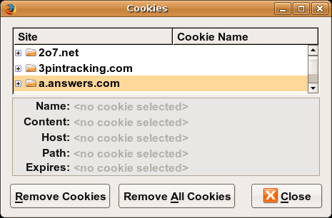

<!-- slide: 9 -->

## JavaScript中的cookie

- JS 有一个全局 document.cookie 字段(字符串)
- 你可以从这个字段中手动设定/获取cookie数据(以;分隔), 并把它保存到浏览器上
- 你不能删除一个cookie, 但你能令它过期, 为什么?
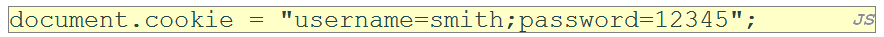
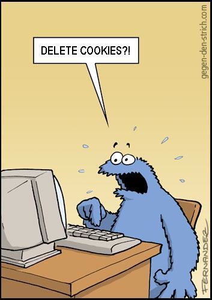

<!-- slide: 10 -->

## 在PHP中设置cookie

- setcookie 使你的脚本传递一个cookie到用户的浏览器
- setcookie 必须在所有输出语句之前调用(HTML块, print, 或者 echo)
- 你能够为每个用户设定多个cookies(20-50), 每个最多3-4K bytes
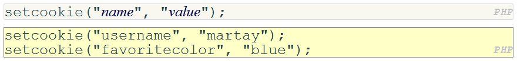

<!-- slide: 11 -->

## 从cookie中获取信息

- 所有从客户端传递的cookie保存在 $_COOKIES 关联数组
- 使用 isset 函数检查一个给定的cookie名是否存在
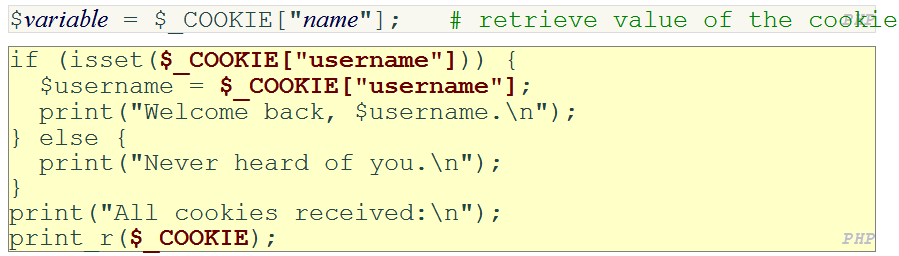

<!-- slide: 12 -->

## 在PHP中设定一个长期的cookie

- 为了设定一个长期的cookie, 传递第三个参数作为它的生存时间,以秒为单位
- time 函数以秒的形式返回当前时间
  - date 函数能够把一个以秒为单位的时间转换为一个可读的日期
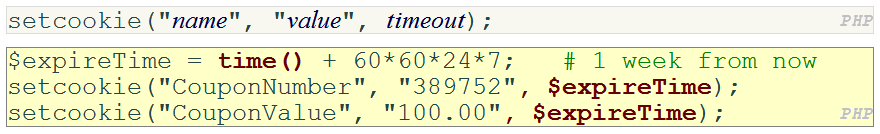

<!-- slide: 13 -->

## 删除一个长期的cookie

- 如果服务器想要移除一个长期的cookie, 它应该通过传递一个先于现在的时间作为其生存时间
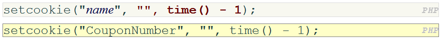

<!-- slide: 14 -->

## 概要

- Cookie
- Session

<!-- slide: 15 -->

## Session是什么?

- session: 描述某个特定浏览器与服务器之间一系列HTTP请求和响应
  - HTTP并不支持session的概念, 但PHP支持
- sessions vs. cookies:
  - cookie是保存在客户端的数据
  - session的数据保存在服务器(每个用户只有一个session)
- session是建立在cookie的基础上的:
  - 客户端保存的唯一数据是具有唯一session ID的cookie
  - 对于每一个页面请求，客户端把它的session ID的cookie传递给服务器，服务器使用这个ID查找并获取客户的session数据

<!-- slide: 16 -->

## session是如何建立的?

- 客户的浏览器向服务器发送一个初始化请求
- 服务器记录客户的IP地址/浏览器, 保存一些本地会话数据, 并且返回会话ID给客户
- 客户在未来的请求中传递相同的会话ID回服务器
- 服务器使用会话ID获取用户的会话数据, 就像一张可以进入换衣房的票
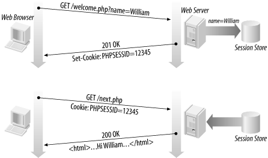

<!-- slide: 17 -->

## PHP中的session: session_start

- session_start 表示你的脚本想使用用户的session
  - 必须在脚本的开头调用,在所有HTML输出之前
- 当你调用 session_start:
  - 如果服务器没见过这个用户, 将会建立一个新的session
  - 否则, 已存在的session数据将会装载进 $_SESSION 关联数组
  - 你可以把数据存放在$_SESSION并在将来的页面上获取它
- PHP的session函数完整列表
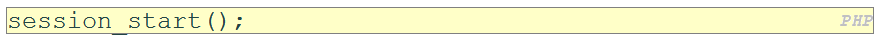

<!-- slide: 18 -->

## session_abort — Discard session array changes and finish session
session_cache_expire — 返回当前缓存的到期时间
session_cache_limiter — 读取/设置缓存限制器
session_commit — session_write_close 的别名
session_decode — 解码会话数据
session_destroy — 销毁一个会话中的全部数据
session_encode — 将当前会话数据编码为一个字符串
session_get_cookie_params — 获取会话 cookie 参数
session_id — 获取/设置当前会话 ID
session_is_registered — 检查变量是否在会话中已经注册
session_module_name — 获取/设置会话模块名称

- PHP的session函数完整列表

<!-- slide: 19 -->

## PHP的session函数完整列表

- session_name — 读取/设置会话名称
- session_regenerate_id — 使用新生成的会话 ID 更新现有会话 ID
- session_register_shutdown — 关闭会话
- session_register — Register one or more global variables with the current session
- session_reset — Re-initialize session array with original values
- session_save_path — 读取/设置当前会话的保存路径
- session_set_cookie_params — 设置会话 cookie 参数
- session_set_save_handler — 设置用户自定义会话存储函数
- session_start — 启动新会话或者重用现有会话
- session_status — Returns the current session status
- session_unregister — Unregister a global variable from the current session
- session_unset — Free all session variables
- session_write_close — Write session data and end session

<!-- slide: 20 -->

## 访问session的数据

- $_SESSION 关联数据读取/储存所有session数据
- 使用 isset 函数查看一个给定的值是否在session中
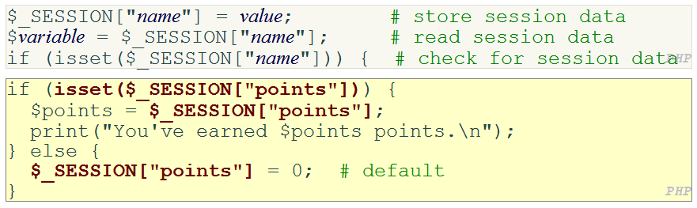

<!-- slide: 21 -->

## session的数据放在什么地方?

- 在客户端, 会话ID保存在以 PHPSESSID为名字的cookie中
- 在服务器上, 会话数据保存为形如/tmp/sess_fcc17f071 的临时文件
- 你可以使用session_save_path函数找到(改变)会话数据存放的文件夹
- 对于大型的应用,会话数据可以保存在SQL数据库(或其它目标路径)中而不是使用session_set_save_handler函数
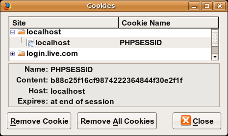

<!-- slide: 22 -->

## 不支持cookie的浏览器

- 如果客户的浏览器不支持cookie, 它仍然可以以查询字符串参数的形式传递一个会话, 这个参数的名字是PHPSESSID
  - 这是自动完成的; session_start 探测浏览器是否支持cookie并选择恰当的方法
- 当需要时 (例如在页面上建立一个链接的URL), 服务器可以使用session_id函数找到客户的会话ID
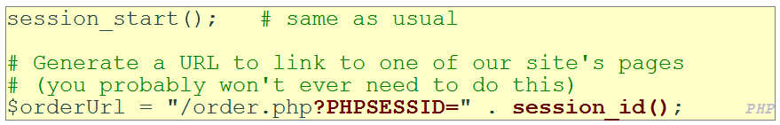

<!-- slide: 23 -->

## 会话超时

- 因为HTTP是无状态的, 服务器难以知道用户什么时候完成一个会话
- 理想状态下, 用户会明确地登出, 但大部分用户不会
- 客户在浏览器关闭时删除会话cookie
- 服务器在一个周期后自动删除旧会话
  - 旧会话会浪费资源并且可能造成安全危险
  - 在PHP服务器上设置或者使用 session_cache_expire 函数调节会话
  - 你可以调用session_destroy 删除一个会话

<!-- slide: 24 -->

## 总结

- Cookie
  - 有状态的浏览器与服务器交互
  - cookie是如何传递和储存的
  - 它们会存活多久
- Session
  - session是如何建立和储存的
  - session超时
  - 在PHP中使用session

<!-- slide: 25 -->

## 练习

- 在单一网页上编写一个简单的 user aware 待办事项列表程序.
  - 一个

元素包含所有的html元素
  - 一个用于添加新的待办事项的表单
  - 一个列出所有待办事项的列表
  - “全部选择”, “全部删除”, 和“删除”按钮
  - 当按下“添加”按钮时, 新的待办事项会被添加到列表的底部
  - 通过两种方式使用web会话保存所有待办事项
    - 使用简单的cookie, 把所有的待办事项保存在一个cookie里面(需要注意的是,应该对这些数据进行编码)
    - 使用PHP的会话机制

<!-- slide: 26 -->

## 阅读材料

- Cookie的介绍 http://en.wikipedia.org/wiki/HTTP_cookie
- Session的介绍http://en.wikipedia.org/wiki/Session_(computer_science)
- PHP Cookies http://php.net/manual/en/features.cookies.php
- W3Schools JavaScript Cookies http://www.w3schools.com/JS/js_cookies.asp
- PHP Sessions http://www.php.net/manual/en/book.session.php
- PHP Sessions 指南http://www.tizag.com/phpT/phpsessions.php

<!-- slide: 27 -->

- 谢谢!
