# Lecture 16 Mashup

<!-- slide: 1 -->

## Lecture 16 Mashup

<!-- slide: 2 -->

## 概要

- Mashup基础
- Web API
- Google API

<!-- slide: 3 -->

## Mashups = 重新混合的数据

- 数据 + API接口(金融数据（股票、期货、债券等）整合接口，如：Tushare等，东方财富网等网站平台)
- 数据 + 其它数据
- 数据 + 功能（分析、统计、挖掘等）
- 一个 mashup 是一个网页或者应用程序，它从两个或以上数据源获取数据并将数据、显示和功能整合在一起，产生一个新的服务.

<!-- slide: 4 -->

## 为什么需要Mashups ?

- “我们都知道，人们的创造力是无限的。世界上到处都是拥有创造性的人, 成千上万,他们通过有别于我们的思维方式，运用现有的基础平台来创造新东西.”
- –文特·瑟夫
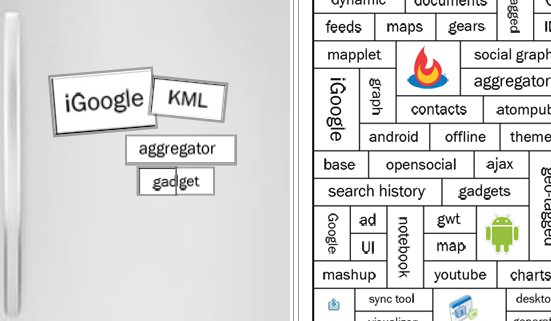

<!-- slide: 5 -->

## 文特·瑟夫

- 文顿·瑟夫，现为Google副总裁兼首席互联网顾问。许多人把文顿·瑟夫看作“互联网之父”之一，他是TCP/IP协议和互联网架构的联合设计者之一。在1994年加入MCI之前，文顿·瑟夫曾担任国家研究计划(CNRI)公司的副总裁。1994年12月，《人物》杂志将文顿·瑟夫选为当年“25个最令人着迷的人”之一。

<!-- slide: 6 -->

## 聚合型Mashup

  - 将各种各样相关的网页的信息组合在一个页面上.
  - 更多的信息+更少的点击量 =  更快乐的网页浏览者
  - 示例: http://www.originalsignal.com, http://doggdot.us, http://reader.google.com

<!-- slide: 7 -->

## 搜索/ 搜索整合型Mashup

  - 搜索型: 让你从API搜索数据
  - 搜索整合型: 让你仅搜索一次,就能马上从多个搜索引擎/API 获取数据.
  - 示例: http://pulpsite.net/zontube/
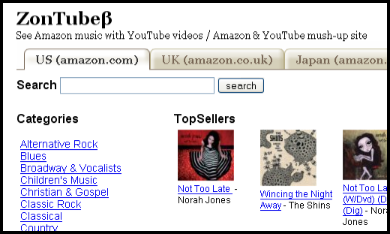
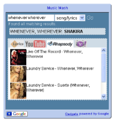

<!-- slide: 8 -->

## 可视化Mashup

  - 可视化: 获取相关数据并用一种新颖有意思的可视化方式来显示 (例如. 云, 地图)
  - 示例: http://imagine-it.org/amazong/vissimweb.htm, http://www.coverpop.com, http://mathias.cianci.free.fr/
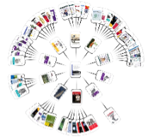
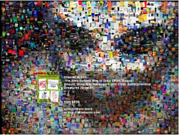
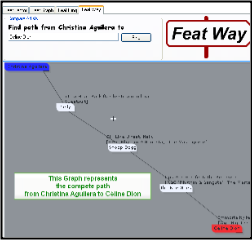

<!-- slide: 9 -->

## 地图类Mashup

  - 从其它数据来源(包括用户!)获取地理信息并绘制在地图上
  - 地理信息可以是经度/纬度，也可以仅仅是一个地址，城市或被地理API编码的地名，这些都很常见
  - 示例: http://www.81nassau.com/apnews/, http://www.bikely.com, http://imagine-it.org/mashplanet/
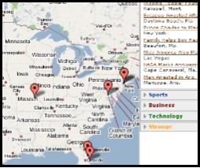
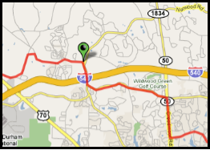
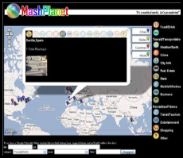

<!-- slide: 10 -->

## 手机类Mashup

  - 从API/订阅源获取在线数据 ，然后用跟手机兼容的格式存入
  - 由于很多奇特的web2.0网页无法在手机上显示 (AJAX) ，但是人们仍想能够快速地获得他们要的信息，这便带来了迫切的需求。
- 示例: http://www.411sync.com/cgi-bin/search_api?query=mydigg+txttester, http://www.411sync.com/cgi-bin/search_api?query=daily, http://www.frucall.com
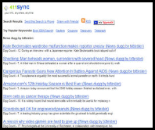
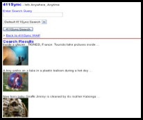

<!-- slide: 11 -->

## 游戏类Mashup

  - 让玩家猜测一个web对象相关的更多信息 (照片, 好友, 地图线索)
  - 我个人最喜欢的类型 ☺
  - 示例: http://imagine-it.org/flickr/PhotoMunchrs.html, http://imagine-it.org/google/wordhunter.htm, http://imagine-it.org/flickr/flicktionary.htm, http://www.facebook.com
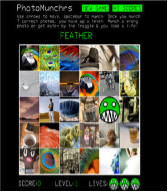

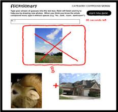
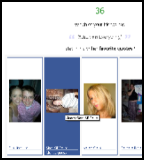

<!-- slide: 12 -->

## 其它类型的Mashup

- 还有许许多多让数据 和API糅合的方法.
- 浏览以下网址参见其他人的做法： http://programmableweb.com
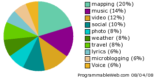

<!-- slide: 13 -->

## 概要

- Mashup基础
- Web API
- Google API

<!-- slide: 14 -->

## 定义: API ... Web API

- Application   (应用)
- Programming(程序)
- Interface 	(接口)

- Web APIs =
- 使用 http(s) 进行传输的API

<!-- slide: 15 -->

## API 类型

- HTTP协议
- 插件(Plugin)
- 可视化(Visual)
- REST | RPC

<!-- slide: 16 -->

## API 类型: HTTP :: RPC

- fooInstance->addNumbers(2, 3);
- <?xml version="1.0"?>
- <methodCall>
- <methodName>Foo.addNumbers</methodName>
- <params>
- <param><value><int>2</int></value></param>
- <param><value><int>3</int></value></param>
- </params>
- </methodCall>
- fooInstance.addNumbers(2, 3);

- PHP

- XML(Network)

- C++

<!-- slide: 17 -->

## API 类型: HTTP :: RPC

- http://api.flickr.com/services/rest/?method=flickr.photos.search&text=pamela+fox

- <rsp stat="ok">
- <photos page="1" pages="2" perpage="100" total="159">
- <photo id="3461223826" owner="37370984@N07" secret="6d0bbbbfa3" server="3512" farm="4" title="Pamela Fox - mapping, red dot fever" ispublic="1" isfriend="0" isfamily="0" />
- <photo id="3461224220" owner="37370984@N07" secret="7365fecf34" server="3605" farm="4" title="Pam pam pam" ispublic="1" isfriend="0" isfamily="0" />
- <photo id="3459126604" owner="44124396772@N01" secret="c54c15ee4b" server="3608" farm="4" title="pamela" ispublic="1" isfriend="0" isfamily="0" />
- </photos>
- </rsp>

<!-- slide: 18 -->

## API 类型: HTTP :: SOAP

- <?xml version="1.0" encoding="utf-8" ?>
- <s:Envelope xmlns:s="http://www.w3.org/2003/05/soap-envelope" xmlns:xsi="http://www.w3.org/1999/XMLSchema-instance" xmlns:xsd="http://www.w3.org/1999/XMLSchema" >
- <s:Body>
- <x:FlickrResponse xmlns:x="urn:flickr">
- [escaped-xml-payload]
- </x:FlickrResponse>
- </s:Body>
- </s:Envelope>
- http://www.flickr.com/services/rest/?method=flickr.test.echo&format=soap&foo=bar

<!-- slide: 19 -->

## API 类型: HTTP :: REST

- 应用程序状态和功能 被抽象为离散的资源
- 通过URL，可以访问资源.
- /blog/posts/1234
- 资源共享一个传输状态的统一接口.
- HTTP://
- GET
- POST
- PUT
- DELETE

<!-- slide: 20 -->

## API 类型: HTTP :: REST

- Feed

- 入口
- GET
- POST
- PUT
- DELETE

<!-- slide: 21 -->

## API 类型: HTTP :: REST

- <?xml version="1.0" encoding="utf-8" ?>
- <catalog_title>
- <id>
- http://api.netflix.com/catalog/titles/series/70023522/seasons/70023522
- </id>
- <title short="The Office: Season  1" regular="The Office: Season 1"/>
- <release_year>2005</release_year>
- <runtime>8700</runtime>
- ...
- </catalog_title>
- http://api.netflix.com/catalog/titles/series/70023522/seasons/70023522

<!-- slide: 22 -->

## API 类型: 可视化

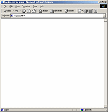
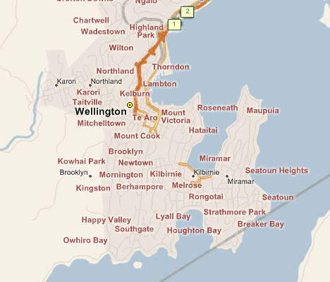

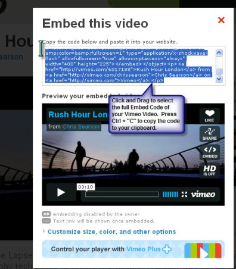

<!-- slide: 23 -->

## API 类型: 可视化

- 
- 

<!-- slide: 24 -->

- API 类型: 可视化 - 展览与监控
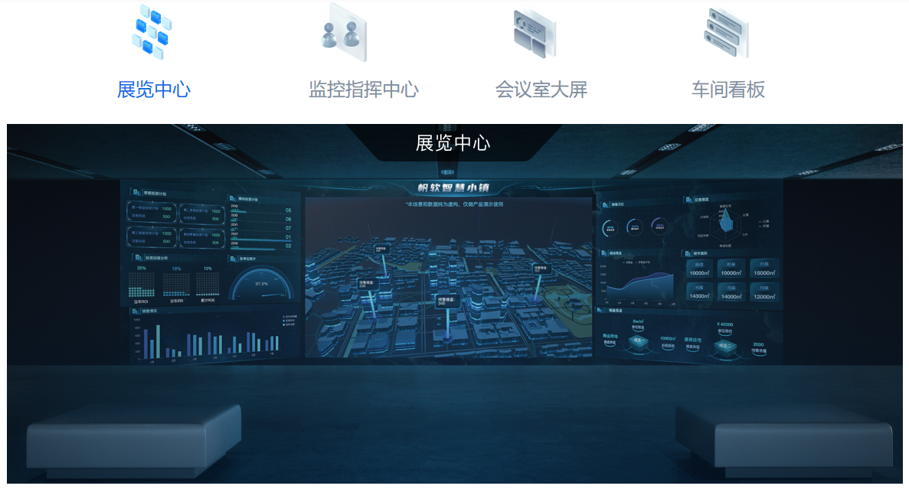

<!-- slide: 25 -->

- API 类型: 可视化 - 高铁可视化监管
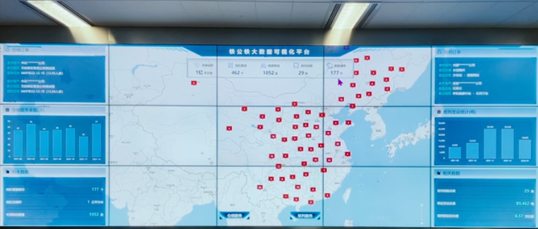
- 国家与区域监管控制中心

<!-- slide: 26 -->

- API 类型: 可视化 - 高铁可视化监管

<!-- slide: 27 -->

- API 类型: 可视化 - 高铁可视化监管
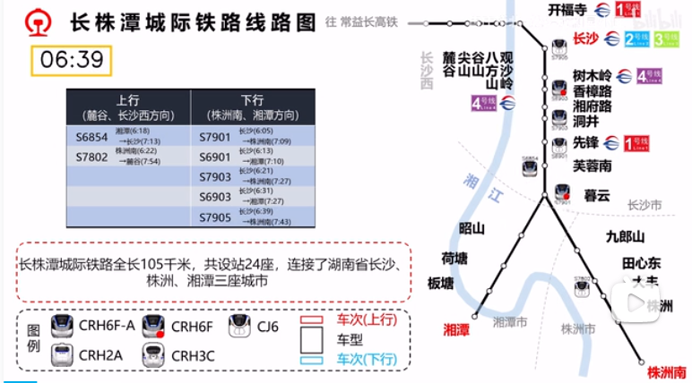

<!-- slide: 28 -->

## API 类型: 插件

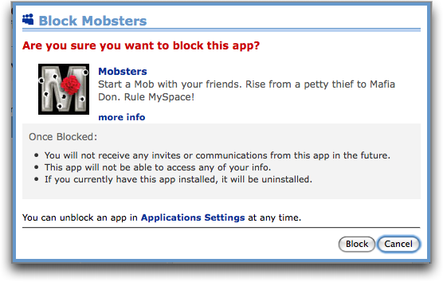
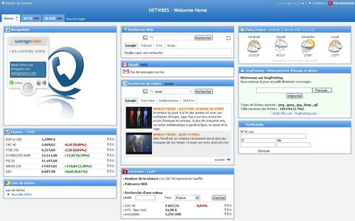

<!-- slide: 29 -->

## 插件

- 插件(Plug-in,又称addin、add-in、addon或add-on,又译外挂)是一种遵循一定规范的应用程序接口编写出来的程序。其只能运行在程序规定的系统平台下（可能同时支持多个平台），而不能脱离指定的平台单独运行。因为插件需要调用原纯净系统提供的函数库或者数据。
- 现在很多软件都有插件，插件有无数种。例如在IE中，安装相关的插件后，WEB浏览器能够直接调用插件程序，用于处理特定类型的文件。
- 插件的定位是开发实现原纯净系统平台、应用软件平台不具备的功能的程序，其只能运行在程序规定的系统平台下（可能同时支持多个平台），而不能脱离指定的平台单独运行。因为插件需要调用原纯净系统提供的函数库或者数据。

<!-- slide: 30 -->

## API 类型: 插件

- <widget:preferences>
- <preference name="hellowho" type="text" label="Hello who ?"
- defaultValue="World" />
- </widget:preferences>
- <title>Title of the Widget</title>
- 

<!-- slide: 31 -->

## 概要

- Mashup 基础
- Web API
- Google API

<!-- slide: 32 -->

## Google API

- HTTP
- 插件(plugins)
- 可视化(Visual)
- REST | RPC
- Google 的数据API
- 关键词广告 API
- 地理编码API
- Google Map API
- Google 视觉化API
- Google 图表 API
- Google Web 元素
- OpenSocial 小工具
- 电子表格 小工具
- Wave小工具/ 机器人

<!-- slide: 33 -->

## Google API: Google Map的API

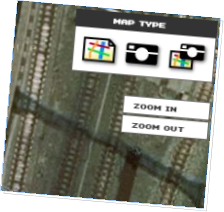
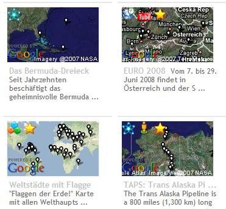
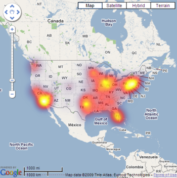
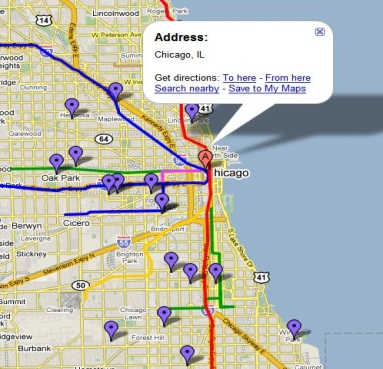
- 迷你地图
- JS 地图的 API
- Flash地图的API
- 静态地图的API
- 地图数据的API

<!-- slide: 34 -->

## Google API: Google Map的API

- TrendsMap

<!-- slide: 35 -->

## Google API: Google Wave的API

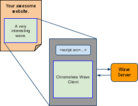

<!-- slide: 36 -->

## Google API: Google Wave的API

- public class MaileyBotServlet extends AbstractRobotServlet {
- public void processEvents(RobotMessageBundle bundle) {
- Wavelet wavelet = bundle.getWavelet();
- sendEmail(wavelet.getTitle());
- }
- public void sendEmail(String title) {
- Message msg = new MimeMessage(session);
- msg.addRecipient(Message.RecipientType.TO,
- new InternetAddress("pamela.fox@gmail.com"));
- msg.setSubject("the wave " + title + " was updated");
- Transport.send(msg);
- }
- }

<!-- slide: 37 -->

## Google API: Google Wave的API

- Emoticony (表情符号)
- Cards

<!-- slide: 38 -->

## Google API: Google Data的API

<!-- slide: 39 -->

## Google API: Google Docs的API

- POST /feeds/documents/private/full
- <entry xmlns="http://www.w3.org/2005/Atom">
- <category scheme="http://schemas.google.com/g/2005#kind"
- term="http://schemas.google.com/sites/2008#folder" label="folder"/>
- <title>New Folder</title>
- </entry>

<!-- slide: 40 -->

## Google API: Google Docs的API

- Docs 编辑器
- 不需要安装相关的编辑器软件就能实现在线编辑相关文件。

<!-- slide: 41 -->

- 华工邮箱提供PPT、DOC等文档在线API
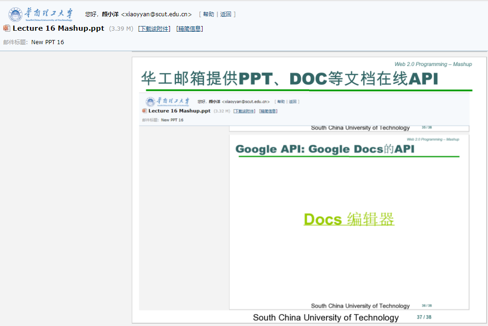

<!-- slide: 42 -->

## 总结

- Mashup 基础
  - 定义
  - 类型: 聚合,搜索/搜索聚合, 可视化, 地图,手机, …
  - Web API
- HTTP::RPC, HTTP::SOAP, HTTP::REST
  - 可视化(Visual)
  - 插件(Plugin)
- Google API
  - 地图, Google Wave, 数据, Docs, ...

<!-- slide: 43 -->

## 练习

- 写一个简单的Google Map 的应用程序,一个显示我们学校(South China University of Technology)地图的网页
  - 通过Google搜索获取我们学校的经度纬度
  - 使用Google Maps JavaScript API V3
  - 按照以下教程的步骤： Google Map Javascript API V3 Tutorial

<!-- slide: 44 -->

## 阅读材料

- Mashup (web混合应用程序) http://en.wikipedia.org/wiki/Mashup_%28web_application_hybrid%29
- 可编程的Web http://www.programmableweb.com/
- Google Ajax APIs http://code.google.com/apis/ajax/
- Google Maps API 家族 http://code.google.com/apis/maps/index.html
- 创造你的第一个地图 http://code.google.com/apis/maps/articles/yourfirstmap.html
- Google Maps API 教程 http://econym.org.uk/gmap/

<!-- slide: 45 -->

- Thank you!
