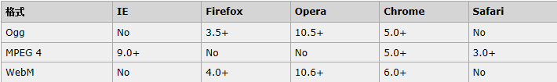
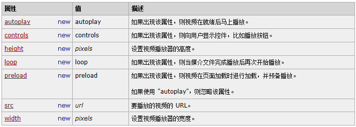
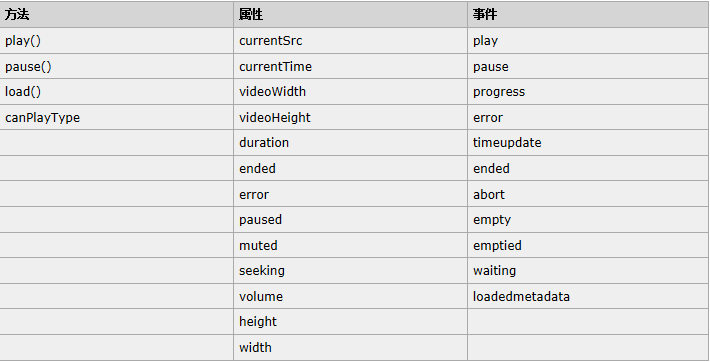
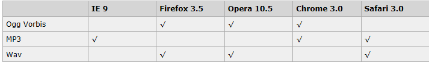
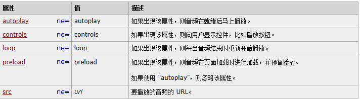

# Lecture 17 Basic HTML

<!-- slide: 1 -->

## Lecture 17 Basic HTML 5

<!-- slide: 2 -->

## HTML5 是下一代的 HTML

- 什么是 HTML5？
  - HTML5 将成为 HTML、XHTML 以及 HTML DOM 的新标准。
  - HTML 的上一个版本诞生于 1999 年。自从那以后，Web 世界已经经历了巨变。
  - HTML5 仍处于完善之中。然而，大部分现代浏览器已经具备了某些 HTML5 支持。

<!-- slide: 3 -->

## HTML5 是如何起步的？

- HTML5 是 W3C 与 WHATWG 合作的结果。
- WHATWG 致力于 web 表单和应用程序，而 W3C 专注于 XHTML 2.0。在 2006 年，双方决定进行合作，来创建一个新版本的 HTML。为 HTML5 建立的一些规则：
  - 新特性应该基于 HTML、CSS、DOM 以及 JavaScript。
  - 减少对外部插件的需求（比如 Flash）
  - 更优秀的错误处理
  - 更多取代脚本的标记
  - HTML5 应该独立于设备
  - 开发进程应对公众透明

<!-- slide: 4 -->

## 新特性

- HTML5 中的一些有趣的新特性：
  - 用于绘画的 canvas 元素
  - 用于媒介回放的 video 和 audio 元素
  - 对本地离线存储的更好的支持
  - 新的特殊内容元素，比如 article、footer、header、nav、section
  - 新的表单控件，比如 calendar、date、time、email、url、search

<!-- slide: 5 -->

<!-- slide: 6 -->

<!-- slide: 7 -->

<!-- slide: 8 -->

<!-- slide: 9 -->

<!-- slide: 10 -->

<!-- slide: 11 -->

<!-- slide: 12 -->

<!-- slide: 13 -->

<!-- slide: 14 -->

<!-- slide: 15 -->

## HTML 5 视频

- 直到现在，仍然不存在一项旨在网页上显示视频的标准。
- 今天，大多数视频是通过插件（比如 Flash）来显示的。然而，并非所有浏览器都拥有同样的插件。
- HTML5 规定了一种通过 video 元素来包含视频的标准方法。

<!-- slide: 16 -->

## 视频格式

- 当前，video 元素支持三种视频格式：
- Ogg = 带有 Theora 视频编码和 Vorbis 音频编码的 Ogg 文件
- MPEG4 = 带有 H.264 视频编码和 AAC 音频编码的 MPEG 4 文件
- WebM = 带有 VP8 视频编码和 Vorbis 音频编码的 WebM 文件

<!-- slide: 17 -->

## 实例

- <video src="movie.ogg" controls="controls">
- </video>
- <video src="movie.ogg" width="320" height="240" controls="controls">
- Your browser does not support the video tag.
- </video>

<!-- slide: 18 -->

## Internet Explorer

- Internet Explorer 8 不支持 video 元素。在 IE 9 中，将提供对使用 MPEG4 的 video 元素的支持。

<!-- slide: 19 -->

## <video> 标签的属性

<!-- slide: 20 -->

## HTML5 <video> - 使用 DOM 进行控制

- HTML5 <video> 元素同样拥有方法、属性和事件。
- 其中的方法用于播放、暂停以及加载等。其中的属性（比如时长、音量等）可以被读取或设置。其中的 DOM 事件能够通知您，比方说，<video> 元素开始播放、已暂停，已停止，等等。

<!-- slide: 21 -->

## HTML5 <video> - 方法、属性以及事件

<!-- slide: 22 -->

## HTML 5 音频

- Web 上的音频
  - 直到现在，仍然不存在一项旨在网页上播放音频的标准。
  - 今天，大多数音频是通过插件（比如 Flash）来播放的。然而，并非所有浏览器都拥有同样的插件。
  - HTML5 规定了一种通过 audio 元素来包含音频的标准方法。
  - audio 元素能够播放声音文件或者音频流。

<!-- slide: 23 -->

## 音频格式

<!-- slide: 24 -->

## <audio> 标签的属性

<!-- slide: 25 -->

- Thank you!
