# Lecture 18 MVC

<!-- slide: 1 -->

## Lecture 18

<!-- slide: 2 -->

## MVC设计模式

- 设计原则
- 设计模式
- MVC模式
- MVC模式的优缺点
- MVC设计案例

<!-- slide: 3 -->

## 设计原则

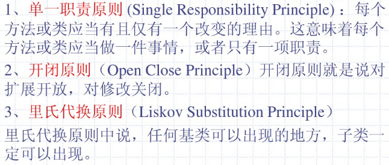
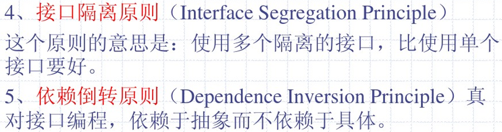

<!-- slide: 4 -->

## 设计模式

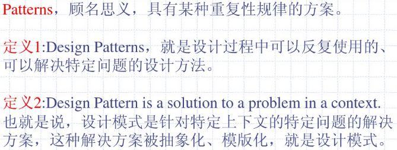

<!-- slide: 5 -->

## MVC设计模式

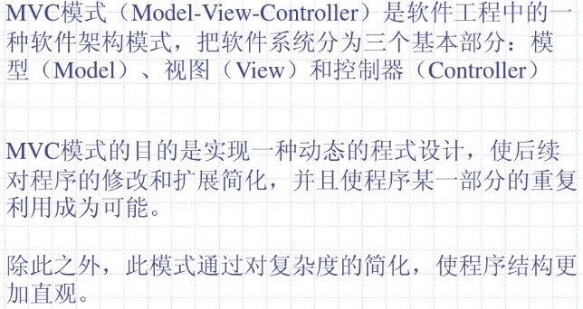

<!-- slide: 6 -->

## MVC设计模式

- 传统Web开发模式与MVC模式的比较
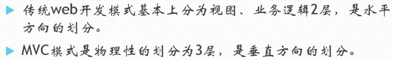

<!-- slide: 7 -->

## MVC设计模式

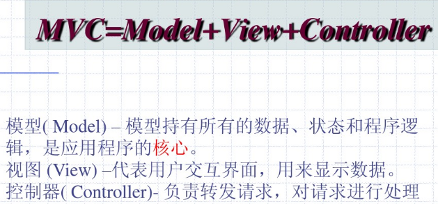

<!-- slide: 8 -->

## MVC设计模式

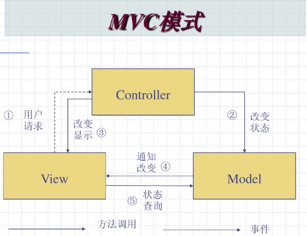

<!-- slide: 9 -->

## MVC设计模式

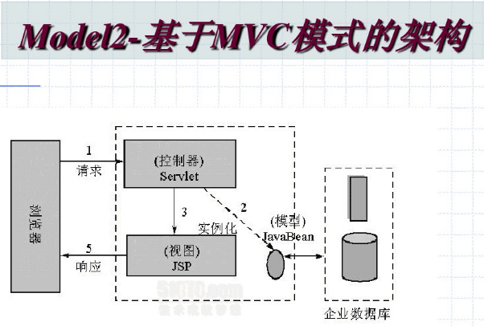

<!-- slide: 10 -->

## 常用于MVC开发的语言与工具

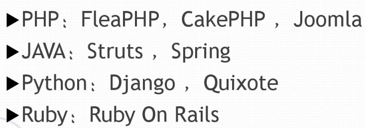
- (SSH)

<!-- slide: 11 -->

## MVC设计模式和SSH框架的关系

- SSH：是指struts2,spring,hibernate，是三种被封装的框架，是框架模式的实现，SSH是一种经典的MVC模式
- SSH：集成SSH框架的系统从职责上分为四层：表示层、业务逻辑层、数据持久层和域模块层，以帮助开发人员在短期内搭建结构清晰、可复用性好、维护方便的Web应用程序。
  - Struts作为系统的整体基础架构，负责MVC的分离，在struts框架的模型部分，控制业务跳转；
  - Hibernate框架对持久层提供支持；
  - Spring做管理，管理struts和hibernate。

<!-- slide: 12 -->

## MVC设计模式和SSH框架的关系

- 具体做法是：用面向对象的分析方法根据需求提出一些模型，将这些模型实现为基本的java对象，然后编写基本的DAO（Data Access Objects）接口，并给出Hibernate的实现，采用Hibernate架构实现的DAO类来实现java类与数据库之间的转换和访问，最后由spring做管理，管理struts和hibernate。

<!-- slide: 13 -->

## MVC设计模式和SSH框架的关系

- 系统的基本业务流程
  - 在表示层中，首先通过jsp页面实现交互界面，负责接收请求（request）和传送响应（response），然后struts根据配置文件(strtus-config.xml)将ActionServlet接收到的请求委派给相应的Action处理。
  - 在业务层中，管理服务组件的Spring IOC容器负责向Action提供业务模型【Model】组件和该组件的协作对象数据处理【DAO】组件完成业务逻辑，并提供事物处理、缓冲池等容器组件以提升系统性能和保证数据的完整性。
  - 在持久层中，依赖于hibernate的对象化映射和数据库交互，处理DAO组件请求的数据，并返回处理结果。

<!-- slide: 14 -->

## MVC设计模式和SSH框架的关系

- MVC三层架构：模型层、控制层和视图层。
  - 模型层，用hibernate框架让javaBean在数据库生成表及关联，通过对javaBean的操作来对数据库进行操作；
  - 视图层，用jsp模板把页面展现给用户以及提供与用户的交互；
  - 控制层，用strust框架来连接数据层和视图层的接收、处理、发送数据并控制流程。
  - 而spring框架粘和了hibernate和struts,透明的管理了整个架构，提供IOC容器使代码松耦合以及AOP框架的切面功能等等。

<!-- slide: 15 -->

## MVC框架模式与SpringMVC框架

- springMVC框架是基于Java的实现了MVC框架模式的请求驱动类型的轻量级框架。前端控制器是DispatcherServlet接口实现类，映射处理器是HandlerMapping接口实现类，视图解析器是ViewResolver接口实现类，页面控制器是Controller接口实现类。

<!-- slide: 16 -->

## MVC框架模式与SpringMVC框架

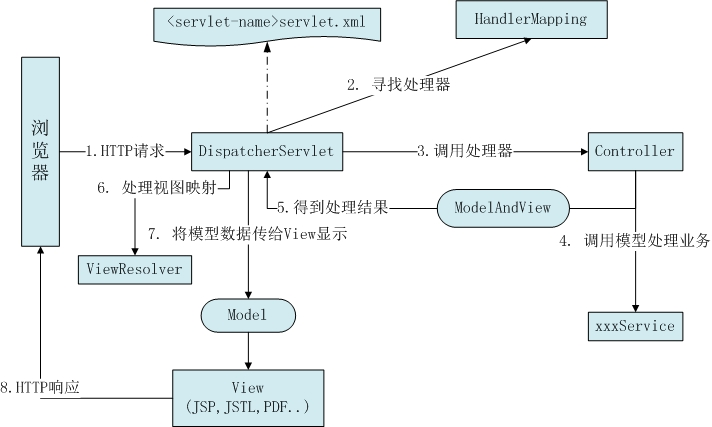
- SpringMVC的工作流程

<!-- slide: 17 -->

## SpringMVC的工作流程

- （1）客户端请求提交到前端控制器DispatcherServlet；
- （2）前端控制器DispatcherServlet查找一个或者多个映射处理器HandlerMapping，从而确定调用哪个页面控制器Controller对请求进行处理；
- （3）DispatcherServlet将请求提交给Controller；
- （4）Controller根据业务逻辑对请求进行处理，并返回ModelAndView；
- （5）DispatcherServlet查找一个或者多个ViewResolver，得到ModelAndView指定的视图view，并将model中的数据传入视图view中进行渲染；
- （6）DispatcherServlet将渲染后的视图返回响应；

<!-- slide: 18 -->

## SpringMVC的工作流程

- DispatcherServlet是Spring MVC的核心，它负责协调SpringMVC的各个组成部分对所有的Http请求进行处理，其主要工作如下：
- （1）截获符合特定格式的Http请求；
- （2）初始化DispatcherServlet上下文对应的WebApplicationContext，并将其与业务层、持久层的WebApplicationContext关联起来；
- （3）初始化Spring MVC的各个组件，并装配到DispatcherServlet中；

<!-- slide: 19 -->

## B/S系统下的MVC和SpringMVC的设计模式对比

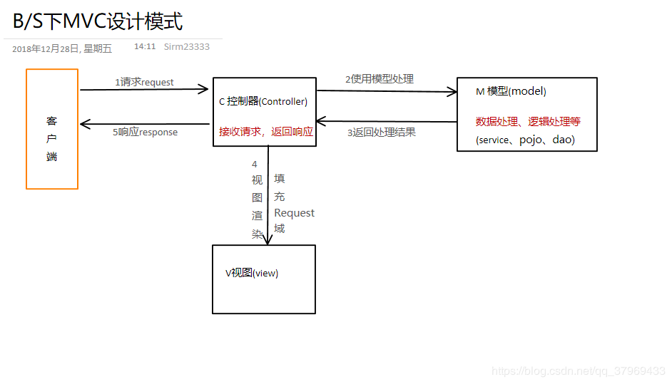

<!-- slide: 20 -->

## B/S系统下的MVC和SpringMVC的设计模式对比

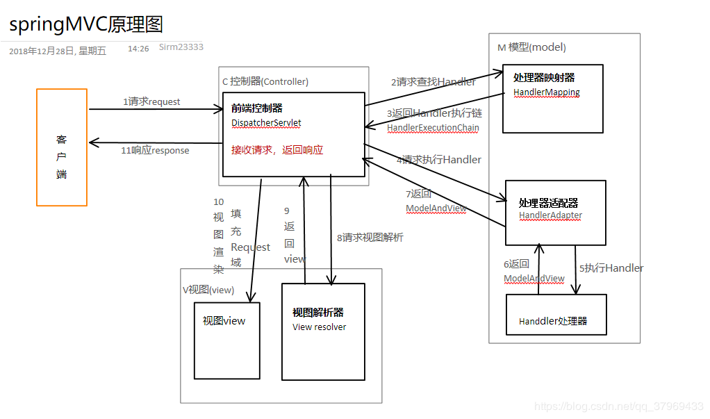

<!-- slide: 21 -->

## JSP + Servlet + JavaBean的MVC

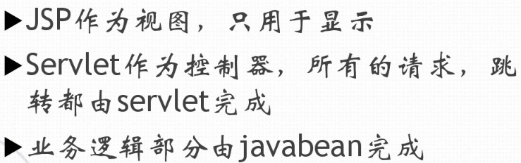
- 流程：

<!-- slide: 22 -->

## JSP + Servlet + JavaBean的MVC

- 技术要点：
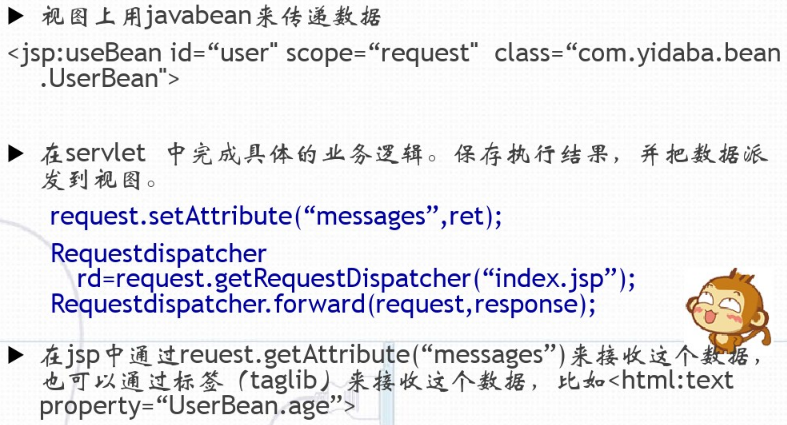

<!-- slide: 23 -->

## JSP + Servlet + JavaBean的MVC

- 结构图：
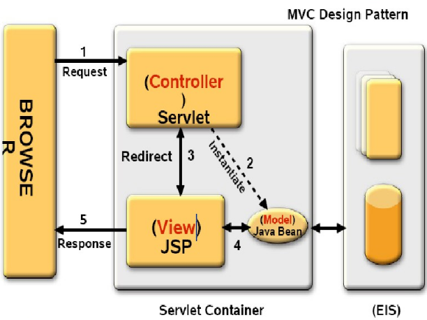

<!-- slide: 24 -->

## MVC设计模式优缺点

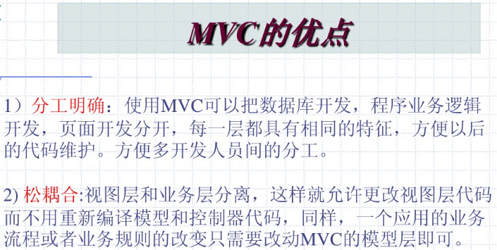

<!-- slide: 25 -->

## MVC设计模式优缺点

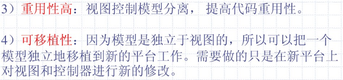

<!-- slide: 26 -->

## MVC设计模式优缺点

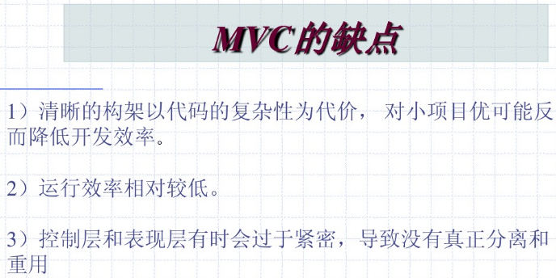

<!-- slide: 27 -->

## MVC设计模式

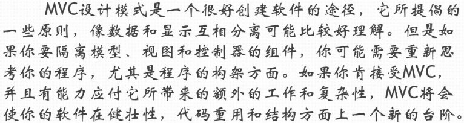

<!-- slide: 28 -->

## MVC设计案例一

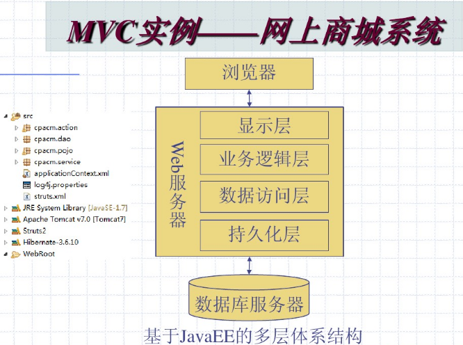

<!-- slide: 29 -->

## MVC设计案例一

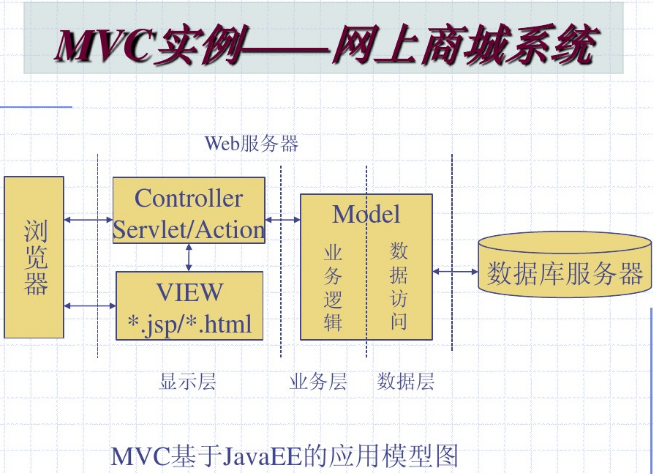

<!-- slide: 30 -->

## MVC设计案例一

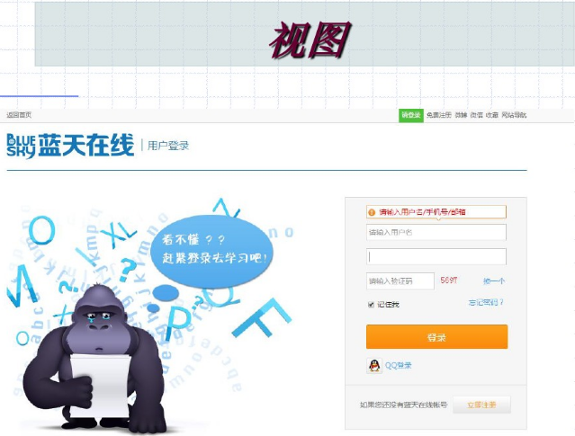

<!-- slide: 31 -->

## MVC设计案例一

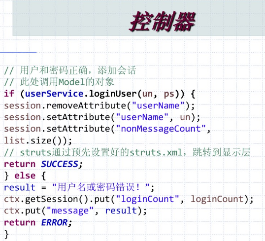

<!-- slide: 32 -->

## MVC设计案例一

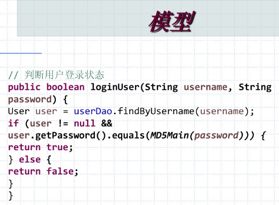

<!-- slide: 33 -->

## MVC设计案例二：在线班级管理系统

- 存在三种对象：学生，教师，管理员；
- 分别能实现登录，教师能实现注册；
- 教师能对学生进行删除修改等操作，管理员可查看所有信息等权限。
- m：为与项目有关所创建的对象和类，如学生类。
- v：用户所看到的界面。
- c：后台控制，实现对不同的对象有不同的权限操作信息

<!-- slide: 34 -->

## MVC设计案例二：在线班级管理系统

- 学生类（M）：
- public class Student
- {
- privateStringrollNo;
- privateString name;
- publicStringgetRollNo()
- {
- return rollNo;
- }
- publicvoid setRollNo(String rollNo)
- {
- this.rollNo= rollNo;
- }
- public String getName(){
- return name;
- }
- public void setName(String name){
- this.name= name;
- }
- }

<!-- slide: 35 -->

## MVC设计案例二：在线班级管理系统

- 视图（V）
- public class StudentView{
- publicvoid printStudentDetails(String studentName,String studentRollNo){
- System.out.println("Student: ");
- System.out.println("Name: "+ studentName);
- System.out.println("Roll No: "+ studentRollNo);
- }
- }

<!-- slide: 36 -->

## MVC设计案例二：在线班级管理系统

- 控制器（C）
- public class StudentController{
- private Student model;
- private StudentView view;
- public StudentController(Student model,StudentView view){
- this.model= model;
- this.view= view;
- }
- public void setStudentName(String name){
- model.setName(name);
- }
- public String getStudentName(){
- return model.getName();
- }
- public void setStudentRollNo(String rollNo){
- model.setRollNo(rollNo);
- }

<!-- slide: 37 -->

## MVC设计案例二：在线班级管理系统

- public String getStudentRollNo(){
- return model.getRollNo();
- }
- public void updateView(){
- view.printStudentDetails(model.getName(),   	model.getRollNo());
- }
- }

<!-- slide: 38 -->

## 金融业量化系统架构

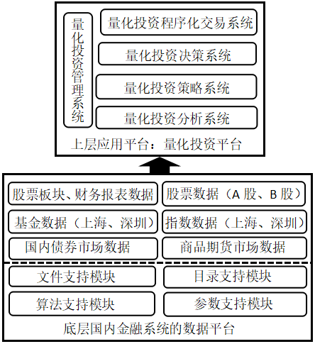

<!-- slide: 39 -->

- 股票市场
- 上海市场
- 深圳市场
- 中小板
- 创业板
- 科创板
- 期货市场
- 中金所
- 大商所
- 郑商所
- 上海金属
- 上海能源
- 各类报表
- 各类板块
- 各类数据库文件
- 各种粒度的数据
- 各种不同的参数

<!-- slide: 40 -->

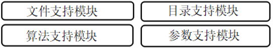
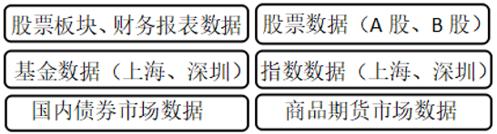

<!-- slide: 41 -->

## 各类不同应用：量化系统

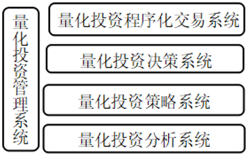

<!-- slide: 42 -->

## MVC设计案例三

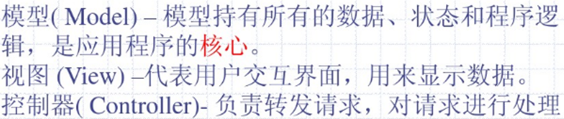
- MVC都可以是复杂的结构，复杂的模型、复杂的控制器、复杂的视图

<!-- slide: 43 -->

## SSH框架

- SSH（struts+spring+hibernate）是目前较流行的一种Web应用程序开源集成框架，用于构建灵活、易于扩展的多层Web应用。集成SSH框架的系统从职责上分为四层：表示层、业务逻辑层、数据持久层和域模块层(实体层)。
- 表示层：通过JSP页面实现交互界面，负责传送请求(Request)和接收响应(Response)，然后Struts根据配置文件(struts-config.xml)将ActionServlet接收到的Request委派给相应的Action处理。
- 业务层：管理服务组件的Spring IoC容器负责向Action提供业务模型(Model)组件和该组件的协作对象数据处理(DAO)组件完成业务逻辑，并提供事务处理、缓冲池等容器组件以提升系统性能和保证数据的完整性。
- 持久层：依赖于Hibernate的对象化映射和数据库交互，处理DAO组件请求的数据，并返回处理结果。
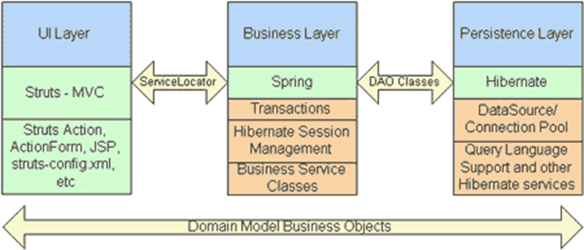

<!-- slide: 44 -->

## Struts介绍

- Struts 是Apache 项目，Struts的前身是Craig R.McClanahan编写的JSP Model2 架构。Struts 在英文中是"支架、支撑"的意思，这表明了 Struts 在Web 应用开发中的巨大作用，采用 Struts 可以更好地遵循 MVC 模式。此外， Struts 提供了一套完备的规范，以及基础类库，可以充分利用 JSP/Servlet 的优点，减轻程序员的工作量，具有很强的可扩展性。
- Struts作为MVC模式的典型实现，对Model、 View和Controller都提供了对应的实现组件，其具体的实现如图所示。
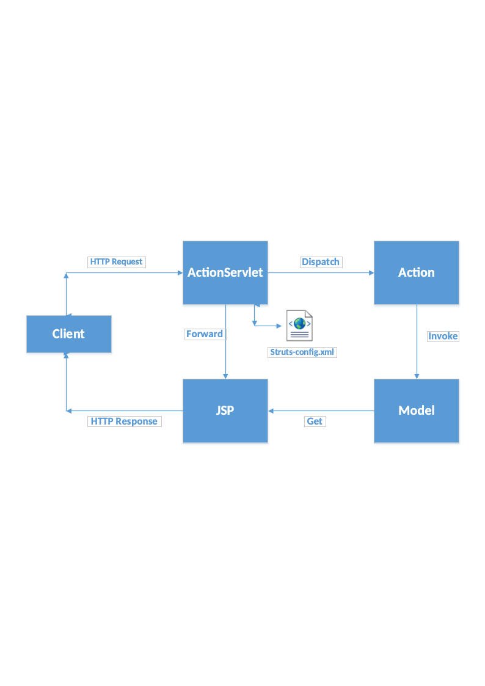
- Struts框架结构图

<!-- slide: 45 -->

## Struts的下载与安装

- Struts 目前的最新版本是1. 2.9 ，下载和安装 Struts 请按如下步骤进行。
- (1)在浏览器的地址栏输入 http://struts.apache.org/download.cgi，下载Struts最新版struts-2.3.15.1-all.zip。
- (2) 将下载到zip文件解压缩，解压缩后有如下文件结构。
  - contrib: 包含了Struts表达式的依赖类库，如JSTL等类库。
  - lib: 包含Struts 的核心类库，Struts 自定义标签库文件以及数据校验的规则文件等。该文件夹下的文件是Struts 的核心部分。
  - webapps: 该文件夹下包含了几个WAR文件，这些WAR文件都是一个Web应用，包含了Struts的说明文档及范例(struts-documentation文件夹下包含了Struts的API文档，用户指南等文档，而struts-examples夹下则包含了Struts 的各种简单范例)等。将这些文件解压缩。
  - 其他license和readme等文档。
- (3)如果需要Web应用增加Struts的支持，则应该将lib文件夹下的jar文件全部复制到Web应用的WEB-INF/llib路径下。

<!-- slide: 46 -->

## Struts的下载与安装

- (4) 如果需要使用Struts的标签库，应该将lib路径下的TLD文件复制到Web应用的WEB-INF路径下，并在Web应用的web.xml文件中配置对应的标签库。
- (5) 如果需要使用Struts 的数据校验，应将lib 路径下的validator-rules.xml文件复制到WEB-INF路径下。
- (6) 如果需要使用Struts表达式，则应将contrib\struts-el\lib 路径下的jar文件复制到WEB-INF路径下，将对应的TLD文件也复制到WEB-INF路径下，并在web.xml文件中配置对应的标签库。

<!-- slide: 47 -->

## Struts的配置

- Struts框架的应用使开发更加规范、统一。所有的控制器都由两部分组成一一核心控制器与业务逻辑控制器。核心控制器负责拦截用户请求，而业务逻辑控制器则负责处理用户请求。为了让核心控制器能拦截到所有的用户请求，应使用模式匹配的Struts 的核心控制器Servlet的URL。配置Struts 的核心控制器，需要在web.xml文件中增加如下代码:
- <!-- 将Struts的核心控制器配置成标准的Servlet-->
- <servlet>
- <servlet-name>actionSevlet</servlet-name>
- <servlet-class>org.apache.struts.action.ActionServlet</servlet-class>
- </servlet>
- <!一 采用模式匹配来配置核心控制器的URL-→
- <servlet-mapping>
- <servlet-name>actionSevlet</servlet-name>
- <url-pattern>*.do</url-pattern>
- </servlet-mapping>

<!-- slide: 48 -->

## Struts的配置

- 核心控制器ActionServlet由系统提供，负责拦截用户请求。业务控制器用于处理用户请求，Struts 要求业务控制器继承Action，下面是业务控制器LoginAction的源代码:
- public class LoginAction extends Action {
- public ActionForward execute(ActionMapping mapping, ActionForm form,
- HttpServletRequest request, HttpServletResponse response)
- throws Exception {
- String username = request.getParameter("username");
- String pass = request.getParameter("pass");// 出错提示
- String errMsg = "";
- /*校验用户名和密码的代码*/********
- catch (Exception e) {
- request.setAttribute("exception", "业务异常");
- return mapping.findForward("error");
- }
- if (errMsg != null && !errMsg.equals("")) {// 如果出错提示不为空，跳转到input
- request.setAttribute("err", errMsg);
- return mapping.findForward("input");
- } else {
- // 否则跳转到welcome
- return mapping.findForward("welcome");
- }
- }
- }
- }

<!-- slide: 49 -->

## Struts的配置

- 使用时必须将该Action配置在Struts 中，让ActionServlet 了解将客户端请求转发给该Action处理。而这一切都是通过struts-config.xml文件完成的。
- 下面是struts-config.xml文件的源代码:
- <?xml version="1.0" encoding="gb2312"?>
- <!-- Strust配置文件的文件头，包含DTD等信息-->
- <!DOCTYPE struts-config PUBLIC
- '-//Apache Software Foundation//DTD Struts Configuration 1. 2//EN"
- ''http://struts.apache.org/dtds/struts-config_l_2.dtd''>
- <!-- Struts配置文件的根元素-->
- <struts-config>
- <actlon-mappings>
- <!-- 配置Struts的Action. Action是业务控制器-->
- <action path="/login" type="lee.Logi nAction" >
- <' 配置该Action的转-->
- <forward name="welcome" path="/WEB-INF/jsp/welcome.jsp"/>
- <!-- 配置该Action的转-->
- <forward name="error" path="/WEB-INF/jsp/error.jsp"/>
- <!--配置该Action的转发-->
- <forward name="input" path="/login.jsp"/>
- <faction>
- <faction-mappings>
- </struts-config>

<!-- slide: 50 -->

## Spring介绍

- Spring是一个开源框架，Spring是于2003年兴起的一个轻量级的Java 开发框架，由Rod Johnson 在其著作Expert One-On-One J2EE Development and Design中阐述的部分理念和原型衍生而来。它是为了解决企业应用开发的复杂性而创建的。框架的主要优势之一就是其分层架构，分层架构允许使用者选择使用哪一个组件，同时为 J2EE 应用程序开发提供集成的框架。
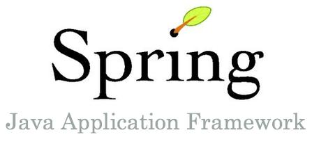

<!-- slide: 51 -->

## Spring特点

- Spring作为开源的中间件，独立于各种应用服务器，甚至无须应用服务器的支持，也能提供应用服务器的功能，如声明式事务等。Spring 致力于J2EE应用的各层的解决方案，而不是仅仅专注于某一层的方案。可以说Spring是企业应用开发的"一站式"选择，并贯穿表现层、业务层及持久层。然而，Spring并不想取代那些已有的框架，而与它们无缝地整合。
- 总结起来，Spring有如下优点:
- 低侵入式设计，代码污染极低。
- 独立于各种应用服务器，可以真正实现WriteOnce, Run Anywhere的承诺。
- Spring的DI机制降低了业务对象替换的复杂性。
- Spring并不完全依赖于Spring，开发者可自由选用Spring框架的部分或全部。

<!-- slide: 52 -->

## Spring的下载与安装

- (1)登录 http://www.springframework.org 站点，下载 Spring 的最新稳定版。
  - dist: 该文件夹下放Spring 的jar包，通常只需要spring.jar文件即可。该文件夹下还有一些类似spring-Xxx.jar的压缩包，这些压缩包是spring.jar压缩包的子模块压缩包。除非确定整个J2EE应用只需使用Spring的某一方面时，才考虑使用这种分模块压缩包。通常建议使用spring.jar。
  - docs: 该文件夹下包含Spring的相关文档、开发指南及API参考文档。
  - lib: 该文件夹下包含Spring编译和运行所依赖的第三方类库，该路径下的类库并不是Spring必需的，但如果需要使用第三方类库的支持，这里的类库就是必需的。
  - samples: 该文件夹下包含Spring 的几个简单示例，可作为Spring入门学习的案例。
  - src: 该文件夹下包含Spring的全部源文件，如果在开发过程中有地方无法把握，可以参考该源文件，了解底层的实现。
  - test: 该文件夹下包含Spring的测试示例。
  - tiger: 该路径下存放关于JOKI.5的相关内容。
  - 解压缩后的文件夹下，还包含一些关于Spring的license和项目相关文件。

<!-- slide: 53 -->

## Spring的下载与安装

- (2) 将spring.jar复制到项目的CLASSPATH路径下，对于Web应用，将spring.jar文件复制到WEB-INF/1ib路径下，该应用即可以利用Spring框架了。
- (3)通常Spring的框架还依赖于其他的一些jar文件，因此还须将lib下对应的包复制到WEB-INF/lib路径下，具体要复制哪些jar文件，取决于应用所需要使用的项目。通常需要复制cglib， dom4j , jakarta-commons , log4j等文件夹下的jar文件。
- (4) 为了编译Java文件，可以找到Spring的基础类，将spring.jar文件的路径添加到环境变量CLASSPATH中。当然，也可使用ANT工具，但无须添加环境变量。

<!-- slide: 54 -->

## Hibernate

- Hibernate是目前最流行的开放源代码的持久层框架，专注于数据库操作。使用Hibernate框架能够使开发人员从繁琐的SQL语句和复杂的JDBC中解脱出来。它对JDBC进行了非常轻量级的对象封装，使得Java程序员可以随心所欲的使用对象编程思维来操纵数据库。 Hibernate可以应用在任何使用JDBC的场合，既可以在Java的客户端程序使用，也可以在Servlet/JSP的Web应用中使用。
- Hibernate是目前最流行的开源对象关系映射(ORM)框架。Hibernate采用低侵入式的设计，完全采用普通的Java对象(POJO)，而不必继承Hibernate 的某个超类或实现Hibernate的某个接口。因为Hibernate是面向对象的程序设计语言和关系数据库之间的桥梁，所以Hibernate允许程序开发者采用面向对象的方式来操作关系数据库。
- ORM的全称是Object/Relation Mapping，对象/关系映射。ORM也可理解是一种规范，具体的 ORM 框架可作为应用程序和数据库的桥梁。基于ORM框架完成映射后，既可利用面向对象程序设计语言的简单易用性，又可利用关系数据库的技术优势。目前流行的ORM框架有产品有：Hibernate、iBATIS、EntityEJB等。

<!-- slide: 55 -->

## Hibernate

- Hibernate的核心接口一共有5个，分别为:Session、SessionFactory、Transaction、Query和Configuration。这5个核心接口在任何开发中都会用到。通过这些接口，不仅可以对持久化对象进行存取，还能够进行事务控制。
- 1)Session接口:Session接口负责执行被持久化对象的CRUD操作(CRUD的任务是完成与数据库的交流，包含了很多常见的SQL语句。)。但需要注意的是Session对象是非线程安全的。同时，Hibernate的session不同于JSP应用中的HttpSession。这里当使用session这个术语时，其实指的是Hibernate中的session，而以后会将HttpSession对象称为用户session。
- 2）SessionFactory接口:SessionFactory接口负责初始化Hibernate。它充当数据存储源的代理，并负责创建Session对象。这里用到了工厂模式。需要注意的是SessionFactory并不是轻量级的，因为一般情况下，一个项目通常只需要一个SessionFactory就够，当需要操作多个数据库时，可以为每个数据库指定一个SessionFactory。
- 3）Configuration接口:Configuration接口负责配置并启动Hibernate，创建SessionFactory对象。在Hibernate的启动的过程中，Configuration类的实例首先定位映射文档位置、读取配置，然后创建SessionFactory对象。
- 4）Transaction接口:Transaction接口负责事务相关的操作。它是可选的，开发人员也可以设计编写自己的底层事务处理代码。
- 5）Query和Criteria接口:Query和Criteria接口负责执行各种数据库查询。它可以使用HQL语言或SQL语句两种表达方式。

<!-- slide: 56 -->

## Hibernate框架图

- Hibernate作为面向对象编程的对象和传统数据库打交道的中介，需要完成对象到数据库表中数据的相互转换，Hibernate框架图如下所示：
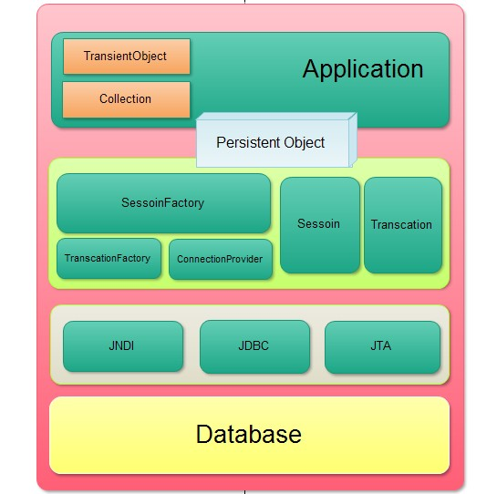

<!-- slide: 57 -->

## Hibernate的下载与安装

- Hibernate 目前的最新版本是 3. 1. 2，安装和使用Hibernate请按如下步骤进行:
- 首先登录http://www.hibernate.org网站，下载Hibernate的二进制包 (windows平台下载zip包，Linux平台下载tar包)。
- 解压缩下载的压缩包，在 hibernate-3.1 路径下有个 hibernate3.jar 的压缩文件，该文件是 Hibernate 的核心类库文件。该路径下还有lib路径，该路径包含Hibernate编译和运行的第三方类库。关于这些类库的使用请参看该路径下的readme.txt文件。
- 将必需的 Hibernate 类库添加到 CLASSPATH 里，或者使用 ANT 工具。
- 总之，编译和运行时可以找到这些类即可。在 Web 应用中，则应该将这些类库复制到
- WEB-INF/lib下。

<!-- slide: 58 -->

## 基于SSH的应用开发案例

- 本节所讲的案例就是一所高等院校的一个信息管理系统的简化模型。首先，一个学校成立之初，随着学校的发展，可能会新增加二级学院，另外一方面也可能由于某些原因，学校需要撤掉某些学院，或者需要修改学院的信息（比如学院名字），有时候还可能要查询学校总共有哪些学院。系统的ER图如下：
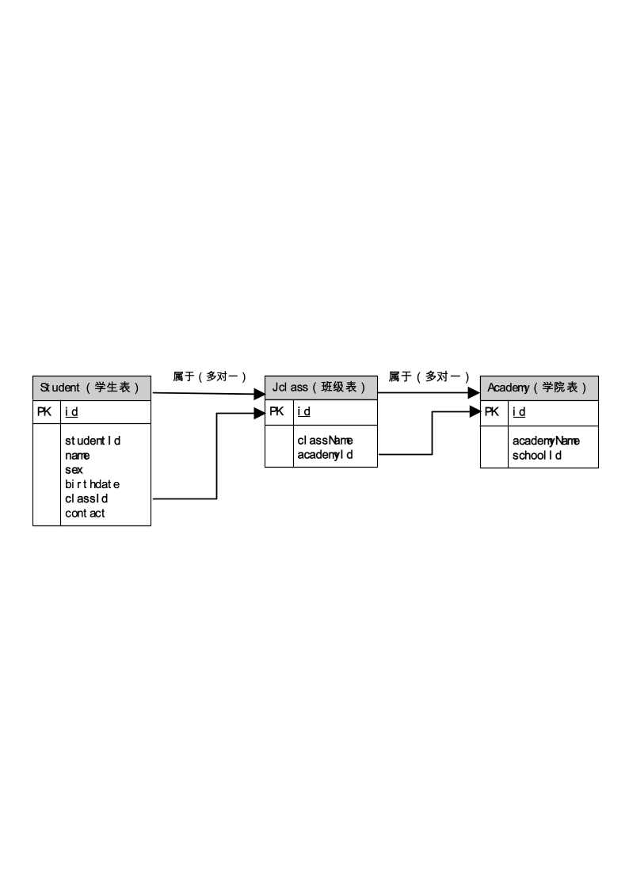
- 系统的ER图

<!-- slide: 59 -->

## 基于SSH的应用开发案例

- 如图，其中register.jsp页面是用做前端显示的。用户可通过此页面，填写学生的基本信息，如姓名、性别、出生年月日等，register.jsp充当的是视图（View）功能。而Student及StudentDao是负责与实际数据库软件打交道的程序，在学生填好register.jsp的信息之后，需要通过StudentDao的数据库操作，把信息更新到数据库中去，其充当的是模型(Model)的功能。而这一切都是在Spring的控制下，进行控制和跳转的，SpringDao和RegisterAction充当的是控制器(Controller)的角色，在整个系统中处于核心的控制功能，从页面的跳转都数据库的更新查询等操作，这一切都是在控制器的控制下进行操作的。
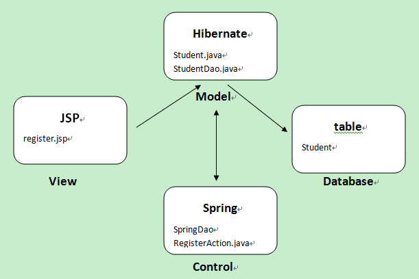

<!-- slide: 60 -->

- Thank you!
