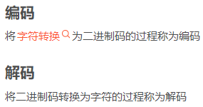
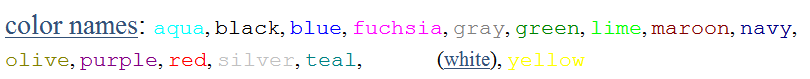

# Lecture 2 HTML and CSS Basics

<!-- slide: 1 -->

## Lecture 2HTML 和 CSS 基础

- Web Programming
- School of Computer Science and Engineering,
- South China University of Technology

<!-- slide: 2 -->

## 概览

- 基础 HTML
- Web 标准
- 基础 CSS
- 思考…

<!-- slide: 3 -->

## 超文本标记语言(HTML)

- 1993: HTML最初的工作草案被提交到互联网工程工作小组 (IETF).
- 1995: HTML 2 标准版作为RFC 1866 发布.
- 1996-97: HTML 3.2 规范了众多包括表单，表格，图像映射 和国际化设置在内的众多特征.
- 1997: HTML 4 作为W3C推荐标准, 增加了样式表, 脚本处理, 框架, 嵌入式对象，国际化设置, 和无效处理的辅助功能.
- 1999: HTML 4.01 是W3C发布的最后一个版本. 目前网络上绝大多数网页仍然用它作为起始语言.
- 2001-01: XHTML, 基于XML的HTML

> 备注：翻译备注：
accessibility for disabilities ： 无效处理的辅助功能

<!-- slide: 4 -->

## 超文本标记语言(HTML)

- 描述网页信息的内容跟结构
  - 不同于网页效果的展示（在屏幕上显示的外观）
- 用开始标签跟结束标签(tags)环绕文本内容
- 每个标签称为一个元素
  - 语法: <element> 内容</element>
  - 示例: 
这是一个段落

- 大多数空格字符在HTML中是可忽略的（被忽略或合并为一个空格）
- 我们将使用的是更严谨，更标准的版本XHTML

<!-- slide: 5 -->

## 超文本标记语言(HTML)

- HTML 编程规范: HTML是树形结构.
  - 缩进嵌套的元素
  - 用空行分隔兄弟节点(siblings)使代码易读.
- HTML 语言的职责
  - HTML 		描述网页的内容跟结构
  - 样式表 (CSS)	 描述网页的外观
  - 脚本(JavaScript)	 描述网页的行为
- index.html
  - http://www.scut.edu.cn/ = http://www.scut.edu.cn/index.html

<!-- slide: 6 -->

## 注释: <!-- … -->

- 为你的HTML文件加入注释或者 “添加注释” 文本
- 注释也可使网页的一段代码无效
- 注释不能嵌套使用，也不能包含 –
- 许多网页不能彻底（或完全地）被注释掉
  - 添加注释是一种沟通途径,，用来向你的同事解释你的设计方法和目的，甚至有时也是为了方便你以后查看.
  - 添加注释不是为了给浏览器跟用户看，而是为了开发者跟设计者.
- <!-- My web page, by Tim Student SS 12345, Spring 2048 -->
- 
SS courses are <!-- NOT --> a lot of fun!

- HTML
- SS courses are a lot of fun!
- output

<!-- slide: 7 -->

## XHTML 网页的结构

- 用head部分描述网页，用body部分来装载网页的内容
- 一个HTML网页被保存在以扩展名.html结尾的文件中
- <?xml version="1.0" encoding="UTF-8"?>
- <!DOCTYPE html PUBLIC "-//W3C//DTD XHTML 1.0 Strict//EN"
- "http://www.w3.org/TR/xhtml1/DTD/xhtml1-strict.dtd"> <html xmlns="http://www.w3.org/1999/xhtml">
- <head>
- information about the page
- </head>
- <body>
- page contents
- </body>
- </html>
- XHTML

> 备注：Header information is used by the browser but not displayed on the page, the most common element in the header is title, and it also includes any CSS style sheets or JavaScript code to attach to the page.

<!-- slide: 8 -->

## 网页的标题: <title>

- 描述该网页的标题
- 放在网页的head部分里面
- 在浏览器的标题栏显示并且作为收藏网页时的标题
- <title>Chapter 2: HTML Basics</title>
- HTML

<!-- slide: 9 -->

## 网页元数据: <meta>

- 描述网页元数据
- 放在网页的head部分里面
- 字符编码(chartset) 在实际操作中非常重要, 我们通常采用 utf-8 编码而不是英文编码
  - 字符编码解码发生在什么地方，什么时候，是怎么执行的？
- <meta name=“description" content=“introduction of SCUT" />
- HTML
- <meta http-equiv="Content-Type" content="text/html; charset=gbk" />
- HTML

- 在HTML解析的过程中进行处理

> 备注：although the charset is also specify by the header of http 
Content-Type: text/html; charset=UTF-8
we often add a meta tag to ensure the page will be rendered by browser correctly, even users store it locally.

<!-- slide: 10 -->

## 字符编码

- 在计算机中处理和显示字符
  - 字符的位宽
  - 恰当的视觉符号
  - 编码 vs.解码
- 字符集
  - ASCII(basic 7b, extension 1B),
  - iso-8859-1/latin-1 (West Europe,1B）
  - GB2312 (2B, Simplified Chinese)
  - GBK(2B, S. & T. Chinese)
  - BIG5 (2B, Traditional Chinese)
  - GB18030 (1,2,4B, Eastern Asia)
  - Unicode (650 languages)
    - UTF-8 (1,2,3,4B , Chinese 3B)
    - UTF-16 (2B, 4B, Chinese 2B)
    - UTF-32 (4B, future)
  - UCS
    - UCS-2 (2B,             comparable with UTF-16)
    - UCS-4 (4B, future)

> 备注：http://hi.baidu.com/yanjinbin/blog/item/0aa7dea2c60edaaacaefd077.html

ASCII及其扩展字符集
作用：表语英语及西欧语言。
位数：ASCII是用7位表示的，能表示128个字符；其扩展使用8位表示，表示256个字符。
范围：ASCII从00到7F，扩展从00到FF。
·        ISO-8859-1字符集
作用：扩展ASCII，表示西欧、希腊语等。
位数：8位，
范围：从00到FF，兼容ASCII字符集。
·        GB2312字符集
作用：国家简体中文字符集，兼容ASCII。
位数：使用2个字节表示，能表示7445个符号，包括6763个汉字，几乎覆盖所有高频率汉字。
范围：高字节从A1到F7, 低字节从A1到FE。将高字节和低字节分别加上0XA0即可得到编码。
·        BIG5字符集
作用：统一繁体字编码。
位数：使用2个字节表示，表示13053个汉字。
范围：高字节从A1到F9，低字节从40到7E，A1到FE。
·        GBK字符集
作用：它是GB2312的扩展，加入对繁体字的支持，兼容GB2312。
位数：使用2个字节表示，可表示21886个字符。
范围：高字节从81到FE，低字节从40到FE。
·        GB18030字符集
作用：它解决了中文、日文、朝鲜语等的编码，兼容GBK。
位数：它采用变字节表示(1 ASCII，2，4字节)。可表示27484个文字。
范围：1字节从00到7F; 2字节高字节从81到FE，低字节从40到7E和80到FE；4字节第一三字节从81到FE，第二四字节从30到39。
·        UCS字符集
作用：国际标准 ISO 10646 定义了通用字符集 (Universal Character Set)。它是与UNICODE同类的组织，UCS-2和UNICODE兼容。
位数：它有UCS-2和UCS-4两种格式，分别是2字节和4字节。
范围：目前，UCS-4只是在UCS-2前面加了0x0000。
·        UNICODE字符集
作用：为世界650种语言进行统一编码，兼容ISO-8859-1。
位数：UNICODE字符集有多个编码方式，分别是UTF-8，UTF-16和UTF-32。
UTF-8：采用变长字节 (1 ASCII, 2 希腊字母, 3 汉字, 4 平面符号) 表示，网络传输, 即使错了一个字节，不影响其他字节，而双字节只要一个错了，其他也错了，具体如下：
如果只有一个字节则其最高二进制位为0；如果是多字节，其第一个字节从最高位开始，连续的二进制位值为1的个数决定了其编码的字节数，其余各字节均以10开头。UTF-8最多可用到6个字节。
UTF-16：采用2字节，Unicode中不同部分的字符都同样基于 现有的标准。这是为了便于转换。从 0x0000到0x007F是ASCII字符，从0x0080到0x00FF是ISO-8859-1对ASCII的扩展。希腊字母表使用从0x0370到 0x03FF 的代码，斯拉夫语使用从0x0400到0x04FF的代码，美国使用从0x0530到0x058F的代码，希伯来语使用从0x0590到0x05FF的代 码。中国、日本和韩国的象形文字（总称为CJK）占用了从0x3000到0x9FFF的代码；
由于0x00在c语言及操作系统文件名等中有特殊意义，故很多情况下需要UTF-8编码保存文本，去掉这个0x00。举例如下：
UTF-16: 0x0080 = 0000 0000 1000 0000
UTF-8:   0xC280 = 1100 0010 1000 0000
UTF-32：采用4字节。
优缺点：
·        UTF-8、UTF-16和UTF-32都可以表示有效编码空间 (U+000000-U+10FFFF) 内的所有Unicode字符。
·        使用UTF-8编码时ASCII字符只占1个字节，存储效率比较高，适用于拉丁字符较多的场合以节省空间。
·        对于大多数非拉丁字符（如中文和日文）来说，UTF-16所需存储空间最小，每个字符只占2个字节。
·        Windows NT内核是Unicode（UTF-16），采用UTF-16编码在调用系统API时无需转换，处理速度也比较快。
·        采用UTF-16和UTF-32会有Big Endian和Little Endian之分，而UTF-8则没有字节顺序问题，所以UTF-8适合传输和通信。
·        UTF-32采用4字节编码，一方面处理速度比较快，但另一方面也浪费了大量空间，影响传输速度，因而很少使用。

<!-- slide: 11 -->

## 块跟内联元素

- 块（block） 元素包含整块区域的内容
  - 示例: 段落, 列表, 表格,单元格
  - 浏览器在块元素之间用空白边缘分隔开
- 内联（inline） 元素作用在一小部分内容上
  - 示例: 加粗文本, 代码片段 , 图像
  - 浏览器允许多个内联元素出现在同一行
  - 必须嵌在块元素里面

> 备注：Block Element: block vs. inline

blank in an element(whitespaces and line breaks) will be collapsed into a single whitespace. blank out of element will be ignored.

<!-- slide: 12 -->

## 段落: 

- 放在 body 部分里面
- 
You're not your job. You're not how much money you have in the bank. You're not the car you drive. You're not the contents of your wallet. You're not your khakis. You're the all-singing, all-dancing crap of the world.

- HTML
- You're not your job. You're not how much money you have in the bank. You're not the car you drive. You're not the contents of your wallet. You're not your khakis. You're the all-singing, all-dancing crap of the world.
- output

<!-- slide: 13 -->

## 换行符:  

- 在块元素中强制换行（内联）
- br 后面必须紧随 />
- 
Teddy said it was a hat,   So I put it on.
 
Now Daddy's sayin',   Where the heck's the toilet plunger gone?

- HTML
- Teddy said it was a hat, So I put it on.
- Now Daddy's sayin', Where the heck's the toilet plunger gone?
- output

<!-- slide: 14 -->

## 标题: <h1>, <h2>, …<h6>

- 在网页中定义标题来分隔主区域（块）
- 更多定义标题的示例
- <h1>South China University of Technology</h1>
- <h2>School of Computer Science and Engineering</h2>
- <h3>Support by Google</h3>
- HTML
- South China University of Technology
- School of Computer Science and Engineering
- Support by Google
- output

<!-- slide: 15 -->

## 语义化的HTML

- 如果你觉得下面的代码在你的浏览器里显示的文本太大了 你会怎么做?
- 把 h1 改为 h3?
- 语义化的HTML – 关注点的分离
  - 选择基于内容的标签而不是基于外观的
  - 灵活的并且可复用的
- <h1>South China University of Technology</h1>
- HTML
- South China University of Technology
- output

> 备注：most browsers show h4 in about the same size of the normal text, and h5 and h6 are in fact smaller than the normal.

! h1 .. h6 is not about appearance, but about structure!

Semantic HTML: A lot of new web developers make the mistake of choosing heading tags based on how each one looks in the browser. They’ll make decisions like: “An h1 looks to large when I used it as the pages’ main header, so I’ll use an h3 instead”. This mistake line of thinking causes other poor decisions, such as creating a blank p paragraph element to get a vertical spacing between two other elements on the page.

The notion of choosing tags based on the meaning of the content rather than its appearance is called semantic HTML.

Semantic HTML strictly separates the concern of structure and appearance. It makes the code more flexible and reusable. It can be used in different devices and browsers.

<!-- slide: 16 -->

## 水平线: 

- 用来分隔网页的主要区域(块)
- 后面必须紧跟着 />
- 
First paragraph

- 

- 
Second paragraph

- HTML
- First paragraph
- Second paragraph
- output

<!-- slide: 17 -->

## 更多关于HTML 的标签

- 有的标签可以包含额外的属性(attribute)
  - 语法: <element attribute1="value1" attribut2="vaule2">content</element>
  - 示例: <a href="page2.html">Next page</a>
- 有的标签不包含内容; 有的标签可以用来打开或关闭内容
  - syntax: <element attribute1="v1" attribut2="v2" />
  - example: 

  - example: 
- src:设置图片路径（相对路径和绝对路径）
- alt：图片不显示时显示所写的字

<!-- slide: 18 -->

## 链接: <a>

- 链接，或者 “锚点”，指向其他页面(内联)
- 使用href 属性指定目标URL链接
  - 可以是绝对的 (指向另一个网页) 或者相对的(指向本网站的另一个页面)
- 锚点是内联元素； 必须放在块元素中，例如 p 或r h1
- 

- Search
- <a href=“http://www.google.com/”>Google</a> or our
- <a href=“lectures.html”>Lecture Notes</a>
- 

- HTML
- Search Google or our Lecture Notes.
- output

> 备注：links are the backbones of the Web

<!-- slide: 19 -->

## 链接: <a>

- 在浏览器中悬停在一个链接上，它的目标URL 将在状态栏中显示
- be descriptiveness!
- 这里体现了什么原则?
- 友善的(Kind).
  - 你必须使你的网页具有描述性，以此使你的浏览者易懂
- Click here to check your course schedule
- output
- Please check your course schedule
- output
- Course Schedule (please check yours before March 15!)”
- output

<!-- slide: 20 -->

## 图像: 

- 在网页中插入绘画图片(内联)
- src 属性指定图片的URL链接
- XHTML 还要求使用一个alt 属性来描述该图片
- 
- HTML
- output

<!-- slide: 21 -->

## 更多关于图像

- 如果插入一个锚点, 图像将变成一个链接
- title 属性指定一个可选提示
- images/gandalf.jpg vs. /images/gandalf.jpg
- <a href="http://theonering.net/">
- 
- </a>
- HTML
- output

<!-- slide: 22 -->

## 短语元素: <em>, <strong>

- em: 强调文本(通常用斜体字表示)
- strong: 语气更强烈强调文本 (通常用粗体显示)
- 如往常一样, 在有效的网页中，标签必须正确地嵌套
- em vs. i,  strong vs. b
  - 再次SoC ~!
- 

- HTML is <em>really</em>,
- <strong>REALLY</strong> fun!
- 

- HTML
- HTML is really, REALLY fun!
- output

<!-- slide: 23 -->

## 嵌套标签

- 反例:
- 标签必须正确地嵌套
  - 一个结束标签必须匹配最近一个开始标签
- 浏览器也许能够正常执行, 但它是无效的XHTML
- 

- HTML is <em>really,
- <strong>REALLY</em> lots of </strong>      fun!
- 

- HTML

<!-- slide: 24 -->

## ul	表示一个项目列表 (块)
            li 	表示在列表里的单个列表项目(块)

- 无序列表: <ul>, <li>
- <ul>
- <li>No shoes</li>
- <li>No shirt</li>
- <li>No problem!</li>
- </ul>
- HTML
- No shoes
- No shirt
- No problem!
- output

<!-- slide: 25 -->

## 一个列表可以包含其他列表:

- 更多关于无序列表
- <ul>
- <li>Simpsons:
- <ul>              	<li>Homer</li>            	<li>Marge</li>
- </ul>
- </li>
- <li>Family Guy:
- <ul>
- <li>Peter</li>
- <li>Lois</li>
- </ul>
- </li>
- </ul>
- HTML
- Simpsons:
  - Homer
  - Marge
- Family Guy:
  - Peter
  - Lois
- output

<!-- slide: 26 -->

## ol 表示一个有编号的项目列表(块)

- 有序列表: <ol>
- 
RIAA business model:

- <ol>
- <li>Sue customers for copying music</li>
- <li>???</li>
- <li>Profit!</li>
- </ol>
- HTML
- RIAA business model:
- Sue customers for copying music
- ???
- Profit!
- output

<!-- slide: 27 -->

## 概览

- 基础HTML
- Web 标准
- 基础CSS
- 思考…

<!-- slide: 28 -->

## Web 标准

- 编写正确的 XHTML 代码和遵循正确的语法是非常重要的 .
- 为什么要使用XHTML 和 Web 标准?
  - 更严谨和结构化的语言
  - 更跨浏览器的支持
  - 更符合我们未来网页的正确展示标准
  - 可以跟其他XML 数据如SVG (graphics), MathML, MusicML, 等交互 .

<!-- slide: 29 -->

## XHTML 版本

- XHTML 1.0 (W3C 推荐)
  - HTML 4.01， 带有 XML语法
  - XHTML 1.0 Strict, XHTML 1.0 Transitional, XHTML 1.0 Frameset
- XHTML 1.1 (W3C推荐)
  - 基于模块的 XHTML
  - Ruby 特性  北 京 (ㄅㄟˇ ㄐ一ㄥ)  (běi jīng)
- XHTML 1.2
  - 通过RDFa 的支持，改进了语义网(Semantic Web)
  - 草案,  并未被广泛采用
- XHTML 2.0
  - 不向后兼容
  - 只有草案, 并非标准, 在2009 年底被废除
- XHTML 5
  - HTML5 规范的一部分(发展中)

> 备注：module-based XHTML: an abstract collection of components through which XHTML can be subsetted and extended. By this means allow XHTML being rendered differently in various devices.
Core modules are:
Structure (html, head, body, title...)
Text (h1, h2, h3... p, pre...)
Hypertext (a)
List (ul, li...)
Other modules include applet, image, forms and basic forms.

<!-- slide: 30 -->

## XHTML 1.0 vs HTML 4.01

- 所有的标签必须有结束
- 所有的标签必须正确地嵌套
- 所有标签属性必须 放在引号里面
- 字符 & 不能单独使用, 要用&amp; 代替
- 标签是大小写敏感的，必须全部使用小写格式
- 属性不能再进一步被最小化
- XHTML 文档必须以如下XML 声明为开头：
  - <?xml version="1.0" encoding="UTF-8"?>
- 不同的 DOCTYPE  声明：
  - <!DOCTYPE html PUBLIC "-//W3C//DTD XHTML 1.0 Strict//EN”	"http://www.w3.org/TR/xhtml1/DTD/xhtml1-strict.dtd">
- <html> 标签要求有 xmlns 属性

> 备注：module-based XHTML: an abstract collection of components through which XHTML can be subsetted and extended. By this means allow XHTML being rendered differently in various devices.
Core modules are:
Structure (html, head, body, title...)
Text (h1, h2, h3... p, pre...)
Hypertext (a)
List (ul, li...)
Other modules include applet, image, forms and basic forms.

<!-- slide: 31 -->

## W3C XHTML 验证器

- validator.w3.org
- 检查你的HTML代码，确保它符合XHTML官方语法
- 比浏览器更严格, 能帮助你改正错误的XHTML
- 

- <a href=“http://validator.w3.org/check/referer”>
- 
- </a>
- 

- HTML
- output

<!-- slide: 32 -->

## 概览

- 基础HTML
- Web 标准
- 基础 CSS
- 思考…

<!-- slide: 33 -->

## 不好的使用样式属性的方式

- 诸如b, i, u, 和font 等标签在严格的XHTML中是不被提倡的
  - 为什么那是不好的?
- 

- Welcome to Greasy Joe's.
- You will <b>never</b>, <i>ever</i>, <u>EVER</u>
- beat OUR prices!
- 

- HTML
- Welcome to Greasy Joe's. You will never, ever, EVER beat OUR prices!
- output

<!-- slide: 34 -->

## 层叠样式表(CSS): <link>

- CSS 描述外观跟布局
  - 不同于用来描述网页的内容 的HTML
  - 能用于屏幕或者打印
- 可以嵌入 HTML中 或者 放在独立的.css 文件中(推荐)
- <head>
- 
- </head>
- Embedded in HTML
- <head>
- ...
- <link href="filename" type="text/css" rel="stylesheet" media="screen" />
- ...
- </head>
- standalone CSS file

> 备注：Although it can be embedded directly in a HTML element by its style attribute, you should do everything you can to avoid this usage, why?

<!-- slide: 35 -->

## 基础 CSS 规则的语法

- 注释 : /* …. */
- 一个 CSS 文件包含一条或多条规则
- 每条规则以一个选择器(selector)开始， 该选择器选中了了一个（或多个）HTML 元素 然后对它们应用样式属性
  - 一个 *  选择器选择了全部的元素
- selector {
- property 1: value 1;
- …
- property n: value n;
- }
- CSS
- p {
- font-family: sans-serif;
- color:red;
- }
- CSS

> 备注：Property names are always lowercase. Properties with multi-word names separated with hypens, such font-family

<!-- slide: 36 -->

## CSS 颜色属性

- p {
- color: red;
- background-color: yellow;
- }
- CSS
- output
- This paragraph uses style above

| 属性 | 描述 |
|---|---|
| color | 元素中的文本颜色 |
| background-color | 元素的背景属性 |

<!-- slide: 37 -->

## 设定颜色

- p { color: red; }
- h2 { color: rgb(128, 0, 196); }
- h4 { color: #FF8800; }
- CSS
- This paragraph uses the first style above.
- This h2 uses the second style above.
- This h4 uses the third style above.
- output
- RGB 格式: 指定红, 绿, 蓝 基色的值， 取值从0 (none) 到255 (full)
- 十六进制格式: 从00 (0, none) 到FF (255, full)的16进制RGB值

<!-- slide: 38 -->

## CSS 字体属性

| 属性 | 描述 |
|---|---|
| font-family | 指定使用的字体 |
| font-size | 指定字体大小 |
| font-style | 用于使用/取消 斜体字 |
| font-weight | 用于使用/取消 粗体字 |
| 完整的字体属性列表 |  |

<!-- slide: 39 -->

## font-family

- p { font-family; Georgia; }
- h2 { font-family: "Courier New"; }
- CSS
- This paragraph uses the Georgia font.
- This h2 uses the Courier New font.
- output
- 中文字体
  - 大多数浏览器仅支持 SimSon（“宋体” ）
  - IE 可以支持Windows操作系统支持的字体
    - 黑体：SimHei	新宋体：NSimSun	仿宋：FangSong  SimFang?楷体：KaiTi    SimKai?	仿宋_GB2312：FangSong_GB2312楷体_GB2312：KaiTi_GB2312	微软雅黑体：Microsoft YaHei
    - …

<!-- slide: 40 -->

## 更多关于 font-family

- p {
- font-family: Garamond, “Times New Roman”, serif;
- }
- CSS
- If no Garamond then uses TNR, and then uses serif.
- output
- 将多种字体名称放入引号里
- 可以对多种字体从高到低指定优先权
- 通用字体名称 :
  - serif, sans-serif, monospace, cursive

> 备注：In the not-so-distant future, you’ll be able to link fonts to your
pages using @font-face. Unfortunately, support is weak in older
browsers. Firefox 3.5 and Safari 4 support @font-face, but previous
versions do not. Internet Explorer has supported @font-face
for a long time, even on IE 6, but IE requires you to convert fonts
to its own proprietary format.
But very soon, you’ll be defining your fonts like this:
@font-face {
font-family: "YourFont";
src: url(/fonts/yourfont.ttf) format("truetype");
}
h1 { font-family: "YourFont", sans-serif }
This approach is extremely flexible and easy to implement,
except for one catch: most fonts, like photographs, need to be
licensed for use like this. They have a copyright, and you have
to respect it. Unlike using a font in an image or embedding it in a
Flash movie, you’re actually distributing the font here, because
the client’s browser needs to download it. – “Web Deign for Developers”

<!-- slide: 41 -->

## font-size

- p {
- font-size: 20pt;
- }
- CSS
- This paragraph uses font size 20pt.
- output
- 单位: 像素 (px) vs. 点(pt) vs. m-size(em)
  - 16px, 16pt, 1.16em
- 模糊的字体小: xx-small, x-small, small, medium, large, x-large, xx-large, smaller, larger
- 百分比的字体大小, e.g.: 90%, 120%

> 备注：http://css-tricks.com/css-font-size/

px: If you need fine-grained control, sizing fonts in pixel values (px) is an excellent choice (it’s my favorite). On a computer screen, it doesn’t get any more accurate than a single pixel. With sizing fonts in pixels, you are literally telling browsers to render the letters exactly that number of pixels in height. Default 14px in most of browsers.

pt: Point values are only for print CSS! A point is a unit of measurement used for real-life ink-on-paper typography. 72pts = one inch. 

em: 1em is equal to the current font-size of the element in question

Historically I think the “em” value is based on the width of the uppercase M

Relative fonts used to be hailed as an accessibility feature for the visually
impaired because the user could increase the font size using the
web browser. However, it made things worse because images didn’t
resize with the fonts, causing strange page flows and readability problems
-- “Web Design for Developer”

<!-- slide: 42 -->

## font-weight, font-style

- p {
- font-weight: bold;
- font-style: italic
- }
- CSS
- This paragraph is bold and italic.
- output
- 上述属性都可通过设置为normal来取消相应属性

> 备注：http://css-tricks.com/css-font-size/

px: If you need fine-grained control, sizing fonts in pixel values (px) is an excellent choice (it’s my favorite). On a computer screen, it doesn’t get any more accurate than a single pixel. With sizing fonts in pixels, you are literally telling browsers to render the letters exactly that number of pixels in height. Default 14px in most of browsers.

pt: Point values are only for print CSS! A point is a unit of measurement used for real-life ink-on-paper typography. 72pts = one inch. 

em: 1em is equal to the current font-size of the element in question

Historically I think the “em” value is based on the width of the uppercase M

<!-- slide: 43 -->

## 概览

- 基础 HTML
- Web  标准
- 基础 CSS
- 思考…

<!-- slide: 44 -->

## 思考…

- 有何不同?
- void swamp(int a, int b) {
- int temp;
- temp = a;
- a = b;
- b = temp;
- }
- C
- <html>
- ….
- <body>
- <h1>Supper Man</h1>
- 

- The guy teaches you Web.
- 

- ….
- HTML
- <?php
- $file="1.txt“;
- $fp=fopen($file,"r");
- $content= fread(
- $fp,filesize($file));
- fclose($fp);
- ?>
- PHP
- body {
- background-color: #997788;
- font-family: SimSon;
- }
- h1 {
- color: blue
- }
- CSS

<!-- slide: 45 -->

## 声明式编程

- 命令式 vs. 声明式
  - 声明式编程 是一种编程范式 ，表达了一个不用描述控制流的逻辑 运算 .       -- Lloyd, J.W., Practical Advantages of Declarative Programming
  - 与此相反的是 命令式编程 , 它需要提供一个明确的算法 .
- 子范式
  - 函数式编程: Scheme, Erlang, Haskell, …
  - 逻辑编程: Prolog
  - 特定领域语言: SQL, CSS, HTML, XSLT, SVG, XAML, regular expressions
  - 约束规划:约束规划经常被用来作为其他模式的一个补充
  - 混合语言: Makefiles, yacc

> 备注：http://en.wikipedia.org/wiki/Declarative_programming

Functional programming: While functional languages typically do appear to specify "how," a compiler for a purely functional programming language is free to extensively rewrite the operational behavior of a function, so it can be considered as a Declarative Programming.
 
Logic programming: Logic programming languages such as Prolog state and query relations. The specifics of how these queries are answered is up to the implementation and its theorem prover

Hybrid languages: Makefiles, for example, specify dependencies in a declarative fashion [3], but include an imperative list of actions to take as well. yacc specifies a context free grammar declaratively,

<!-- slide: 46 -->

## 总结

- HTML
  - HTML & XHTML
  - HTML 标签: title, meta, p, h1, ..., hr, a, img, br, 注释, em, strong, ul, ol, li
  - 块vs. 内联
  - 字符编码
- CSS
  - 为什么? 怎么样?
  - 链接, 规则
  - 属性:  color相关, fonts相关
- 思考:
  - SoC
  - Declarative Programming

<!-- slide: 47 -->

## 练习

- 为你自己写一个网页，包含自我介绍，最近图片，这学期选择的课程，和一些最喜欢的电影
  - 你的自我介绍必须超过一个段落
  - 你的课程必须放在一个有序列表里面
  - 你的最喜欢的电影必须放在一个无序列表里面
  - 设置一个链接指向SE-805课程的网站
  - 为了易读，请使用不同的字体

<!-- slide: 48 -->

## 进阶阅读

- http://en.wikipedia.org/wiki/XHTML
- http://en.wikipedia.org/wiki/Cascading_Style_Sheets
- 章节1~8, Web Programming with HTML, XHTML, and CSS http://my.ss.sysu.edu.cn:8080/display/W2PSC/References+and+Books
- HTML标签列表: http://www.w3schools.com/tags/default.asp
- HTML 字符集列表: http://www.w3schools.com/tags/ref_entities.asp
- XHTML 1.1 说明文档. http://www.w3.org/TR/xhtml11/
- XHTML 1.1 元素参考: http://www.w3.org/2007/07/xhtml-basic-ref.html
- W3  CSS 所有属性列表: http://www.w3.org/TR/CSS21/propidx.html
- W3 CSS 2.1 说明文档: http://www.w3.org/TR/CSS21/
- 各操作系统支持的字体: http://www.apaddedcell.com/web-fonts

<!-- slide: 49 -->

- Thank you!
