# Lecture 3 More Basic HTM and CSS(C)

<!-- slide: 1 -->

## 第三讲更多基础的HTML和CSS

- Web Programming
- School of Computer Science and Engineering,
- South China University of Technology

<!-- slide: 2 -->

## 概要

- 更多HTML元素
- 更多基础的CSS
- CSS实践

<!-- slide: 3 -->

## 网页元数据: <meta>

- HTML语言head区的一个辅助性标签，位于文档的头部，不包含任何内容。 标签的属性定义了与文档相关联的名称/值对。
- meta元素可提供相关页面的元信息（meta-information），比如针对搜索引擎和更新频度的描述和关键词。
- meta标签共有两个属性，它们分别是http-equiv属性和name属性，不同的属性又有不同的参数值，这些不同的参数值就实现了不同的网页功能。

<!-- slide: 4 -->

## 网页元数据: <meta>

- name
  - author
  - description
  - keywords
  - generator
  - revised
- http-equiv
  - content-type
  - expires
  - refresh
- <meta http-equiv="Content-Type" content="text/html; charset=iso-8859-1" />
- <meta name="description" content="Authors' web site for Building Java Programs." />
- <meta name="keywords" content="java, textbook" />
- XHTML
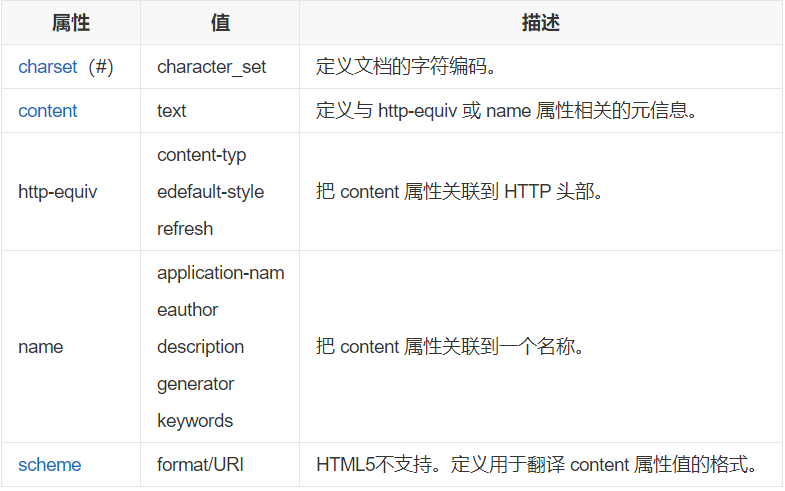

<!-- slide: 5 -->

## 网页元数据: <meta>

- name属性主要用于描述网页，与之对应的属性值为content，content中的内容主要是便于搜索引擎机器人查找信息和分类信息用的。
- meta标签的name属性语法格式是：<meta name="参数" content="具体的参数值">；。
- http-equiv属性相当于http的文件头作用，它可以向浏览器传回一些有用的信息，以帮助正确和精确地显示网页内容，与之对应的属性值为content，content中的内容其实就是各个参数的变量值。
- meta标签的http-equiv属性语法格式是：<meta http-equiv="参数" content="参数变量值"> ；

<!-- slide: 6 -->

## 网页元数据: <meta>

- 如果你能够用好meta标签，会给你带来意想不到的效果，例如加入关键字会自动被大型搜索网站自动搜集；可以设定页面格式及刷新等等。
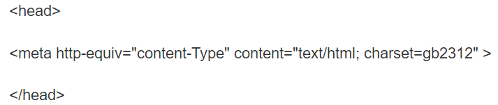
- content-Type（显示字符集的设定）

<!-- slide: 7 -->

## 网页元数据: <meta>

- 其中name属性主要有以下几种参数：
- A、Keywords（关键字）
- 说明：keywords用来告诉搜索引擎你网页的关键字是什么。
- 举例：<meta name ="keywords" content="science,education,culture,politics,ecnomics,relationships,entertainment,human">
- B、description（网站内容描述）
- 说明：description用来告诉搜索引擎你的网站主要内容。
- 网站内容描述（description）的设计要点：
- ①网页描述为自然语言而不是罗列关键词（与keywords设计正好相反）；

<!-- slide: 8 -->

## 网页元数据: <meta>

- C、robots（机器人向导）
- 说明：robots用来告诉搜索机器人哪些页面需要索引，哪些页面不需要索引。
- content的参数有all,none,index,noindex,follow,nofollow。默认是all。
- 举例：<meta name="robots" content="none">
- D、author（作者）
- 说明：标注网页的作者

<!-- slide: 9 -->

## 网页元数据: <meta>

- meta标签的http-equiv属性语法格式是：<meta http-equiv="参数" content="参数变量值"> ；其中http-equiv属性主要有以下几种参数：
- A、Expires（期限）：可以用于设定网页的到期时间。一旦网页过期，必须到服务器上重新传输。
- 用法：<meta http-equiv="expires" content="Fri,12 Jan 2001 18:18:18 GMT">
- 注意：必须使用GMT的时间格式。
- B、Pragma(cache模式）：禁止浏览器从本地计算机的缓存中访问页面内容。
- 用法：<meta http-equiv="Pragma" content="no-cache">
- 注意：这样设定，访问者将无法脱机浏览。

<!-- slide: 10 -->

## 网页元数据: <meta>

- C、Refresh（刷新）：自动刷新并转到新页面。
- 用法：<meta http-equiv="Refresh" content="2;URL">；（注意后面的分号，分别在秒数的后面和网址的前面，URL可为空）注意：其中的2是指停留2秒钟后自动刷新到URL网址。
- D、Set-Cookie(cookie设定）：如果网页过期，那么存盘的cookie将被删除。
- 用法：<meta http-equiv="Set-Cookie" content="cookievalue=xxx; expires=Friday,12-Jan-2001 18:18:18 GMT; path=/">注意：必须使用GMT的时间格式。
- E、Window-target（显示窗口的设定）：强制页面在当前窗口以独立页面显示。
- 用法：<meta http-equiv="Window-target" content="_top">
- 注意：用来防止别人在框架里调用自己的页面。

<!-- slide: 11 -->

## 网页元数据: <meta>

- F、content-Type（显示字符集的设定）
- 说明：设定页面使用的字符集。
- 用法：<meta http-equiv="content-Type" content="text/html; charset=gb2312">
- G、content-Language（显示语言的设定）
- 用法：<meta http-equiv="Content-Language" content="zh-cn" />

<!-- slide: 12 -->

## 网页元数据: <meta>

- 功能
- 上面我们介绍了meta标签的一些基本组成，接着我们再来一起看看meta标签的常见功能：
- 帮助主页被各大搜索引擎登录
- 定义页面的使用语言
- 自动刷新并指向新的页面
- 动画效果
- 网页定级评价
- 控制网页窗口

<!-- slide: 13 -->

## 网页元数据: <meta>

- 其他用法
- scheme(方案)
- 用于指定要用来翻译属性值的方案。此方案应在由 <head> 标签的 profile 属性指定的概况文件中进行了定义。
- 用法：<meta scheme="ISBN" name="identifier" content="0-14-XXXXXX-1" >
- Link （链接）
- 说明：链接到文件
- 用法：<Link href="soim.ico" rel="Shortcut Icon">
- Base (基链接)
- 说明：插入网页基链接属性

<!-- slide: 14 -->

## 表格: <table>, <tr>, <td>, <th>, <caption>

| name | gender |
|---|---|
| Bill | male |
| Susan | female |

- <table>
- <caption>Smart Guys</caption>
- <tr><th>name</th><th>gender</th></tr>
- <tr><td>Bill</td><td>male</td></tr>
- <tr><td>Susan</td><td>female</td></tr>
- </table>
- HTML
- output
- 不要使用表格进行布局~!
- Smart Guys

| name | gender |
|---|---|
| Bill | male |
| Susan | female |

<!-- slide: 15 -->

## 表格: <table>, <tr>, <td>, <th>, <caption>

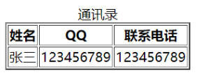
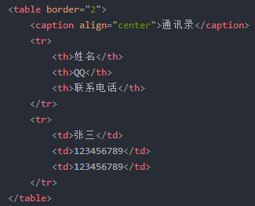

<!-- slide: 16 -->

## 定义列表: <dl>, <dt>, <dd>

- dl 表示一个定义列表(块元素)
- dt 表示每一个项目(即术语), 而 dd 表示它的意义
- <dl>
- <dt>newbie</dt><dd>one who does not have mad skills</dd>
- <dt>own</dt><dd>to soundly defeat
- (e.g. I owned that newbie!)</dd>
- <dt>frag</dt> <dd>a kill in a shooting game</dd>
- </dl>
- HTML
- newbie
- one who does not have mad skills
- own
- to soundly defeat (e.g. I owned that newbie!)
- frag
- a kill in a shooting game
- output

<!-- slide: 17 -->

## 引用: <blockquote>

- 一段长引用(块元素)
- 
As Lincoln said in his famous Gettysburg Address:
 <blockquote>
  - 
Fourscore and seven years ago, our fathers brought forth on this continent a new nation, conceived in liberty, and dedicated to the proposition that all men are created equal.

- </blockquote>
- HTML
- As Lincoln said in his famous Gettysburg Address:
  - Fourscore and seven years ago, our fathers brought forth on this continent a new nation, conceived in liberty, and dedicated to the proposition that all men are created equal.
- output

<!-- slide: 18 -->

## 行内引用: <q>

- 一段短引用(行内元素)
- 
Quoth the Raven, <q>Nevermore.</q>

- HTML
- Quoth the Raven, “Nevermore”.
- output
- 为什么不直接这样写?
  - 
Quoth the Raven, "Nevermore."

- 基于以下两个理由,我们不使用 “ :
  - XHTML不应该包含文字的引用符号; 他们应该写成 &quot;
  - 使用 <q>允许我们将CSS样式应用于quotations中

<!-- slide: 19 -->

## HTML字符实体

- 完整的HTML字符实体列表
- 你会如何显示网页上的&amp;?
- 在网页中表示任何unicode字符的方法

| 字符 | 实体 |
|---|---|
| < > | &lt; &gt; |
| é è ñ | &eacute; &egrave; &ntilde; |
| ™ © | &trade; &copy; |
| π δ Δ | &pi; &delta; &Delta; |
| И | &#1048; |
| " & | &quot; &amp; |

<!-- slide: 20 -->

## HTML-编码文本

- &lt;p&gt; &lt;a href=&quot;http://google.com/search?q=marty&amp;ie=utf-8&amp;aq=t&quot;&gt; Search Google for Marty &lt;/a&gt; &lt;/p&gt;
- HTML
- 
 <a href="http://google.com/search?q=marty&ie=utf-8&aq=t"> Search Google for Marty </a> 

- output
- 在网页中，要照原样显示含有html标签的文本，我们需要对那些特定字符进行转义，使用相应的转义字符（如上例）。

<!-- slide: 21 -->

## 计算机代码: <code>

- code: 一段简短的计算机代码(通常会通过固定宽度的字体呈现出来)
- 
 The <code>ul</code> and <code>ol</code> tags make lists. 

- HTML
- The ul and ol tags make lists.
- output

<!-- slide: 22 -->

## 预编排文字: <pre>

- 一大段预编排的文字(块元素)
- <pre>
- Steve Jobs speaks loudly
- reality distortion
- Apple fans bow down
- </pre>
- HTML
- Steve Jobs speaks loudly
- reality distortion
- Apple fans bow down
- output
- 显示时会保留空格和回车
- 以默认的等宽度字体显示
- 如果我们把它包含在code标签里面,它看起来会是怎样的?

<!-- slide: 23 -->

## 概要

- 更多HTML元素
- 更多基础的CSS
- CSS实践

<!-- slide: 24 -->

## 样式分组

- p, h1, h2 {
- color: green;
- }
- h2 {
- background-color: yellow;
- }
- CSS
- This paragraph uses the above style.
- output
- 一种样式可以选择多个元素, 由逗号分隔
- 单独的元素也可以拥有自己的样式 (例如上面的h2)
- This h2 uses the above style.

<!-- slide: 25 -->

## CSS的文本属性

| 属性 | 描述 |
|---|---|
| text-align | 文本的水平对齐方式 |
| text-decoration | 文本的修饰, 例如下划线 |
| line-height, word-spacing, letter-spacing | 文本的间隔 |
| text-indent | 每一段落的首字符缩进 |
| 完整的文本属性列表 |  |

<!-- slide: 26 -->

## text-align

- text-align 可以是 left, right, center, 或者 justify (两端对齐, 并使各行长度相等)
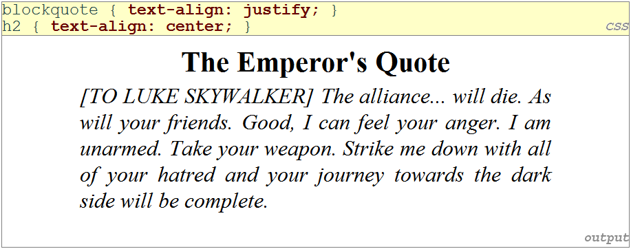

<!-- slide: 27 -->

## text-decoration

- 可以是
- 可以组合其效果:
  - text-decoration: overline underline
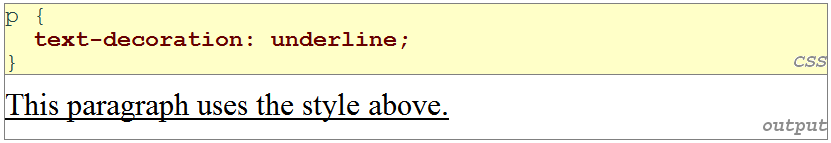
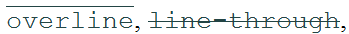
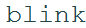
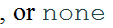

<!-- slide: 28 -->

## list-style-type 属性

- ol { list-style-type: upper-roman }
- CSS
- 可能的值: none : 没有标记
  - disc (default), circle, square
  - decimal : 1, 2, 3, etc.
  - decimal-leading-zero : 01, 02, 03, etc.
  - lower-roman : i, ii, iii, iv, v, etc.
  - upper-roman : I, II, III, IV, V, etc.
  - lower-alpha : a, b, c, d, e, etc.
  - upper-alpha : A, B, C, D, E, etc.
  - lower-greek : alpha, beta, gamma, etc.
  - 其它: hebrew, armenian, georgian, cjk-ideographic, hiragana, katakana, hiragana-iroha, katakana-iroha

<!-- slide: 29 -->

## 概要

- 更多HTML元素
- 更多基础的CSS
- CSS实践

<!-- slide: 30 -->

## Body 样式

- 要把一种样式应用到网页中的整个body, 你需要写一个body元素的选择器
- 避免让你手动为每一个元素添加样式
- body { font-size: 16px; }
- CSS

<!-- slide: 31 -->

## 层叠样式表

- 它被称为层叠样式表是因为元素的属性以以下的顺序 层叠 在一起:
  - 浏览器的默认样式
  - 外部样式表文件 (在<link>标签里面)
  - 内部样式表 (在网页头的<style>标签里面)
  - 行内样式 (HTML 元素的样式属性)

<!-- slide: 32 -->

## 继承样式

- 当多种样式应用到某一个元素时, 它们是可以被继承的
- 一个更紧密匹配的规则可以覆盖一个更通用的继承而来的规则
- 不是所有的属性都是可以被继承的(注意上面的链接颜色)
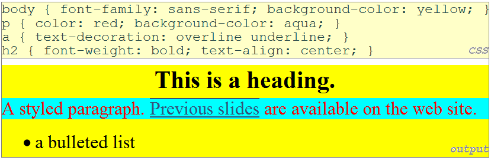

<!-- slide: 33 -->

## 冲突的样式

- 当两种样式为同一个属性设定了冲突的值时, 后一个样式会取得更高的优先级
- (稍后我们会学到特殊的样式, 它们可以覆盖通用的样式)
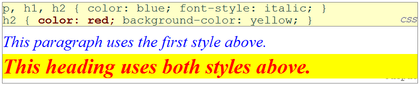

<!-- slide: 34 -->

## W3C CSS 验证器

- jigsaw.w3.org/css-validator/
- 检查你的CSS, 确保它符合官方CSS规格
- 比浏览器严格,  因为浏览器可能正确的渲染畸形的CSS
- 

- <a href="http://jigsaw.w3.org/css-validator/check/referer">
- 
- </a>
- 

- HTML
- output

<!-- slide: 35 -->

## CSS 的背景属性

| 属性 | 描述 |
|---|---|
| background-color | 背景色 |
| background-image | 背景图 |
| background-position | 相对于元素的背景位置 |
| background-repeat | 背景是否/如何被重复 |
| background-attachment | 背景是否随页面滚动 |

<!-- slide: 36 -->

## background-image

- 背景图/颜色充满元素的内容区域
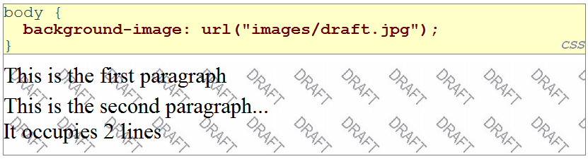
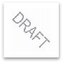
- draft.jpg

<!-- slide: 37 -->

## background-repeat

- 可以是repeat (默认), repeat-x, repeat-y, 或者no-repeat
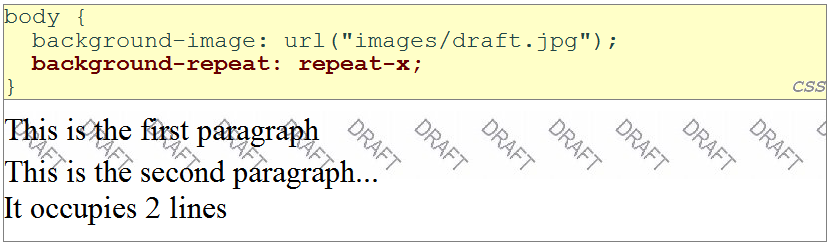

<!-- slide: 38 -->

## background-position

- 值由两部分组成, 每一个可以是top, left, right, bottom, center, 以百分数或者px, pt 为单位的长度.
- 值可以是负数, 以指定超出左/上边界的长度
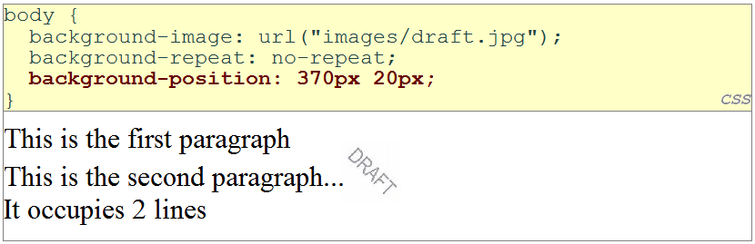

<!-- slide: 39 -->

## 收藏夹图标(“favicon”)

- 在head部分里面的link标签, 能够为网页指定一个图标
- IE6: 这种方法是无效的; 必须在服务器根目录放置一个ico格式并且命名为favicon.ico的文件(指导)
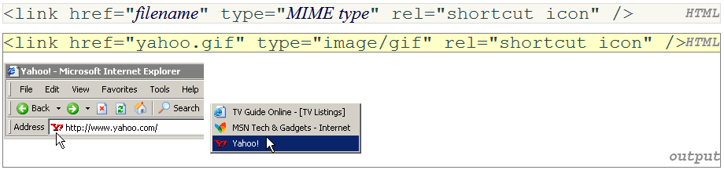

<!-- slide: 40 -->

## 总结

- 更多HTML元素
  - meta
  - dl, dt, dd
  - blockquote, q
  - HTML字符实体, HTML编码文本
  - code, pre
- 更多基础的CSS
  - 样式分组
  - 注释
  - 文本属性: text-align, text-decoration
  - 列表样式类型

<!-- slide: 41 -->

## 总结

- CSS实践
  - body 样式
  - 层叠 vs. 继承
  - 冲突处理
  - W3C CSS 验证器
  - 背景属性: background-image, background-repeat, background-position
  - 收藏夹图标
- 所有HTML标签的列表: http://www.w3schools.com/tags/default.asp

<!-- slide: 42 -->

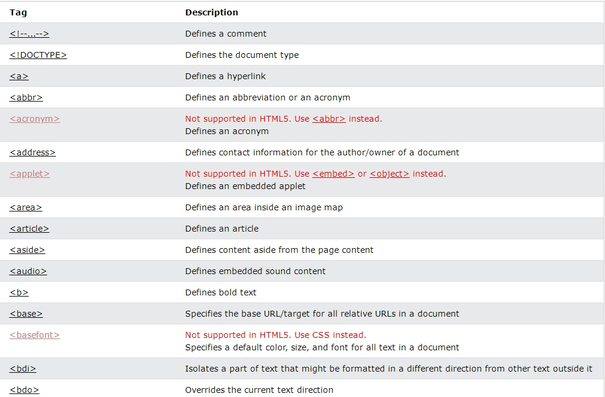

<!-- slide: 43 -->

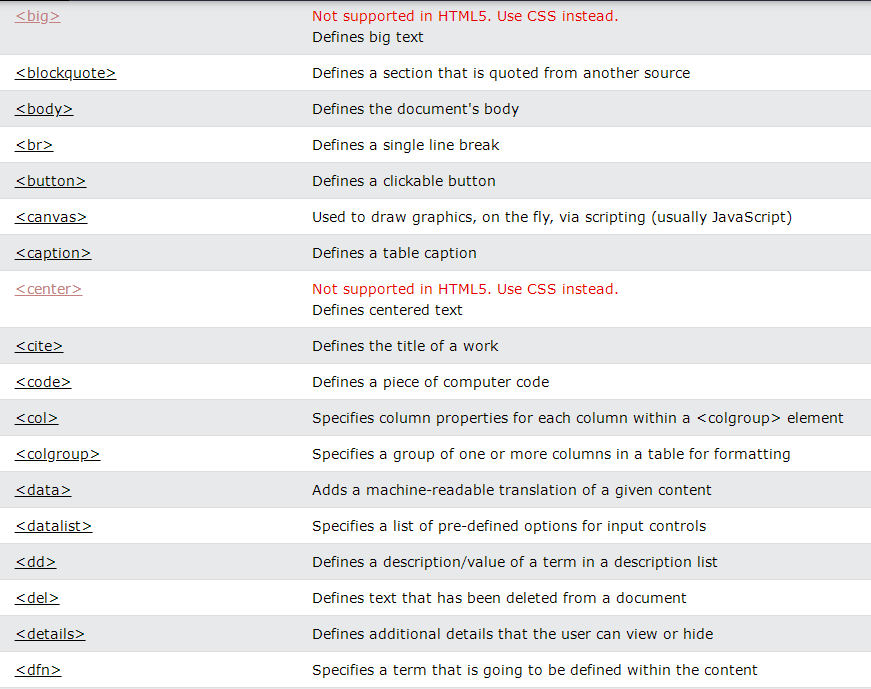

<!-- slide: 44 -->

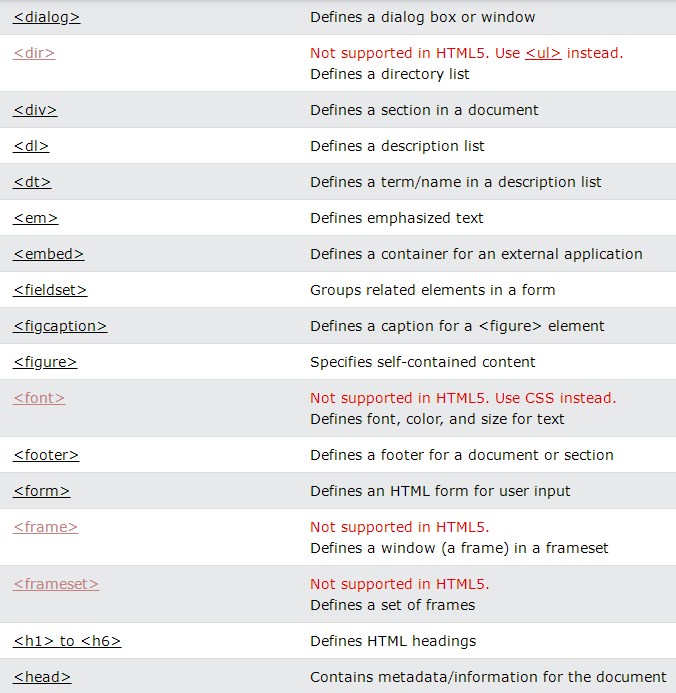

<!-- slide: 45 -->

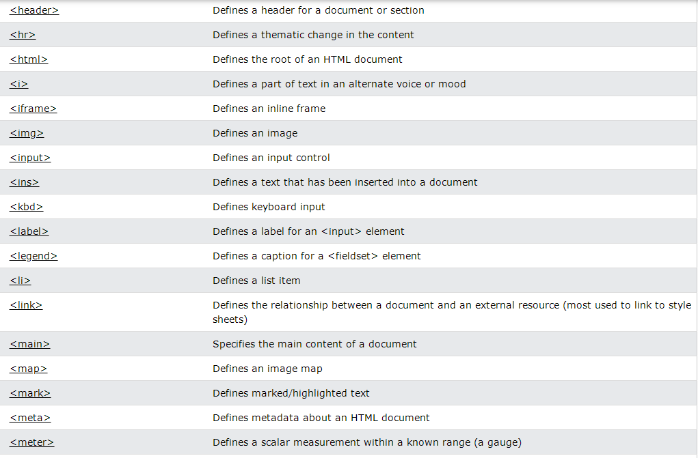

<!-- slide: 46 -->

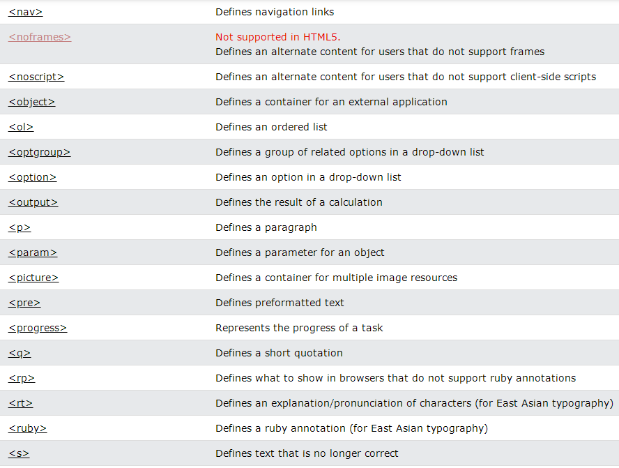

<!-- slide: 47 -->

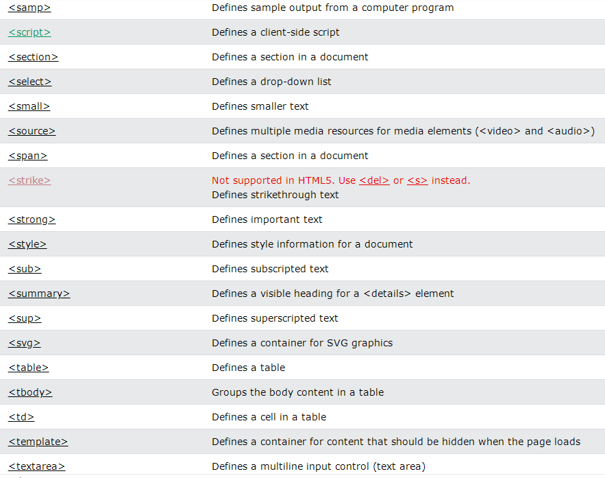

<!-- slide: 48 -->

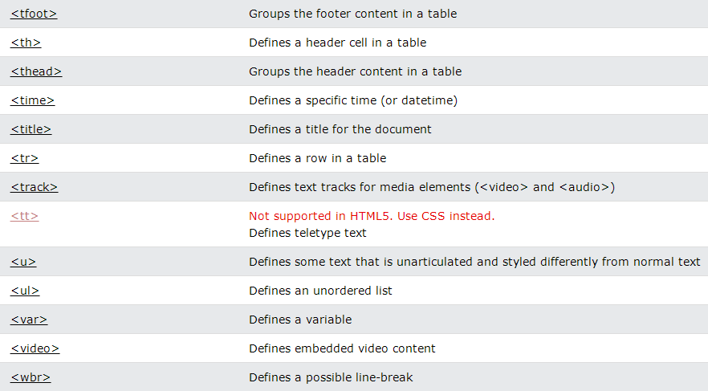

<!-- slide: 49 -->

## 所有CSS的列表

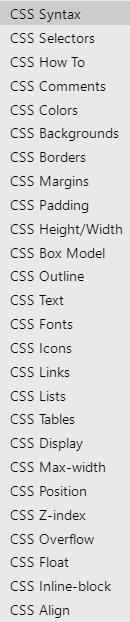
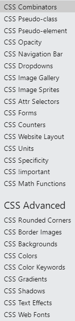
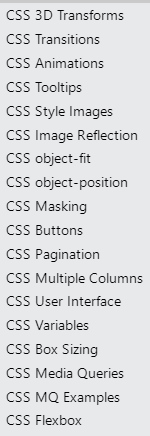
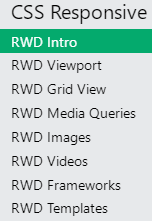

<!-- slide: 50 -->

## 练习

- 在一个网页中列出我们在这个课程中学过的所有html标签和css属性,并且解释它们的用途和用法
  - dl, dt, dd 用于定义
  - blockquote, q 用于引用 w3 school 的语句
  - code, pre 用于例子
  - 把样式写在一个单独的css文件中

<!-- slide: 51 -->

## 阅读资料

- http://en.wikipedia.org/wiki/XHTML
- http://en.wikipedia.org/wiki/Cascading_Style_Sheets
- 第1~8章, Web Programming with HTML, XHTML, and CSS http://my.ss.sysu.edu.cn:8080/display/W2PSC/References+and+Books
- 所有HTML标签的列表: http://www.w3schools.com/tags/default.asp
- HTML字符实体的列表: http://www.w3schools.com/tags/ref_entities.asp
- XHTML 1.1 说明. http://www.w3.org/TR/xhtml11/
- XHTML 1.1 元素参考: http://www.w3.org/2007/07/xhtml-basic-ref.html
- W3 所有 CSS 属性的列表: http://www.w3.org/TR/CSS21/propidx.html
- W3 CSS 2.1 规格: http://www.w3.org/TR/CSS21/
- 各种操作系统的字体: http://www.apaddedcell.com/web-fonts

<!-- slide: 52 -->

- 谢谢!
