# Lecture 4 Page Sections and the CSS Box Model

<!-- slide: 1 -->

## Lecture 4网页区域和 CSS 盒子模型

- Web Programming
- School of Computer Science and Engineering,
- South China University of Technology

<!-- slide: 2 -->

## 概述

- 更多 CSS知识
- 样式化网页区域
- 布局介绍

<!-- slide: 3 -->

## HTML 的id 属性

- 允许你给网页上任一个元素分配一个唯一的ID
- 每个ID必须唯一；在网页中只能定义一次
- 
Spatula City! Spatula City!
 
Our mission is to provide the most spectacular spatulas and splurge on our specials until our customers <q>esplode</q> with splendor!

- HTML
- Spatula City! Spatula City!
- Our mission is to provide the most spectacular spatulas and splurge on our specials until our customers esplode with splendor!
- output

<!-- slide: 4 -->

## 链接到Web 网页的某个区域

- 一个链接目标可以以#开头，以ID名称结束
- 浏览器会加载指定页面，并跳转到给定ID的元素处
- 
Visit <a href= “http://www.textpad.com/download/index.html#downloads"> textpad.com</a> to get the TextPad editor.
 
<a href="#mission">View our Mission Statement</a>

- HTML
- Visit textpad.com to get the TextPad editor.
- View our Mission Statement
- output

<!-- slide: 5 -->

## CSS ID 选择器

- 仅对拥有ID为 mission 的段落应用样式规则
- 元素也可被明确地指定为 p#mission { … }
- #mission {
- font-style: italic;
- font-family: "Garamond", "Century Gothic", serif;
- }
- HTML
- Spatula City! Spatula City!
- Our mission is to provide the most spectacular spatulas and splurge on our specials until our customers esplode with splendor!
- output

<!-- slide: 6 -->

## HTML 的类(class) 属性

- 使用类，可以选定一组元素并为该组元素应用样式规则
- 不同于 id, 一个 class 名称可以在网页中被多次使用
- 
Spatula City! Spatula City!

- 
See our spectacular spatula specials!

- 
Today only: satisfaction guaranteed.

- HTML
- Spatula City! Spatula City!
- See our spectacular spatula specials!
- Today only: satisfaction guaranteed.
- output

<!-- slide: 7 -->

## CSS 类选择器（class selector）

- 为拥有任何类为special 的元素 或者 类为shout 的p 元素应用相应的样式规则
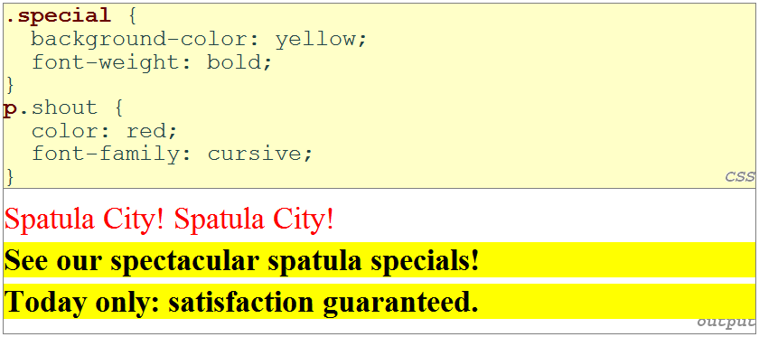

<!-- slide: 8 -->

## 多重类属性

- 一个元素可以拥有多个类属性 (用空格分隔开)
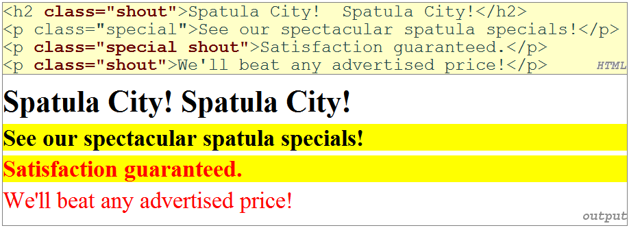

<!-- slide: 9 -->

## CSS  伪类

| 类 | 描述 |
|---|---|
| :active | 向被激活或被选择的元素添加样式 |
| :focus | 向拥有键盘输入焦点的元素添加样式 |
| :hover | 当鼠标悬浮在元素上方时，向元素添加样式 |
| :link | 向未被访问的链接添加样式 |
| :visited | 向已被访问的链接添加样式 |
| :first-letter | 向元素中的文本的首字母添加样式 |
| :first-line | 向元素中的文本的第一行添加样式 |
| :first-child | 向元素的第一个子元素添加样式 |

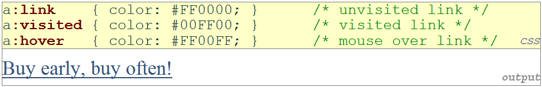

<!-- slide: 10 -->

## 概述

- 更多 CSS知识
- 样式化网页区域
- 布局介绍

<!-- slide: 11 -->

## 网页区域化的目的

- 为了对网页中的单个元素 , 组元素, 文本区域 添加样式
- 为了创造跟复杂的网页布局 (后来)
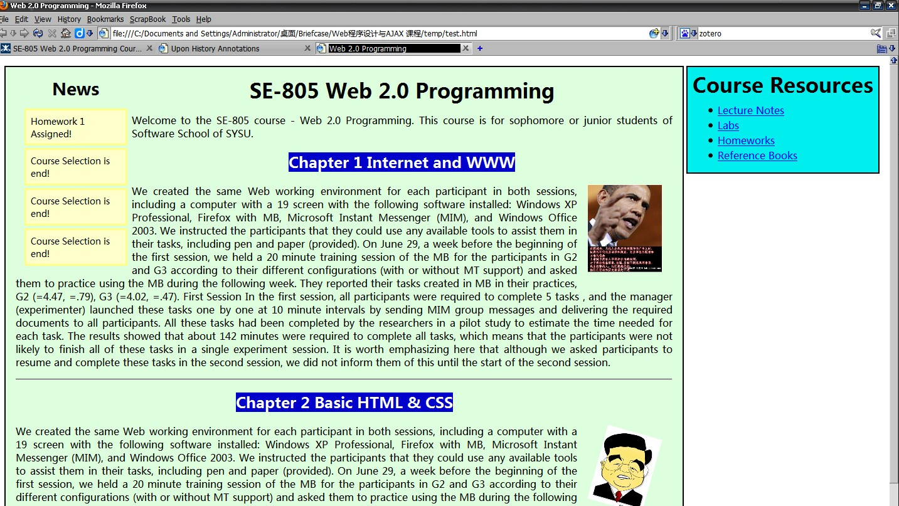

<!-- slide: 12 -->

## 网页区域: 

- 一个用来指示网页中某个逻辑区域的标签
- 默认没有显示外观，但你可以为其添加样式
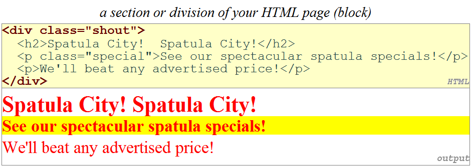

<!-- slide: 13 -->

## 内联区域: 

- 没有显示的外观，但你可以为其添加样式或者ID，应用在span里面的文本
- 是一个行内标签，用来组合行内的多个元素。
- 可是, 我们何时要使用
, , 何时使用
, <h1>呢?
- div占用的位置是一行。
- span占用的是内容有多宽就占用多宽的空间距离。
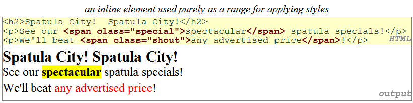

<!-- slide: 14 -->

## CSS 上下文选择器

- 只有当网页中的选择器2(selector2)在选择器1(selector1 )里面时应用给定的属性(properties)
- selector1 selector2 {
- properties
- }
- CSS
- selector1 > selector2 {
- properties
- }
- CSS
- 只有当网页中的选择器2(selector2)直接被选择1(selector1 )包含时应用给定的属性(properties)      (选择器2的标签紧随选择器1的标签，中间不夹带其它标签 )

<!-- slide: 15 -->

## 上下文选择器 示例

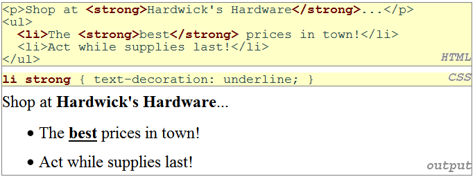

<!-- slide: 16 -->

## 更多复合示例

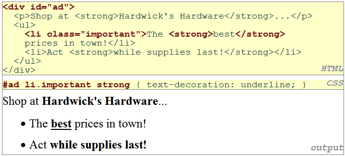

<!-- slide: 17 -->

## CSS 层叠

- 浏览器的样式表优先级最低.
- 用户的样式表优先于浏览器的样式表.
- 网页制作者的样式表优先于用户跟浏览器的样式表 .
- (X)HTML 的样式属性优先级高于任何定义在样式表中的样式规则.
- 在一个样式表中，当发生冲突时，指定最详细明确的样式规则生效.

<!-- slide: 18 -->

## 选择器特征值

- CSS 选择器的特征值是形如abcd  的四位数
- 对于变量a ，如果该样式采用(X)HTML样式属性指定的话，记为1 ，否则记为0 。
- 统计出选择器中ID属性的个数，把值赋给b 。
- 把选择器中属性的个数，伪类的个数，类名的个数求和，结果赋给  c.
- 统计选择器中元素名的个数，将其值赋给 d.
- 忽略伪元素.
- 当两个样式规则拥有同样的特征值，后一个出现的起作用
- 最后，带有!important  的样式规则拥有最高优先级
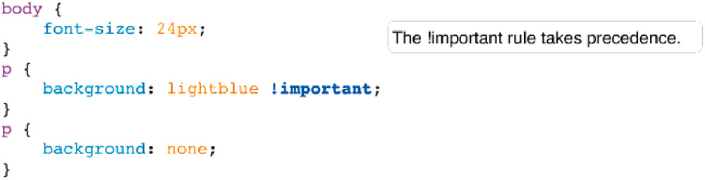

<!-- slide: 19 -->

## 选择器特征值

| 选择器 | 选择器类型 | 特征值 |
|---|---|---|
| * | Universal Selector | 0000  (a = 0, b = 0, c = 0, d = 0) |
| li | 元素名 | 0001  (a = 0, b = 0, c = 0, d = 1) |
| ul li | 元素名 | 0002  (a = 0, b = 0, c = 0, d = 2) |
| div h1 + p | 元素名 | 0003  (a = 0, b = 0, c = 0, d = 3) |
| input[type=’text’] | 元素名 + 属性 | 0011  (a = 0, b = 0, c = 1, d = 1) |
| .someclass | 类名 | 0010  (a = 0, b = 0, c = 1, d = 0) |
| div.someclass | 元素名 + 类名 | 0011  (a = 0, b = 0, c = 1, d = 1) |
| div.someclass.someother | 元素名 + 类名 + 类名 | 0021  (a = 0, b = 0, c = 2, d = 1) |
| #someid | ID名 | 0100  (a = 0, b = 1, c = 0, d = 0) |
| div#someid | 元素名 + ID名 | 0101  (a = 0, b = 1, c = 0, d = 1) |
| style (attribute) | 样式(属性) | 1000  (a = 1, b = 0, c = 0, d = 0) |

<!-- slide: 20 -->

## CSS 继承

- 许多CSS规则的属性可以被相应规则的孩子元素继承，但有的却不可以。
- 可以被继承的属性类型: text, color, and font
- 不可以被继承的属性类型: border, margin, padding
- 对于具体应用，所有的直接或继承的样式规则的作用是一样的
- 如果你不记得一个属性是否可继承, 最好通过测试来验证下, 而不是通过Google搜索和 W3-School的教程

<!-- slide: 21 -->

## 概述

- 更多CSS知识
- 样式化网页区域
- 布局介绍

<!-- slide: 22 -->

## CSS 的盒子模型

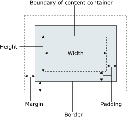
- 为了方便布局, 每个元素包括:
  - 该元素的实际内容
  - 环绕元素的边框
  - 在内容跟边框之间的内边距(内部)
  - 在边框与其他内容之间的外边距(外部)
- 宽度(width) = 内容宽度+ 左/右内边距+ 左/右外边距高度(height) =内容宽度+ 上/下 内边距+ 上/下外边距

<!-- slide: 23 -->

## 文档浮动– 块元素

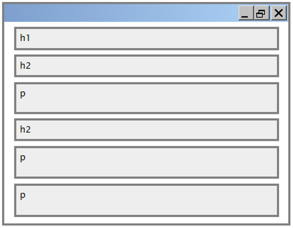

<!-- slide: 24 -->

## 文档浮动– 内联元素

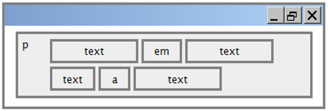

<!-- slide: 25 -->

## 文档浮动– 更大的示例

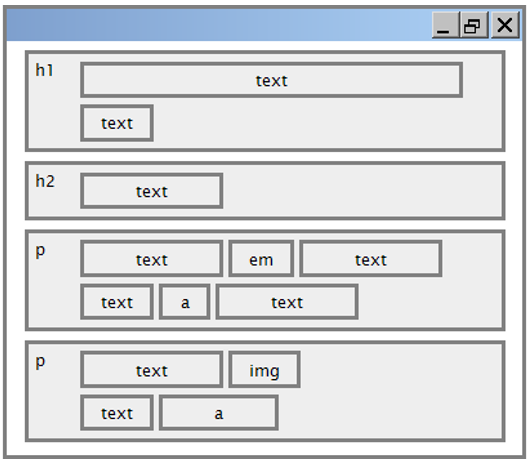

<!-- slide: 26 -->

## CSS 边框的属性

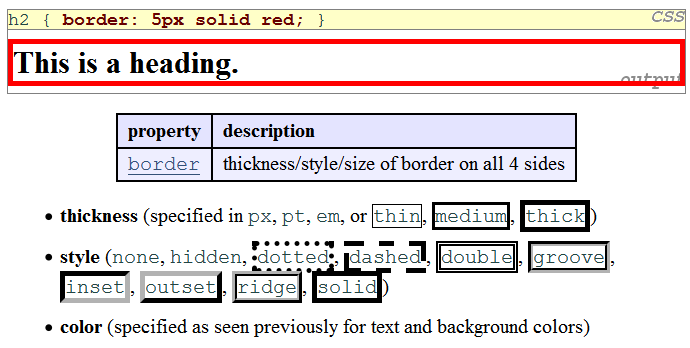

<!-- slide: 27 -->

## 更多边框(border)属性

| 属性 | 描述 |
|---|---|
| border-color, border-width, border-style | 设置边框在四个方向的属性 |
| border-bottom, border-left, border-right, border-top | 设置边框在特定方向的所有属性 |
| border-bottom-color, border-bottom-style, border-bottom-width, border-left-color, border-left-style, border-left-width, border-right-color, border-right-style, border-right-width, border-top-color, border-top-style, border-top-width | 设置边框在特定方向的属性 |
| 完整边框属性列表 |  |

<!-- slide: 28 -->

## 边框(border) 例子2

- 边框的每个方向上的属性都可以单独设置
- 如果你省略一些属性设置，它们将被设置为默认值 (例如上面例子中的 border-bottom-width)
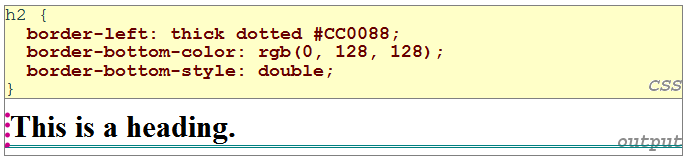

<!-- slide: 29 -->

## CSS 内边距(padding)的属性

| 属性 | 描述 |
|---|---|
| padding | 四个方向都设置内边距 |
| padding-bottom | 设置下内边距 |
| padding-left | 设置左内边距 |
| padding-right | 设置右内边距 |
| padding-top | 设置上内边距 |
| 完整内边距属性列表 |  |

<!-- slide: 30 -->

## 内边距 例子 1

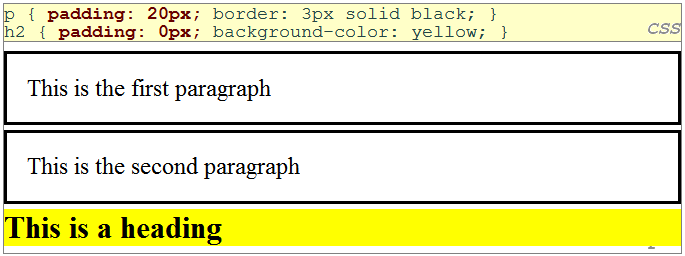

<!-- slide: 31 -->

## 内边距 例子 2

- 每个方向上的内边距都可以被单独设置
- 要注意的是内边距的背景色跟其所在元素的背景色相同
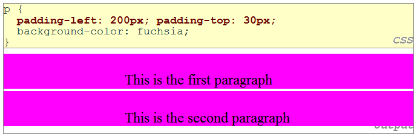

<!-- slide: 32 -->

## CSS 外边距属性

| 属性 | 描述 |
|---|---|
| margin | 设置4个方向上的外边距 |
| margin-bottom | 仅设置底部外边距 |
| margin-left | 仅设置左方外边距 |
| margin-right | 仅设置右方外边距 |
| margin-top | 仅设置顶部外边距 |
| 完整外边距属性列表 |  |

<!-- slide: 33 -->

## 外边距 例子1

- 注意到外边距总是透明的(它们不包含所在元素的背景色。)
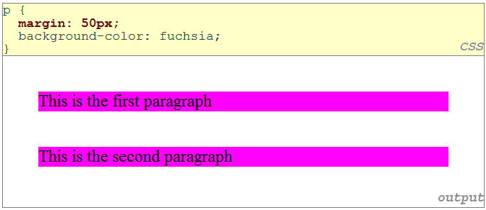

<!-- slide: 34 -->

## 外边距 例子2

- 每个方向上的外边距可被单独设置
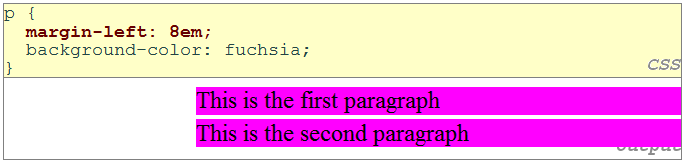

<!-- slide: 35 -->

## CSS 尺寸属性

| 属性 | 描述 |
|---|---|
| width, height | 设置元素的宽度跟高度 (仅对块元素) |
| max-width, max-height, min-width, min-height | 设置元素的最大/最小 尺寸 |

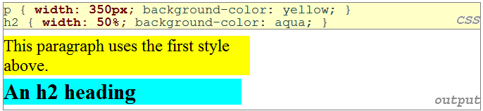

<!-- slide: 36 -->

## 中间对齐一个块元素: 自动化(auto) 边缘

- 如果宽度(width) 被设定，效果会较好 (否则, 可能出现占据整个网页宽度的情况)
- 在块元素内设置内联元素的中央对齐，
- 使用：  text-align: center
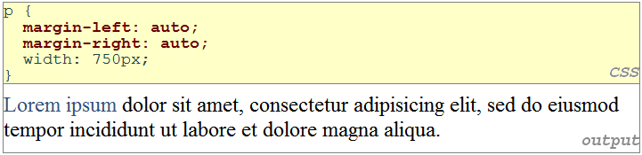

<!-- slide: 37 -->

## 总结

- 更多CSS知识
  - HTML 属性: id, class
  - 多重类
  - 伪类
- 样式化网页区域
  - 网页区域化的目的
  - div, span
  - CSS 上下文选择器
  - CSS 层叠 和 继承
- 布局介绍
  - 盒子模型, 文档浮动
  - 边框,内边距, 外边距的属性
  - 尺寸的属性

<!-- slide: 38 -->

## 练习

- 完成我们这次课程的例子
  - 原始例子可从这里下载
  - 最后效果应该如下所示:
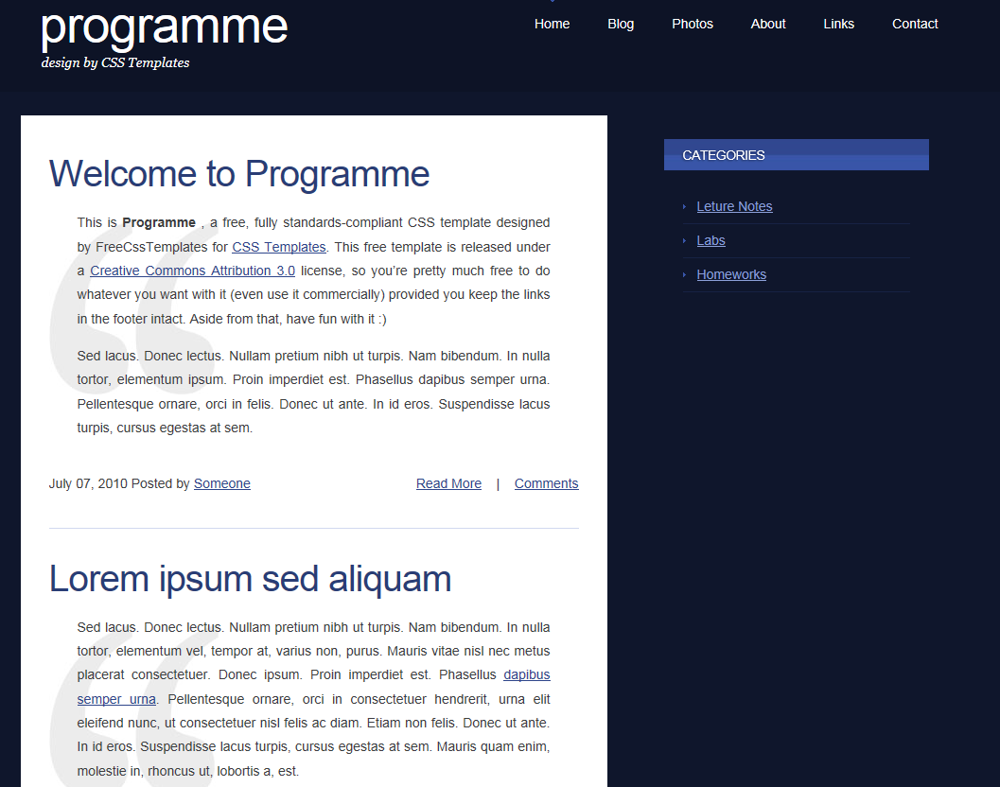

<!-- slide: 39 -->

## 进阶阅读

- W3C CSS2 Specification:  http://www.w3.org/TR/REC-CSS2/
- W3Schools CSS2 Reference: http://www.w3schools.com/css/css_reference.asp
- W3Schools CSS Tutorial: http://www.w3schools.com/css/default.asp
- Chapter 3, 4, 7, 8, and 11 of Beginning CSS Cascading Style Sheets for Web Design, second edition
- http://www.barelyfitz.com/screencast/html-training/css/positioning/
- http://www.quirksmode.org/css/display.html
- http://en.wikipedia.org/wiki/User-centered_design
- http://www.stcsig.org/usability/newsletter/9807-webguide.html

<!-- slide: 40 -->

- Thank you!
