# Lecture 5 Floating and Positioning(C)

<!-- slide: 1 -->

## 第五讲 浮动与定位

<!-- slide: 2 -->

## 概要

- 浮动元素
- 缩放与定位
- 邪恶的IE
- 思考 …
  - 声明式编程
  - 以用户为中心的设计

<!-- slide: 3 -->

## CSS float 属性

- 从正常的文件流中移出; 浮动元素下方的内容将会环绕它
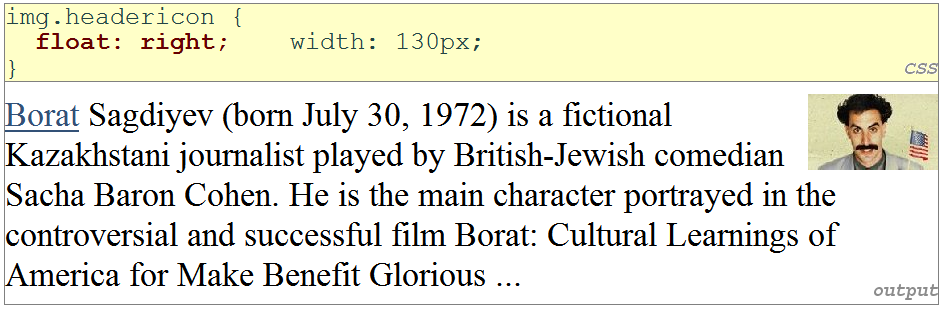

| 属性 | 描述 |
|---|---|
| float | 悬停的方向; 可以是left, right 或者 none(默认) |

<!-- slide: 4 -->

## float元素图解

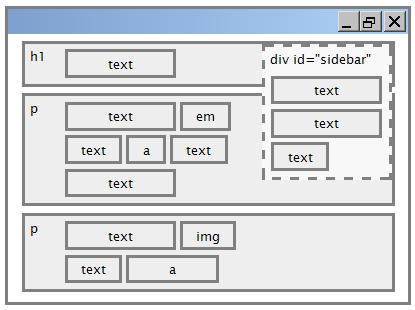

<!-- slide: 5 -->

## 常见的 float 错误: 缺少width

- 浮动的块元素必须要有width属性
  - 如果浮动元素的宽度没有指定, 它将会占用整个页面宽度. 这样, 就没有内容可以环绕它.
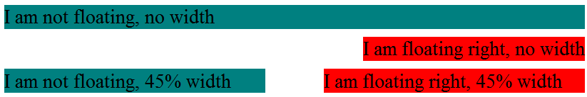

<!-- slide: 6 -->

## clear 属性

| 属性 | 描述 |
|---|---|
| clear | 不允许浮动的元素跟这个元素重叠; 可以是left, right, 或者none(默认) |

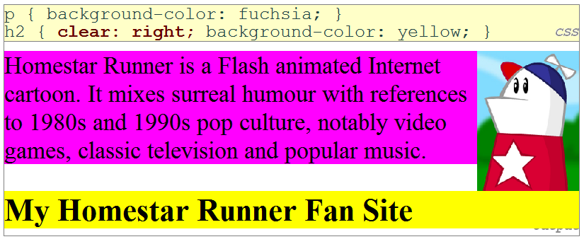

<!-- slide: 7 -->

## Clear 图解

- div#sidebar { float: right; }
- p { clear: right; }
- CSS

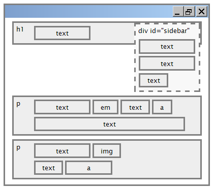

<!-- slide: 8 -->

## 常见的错误: 容器太短

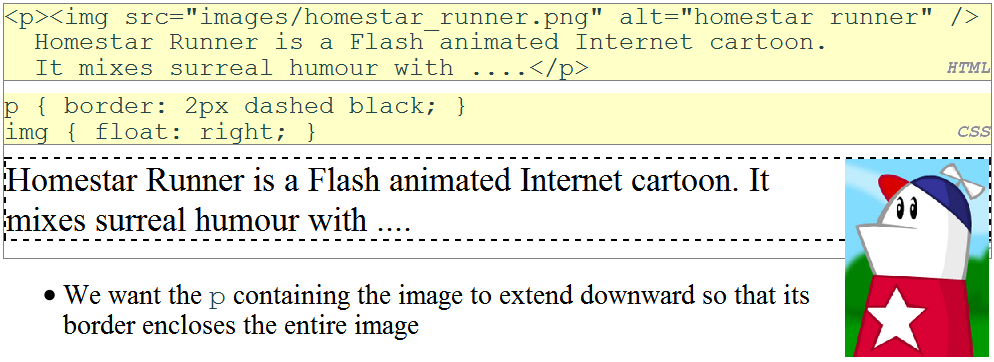
- 我们想让p元素向下延伸, 使其边框能够完全包住整个图片

<!-- slide: 9 -->

## overflow 属性

| 属性 | 描述 |
|---|---|
| overflow | 指明当一个元素的内容太大的时候该怎么做; 可以是auto, visible, hidden, scroll, 或者 inherit |

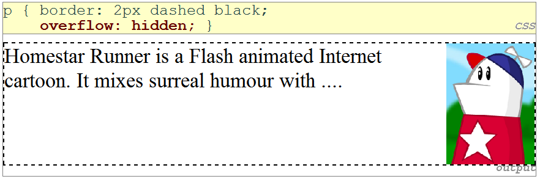

<!-- slide: 10 -->

## 多列布局

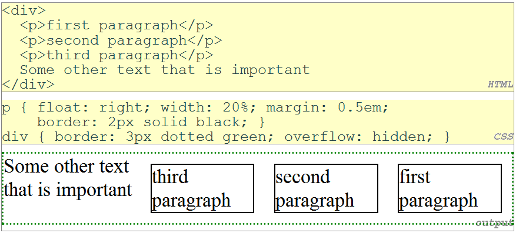

<!-- slide: 11 -->

## 概要

- 浮动元素
- 缩放与定位
- 邪恶的IE
- 思考 …
  - 声明式编程
  - 以用户为中心的设计

<!-- slide: 12 -->

## position 属性

| 属性 | 取值 | 描述 |
|---|---|---|
| position | static | 默认位置 |
|  | relative | 相对于正常位置进行相对定位 |
|  | absolute | 相对于所包含 的元素进行绝对定位 |
|  | fixed | 相对于浏览器窗口进行绝对定位 |
| top, bottom, left, right | 与盒子四边的距离 |  |

- div#ad {
- position: fixed;
- right: 10%;
- top: 45%;
- }
- CSS

<!-- slide: 13 -->

## Absolute 定位

- 从正常的文件流中移出(跟float相似)
- 以包含它的块元素为参考进行相对定位(假如该块元素也是用absolute或者relative定位)
- 真正的位置由 top, bottom, left, right 的值决定
- 通常应该指定一个 width 属性
- #menubar {
- position: absolute;
- left: 400px;
- top: 50px;
- }
- CSS
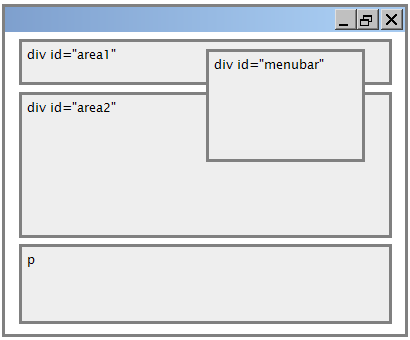

<!-- slide: 14 -->

## Relative 定位

- 以absolute定位的元素通常参照整个页面的四角进行定位
- 为了避免以absolute定位的元素参照其他元素的四角进行定位, 把用absolute 定位的元素封装在一个用 relative 定位的元素里面
- #area2 { position: relative;}
- CSS
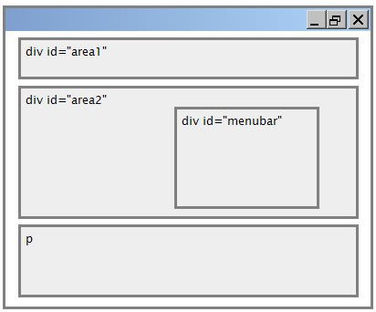

<!-- slide: 15 -->

## Fixed 定位

- 从正常的文件流中移出(跟float相似)
- 相对于浏览器窗口进行定位
  - 甚至当用户滚动页面时, 元素仍会留在同样的位置
- #menubar {
- position: fixed;
- left: 400px;
- top: 50px;
- }
- CSS
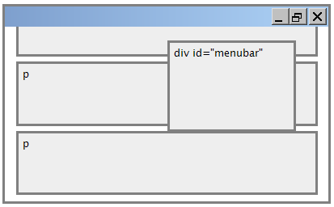

<!-- slide: 16 -->

## 对齐 vs. 浮动 vs. 定位

- 首先, 使用 align 进行布局
  - 水平对齐: text-align
    - 用在块元素上; 它对齐在其内部的内容 (不只是文本, 但不是元素本身)
  - 垂直对齐: vertical-align
    - 用在行内元素上, 它垂直地对齐它自己与它包含的元素
- 如果 alignment 不凑效, 尝试使用 float
- 如果 float 不凑效, 尝试使用 position
  - absolute / fixed 定位是最后的解决方法, 并且不应被过度利用
- 更多布局的例子

<!-- slide: 17 -->

## 关于行内盒模型的细节

- size 属性 (width, height, min-width, 等.) 会被行内盒模型忽视
- margin-top 和 margin-bottom 会被忽视, 但 margin-left 和margin-right 则不会
- 块元素盒模型的 text-align 属性控制它里面行内盒模型的水平位置
  - text-align 并不会对齐页面上的块元素
- 每一个行内盒模型的 vertical-align 属性会使它在其块元素中保持对齐

<!-- slide: 18 -->

## vertical-align 属性

- 可以是 top, middle, bottom, baseline (默认), sub, super, text-top, text-bottom, 或者长度值 或者 使用 %
  - baseline属性指的是与非悬挂字母的底部对齐
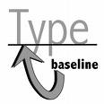

| 属性 | 描述 |
|---|---|
| vertical-align | 指定一个行内元素应该如何垂直对齐.该属性定义行内元素的基线相对于该元素所在行的基线的垂直对齐. |

<!-- slide: 19 -->

## vertical-align 例子

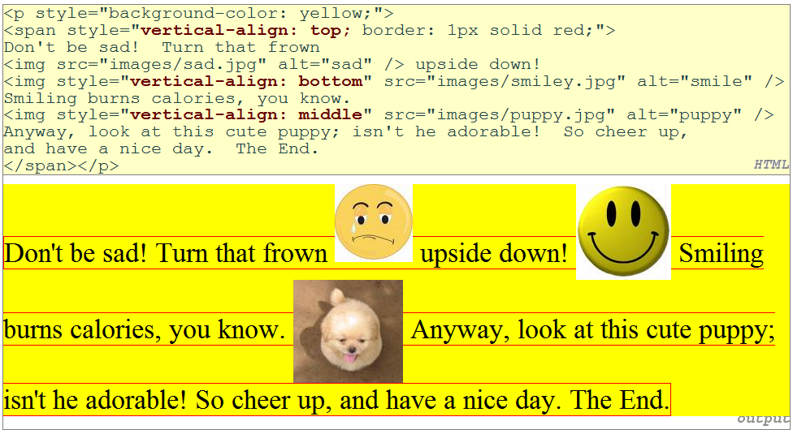

<!-- slide: 20 -->

## 常见错误: 图片下的空白

- 即使 padding 和 margin 都是 0, 图片下面仍然有红色的空白
- 这是因为图片垂直对齐于这个段落的基线(不同于底部)
- 设定为 bottom 的 vertical-align 属性可以解决这个问题 (也可以把line-height 设为 0px)
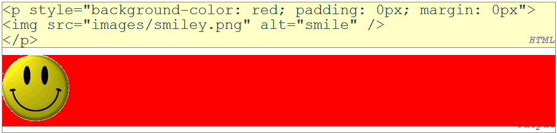

<!-- slide: 21 -->

## display 属性

- 值: none, inline, block, run-in, table, table-caption, …
  - 不是所有的浏览器都支持所有的类型(从这个网址上可以查到http://www.quirksmode.org/css/display.html )
- 尽量少用, 因为它会彻底地改变网页的布局
- h2 { display: inline; background-color: yellow; }
- CSS
- output
- This is another heading
- This is a heading

| 属性 | 描述 |
|---|---|
| display | 设定元素该呈现为CSS盒模型中的哪种类型 |

<!-- slide: 22 -->

## display 属性

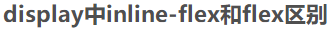
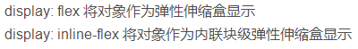
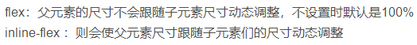

<!-- slide: 23 -->

## 以行内的方式显示块元素

- 列表和其它块元素可以以行内的方式显示
  - 从左到右在同一行上显示
  - 宽度由内容决定(块元素占据整个页面的宽度)
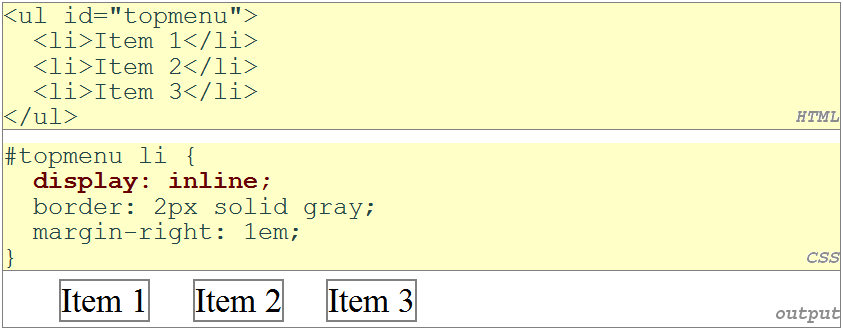

<!-- slide: 24 -->

## visibility 属性

- hidden 元素仍然会占据屏幕的空间, 但是不会显示出来
  - 把 display 设为 none 则不会占据任何空间
- 可以用来显示/隐藏页面上的HTML内容, 作为对事件的响应
- p.secret { visibility: hidden }
- CSS
- output

| 属性 | 描述 |
|---|---|
| visibility | 设定一个元素是否应该显示在屏幕上; 可以是 visible (默认) 或者 hidden |

<!-- slide: 25 -->

## 概要

- 浮动元素
- 缩放与定位
- 邪恶的IE
- 思考 …
  - 声明式编程
  - 以用户为中心的设计

<!-- slide: 26 -->

## 邪恶的 IE

- IE对于网页设计者和开发者是一个痛苦, 因为它跟W3C的标准不兼容, 而且大部分是故意的
- 奇怪的IE盒模型
- float时会有双倍的外边距
- 当块元素在一个浮动元素下面
- 时, 它会有偏移
- 透明的png (IE 6.0)
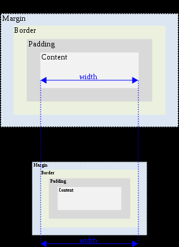

<!-- slide: 27 -->

## 邪恶的 IE

- 有大量的变通方法可以使用, 但最好的是用条件注释装载一个特定的IE样式表
- gt, lt, gte, lte
- <!--[if IE 7]>
- According to the conditional comment this is Internet Explorer
- <![endif]-->
- <!--[if gte IE 5]>
- According to the conditional comment this is Internet Explorer 5 and up
- <![endif]-->
- XHTML

<!-- slide: 28 -->

## 概要

- 浮动元素
- 缩放与定位
- 邪恶的IE
- 思考 …
  - 声明式编程
  - 以用户为中心的设计

<!-- slide: 29 -->

## 声明式编程

- 声明式编程是一种表达计算的逻辑而没有描述它的控制流的编程范式.
- DSL: SQL, CSS, HTML, WPDL, …
  - 它们在软件开发中是相同的逻辑
  -  提取相同的逻辑
  -  创造一门能规范地描述它们的语言
  -  证明或者验证这种语言
  -  用这种语言去描述其它逻辑
  -  改变这种语言使它能适应更多的场合
- DSL的好处 – 使逻辑客观化
  - 容易编码和调试
  - 可扩展性和可维护性
  - 重用性
  - …

<!-- slide: 30 -->

## 概要

- 浮动元素
- 缩放与定位
- 邪恶的IE
- 思考 …
  - 声明式编程
  - 以用户为中心的设计

<!-- slide: 31 -->

## 什么是设计?

- 设计是规划每个对象和系统创建的基础。
  - 作为动词, “设计”指一个产品, 结构, 系统, 或者原件有意识地从无到有的开发计划.
  - 作为名词, “设计”被用来指最终的计划(解决方案)，例如建议, 绘画, 模型, 描述等，或者指经过设计流程后，实现该计划而获得的最终产品的效果

<!-- slide: 32 -->

## 什么是设计?

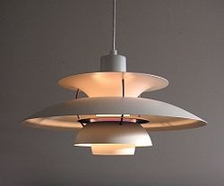
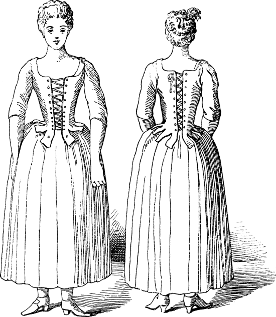

- 设计是关于我们想要什么, 而不是如何得到

<!-- slide: 33 -->

## 以用户为中心的设计

- 宽泛地说, 以用户为中心的设计 (UCD) 是一门设计哲学 ，也是一个设计过程. 在这个设计过程中的每一个阶段, 界面或者网页必须针对终端用户的需要, 想法和限制去考虑和设计.
- 以用户为中心的设计可以看做一个多阶段问题的解决过程.它不仅需要设计者去分析和预测用户可能会如何使用这个界面, 而且需要根据现实世界中用户的行为来检验他们的猜测是否正确.

<!-- slide: 34 -->

## 常见UCD过程

- 1) 与实际用户或者潜在的终端用户交流, 以找出他们面对的困难, 通常与某个特定的问题有关.
- 2) 找出潜在解决方法的原型.
- 3) 与用户测试这个原型是否有效, 如何有效或者无效.
- 4) 迭代进行原型设计和测试, 重复第2和第3步.
- 5) 根据你的最佳解决方法, 得出一个严密的用户研究(可选, 但推荐)
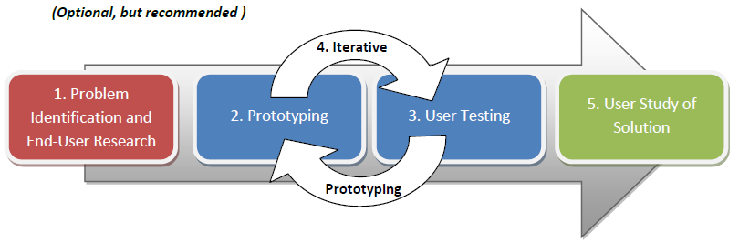

<!-- slide: 35 -->

## UCD – 网页: 目的

- 谁是网页的用户?
- 用户的任务和目的是什么?
- 用户对于网页的体验层次是多少?反之亦然.
- 用户需要网页提供什么功能?
- 用户需要什么信息?它们应该以什么形式提供?
- 用户认为网页应该如何工作?

<!-- slide: 36 -->

## UCD – 网页: 元素

- 可见性
  - 网页的精神模型
  - 重要的元素应该被明确强调
  - 用户应该能一眼就能知道他们能或者不能在网站上做什么
- 易用性
  - 用户应该能够快速和轻松地在网页上找到所需的信息(导航, 搜索, 内容表格, 明确标识的部分, 页码, 代码着色等)
- 易读性
  - 文本应该容易阅读的(例如不应该太长或者太短)
- 语言
  - 清晰, 有效的

<!-- slide: 37 -->

## UCD – 网页: 修辞情境

- 观众
  - 将会使用这个网页的人 (年龄, 地理位置, 种族, 性别, 受教育程度等)
- 目的
  - 这个网页将会被如何使用, 并且观众使用这个网页想要完成的事情(例如购买一件产品, 推销想法, 完成一个任务, 建议, 还有各种劝说)
- 来龙去脉
  - 这种情况发生的环境.
    - 怎样的情况会产生对这个网页的需求?
    - 来龙去脉也包括 这种情况中的社会或者文化因素

<!-- slide: 38 -->

## 总结

- 浮动元素
  - float, clear, overflow
- 缩放与定位
  - 定位(absolute, relative, fixed)
  - 对齐 vs. 浮动 vs. 定位
  - 行内盒模型, vertical-align
  - display, visibility
- 邪恶的IE
- 声明式编程 –DSL的灵魂
- 以用户为中心的设计
  - 设计, UCD
  - UCD 过程
  - UCD – 网页: 目的, 元素, 修辞情境

<!-- slide: 39 -->

## 练习

- 最流行的网页字体是什么, 为什么?
- 现代网页中, 什么是常见布局元素?
- 为什么 “css + div” 风格的布局比 “table” 风格好?
- 一般来说, 建立一个网站/Web应用的第一步是做什么?
- 还有, 我们如何评价一个网页的设计, 它的哪一个属性是最重要的?

<!-- slide: 40 -->

## 阅读资料

- W3C CSS2 规范:  http://www.w3.org/TR/REC-CSS2/
- W3 Schools CSS2 指南: http://www.w3schools.com/css/css_reference.asp
- W3 Schools CSS 指南: http://www.w3schools.com/css/default.asp
- Beginning CSS Cascading Style Sheets for Web Design, second edition (在Wiki上)的第3, 4, 7, 8, 和11章http://www.barelyfitz.com/screencast/html-training/css/positioning/
- http://www.quirksmode.org/css/display.html
- http://en.wikipedia.org/wiki/User-centered_design
- http://www.stcsig.org/usability/newsletter/9807-webguide.html

<!-- slide: 41 -->

- 谢谢!
