# Lecture 6 Basic JavaScript

<!-- slide: 1 -->

## Lecture 6基础JavaScript

<!-- slide: 2 -->

## 动态Vs. 静态

- 静态网页
  - 客户端/用户的观点 : 一个指向不变的html文件的url
  - 服务器/开发者的观点:一个存储在Web服务器根目录或者子目录下的html文件 …
  - 可以直接在浏览器上显示
- 动态网页
  - 客户端/用户的观点 :一个指向动态的html文件的url (每次请求访问都可能不一样)
  - 服务器/开发者的观点: 一个生成html的程序/脚本
  - 不是 html, 但是程序生成html
  - 不能直接在浏览器上显示
- 动态网页, Dynamic HTML (DHTML), 有何不同?

<!-- slide: 3 -->

## 概要

- JavaScript简介
- JavaScript入门

<!-- slide: 4 -->

## JavaScript简介

- JavaScript 是世界上最流行的编程语言之一。
- 这门语言可用于 HTML 和 web，更可广泛用于服务器、PC、笔记本电脑、平板电脑和智能手机等设备。
- JavaScript 是脚本语言
- JavaScript 是一种轻量级的编程语言。
- JavaScript 是可插入 HTML 页面的编程代码。
- JavaScript 插入 HTML 页面后，可由所有的现代浏览器执行。
- JavaScript 很容易学习。

<!-- slide: 5 -->

- JavaScript 与 Java 是两种完全不同的语言，无论在概念还是设计上。
- Java（由 Sun 发明）是更复杂的编程语言。
- ECMA-262 是 JavaScript 标准的官方名称。
- JavaScript 由 Brendan Eich 发明。它于 1995 年出现在 Netscape 中（该浏览器已停止更新），并于 1997 年被 ECMA（一个标准协会）采纳。

<!-- slide: 6 -->

## Hello, World!

- 以下内容可以放在一个HTML中:
- 脚本代码<scrpt开始，以 /script>结束
- JavaScript语句, 函数声明等放在这两个起始和结束标记之间
- 
- HTML
- Hello, World!

<!-- slide: 7 -->

## 观察JavaScript的输出

- 你的JavaScript代码必须先运行/执行，才能在浏览器输出。
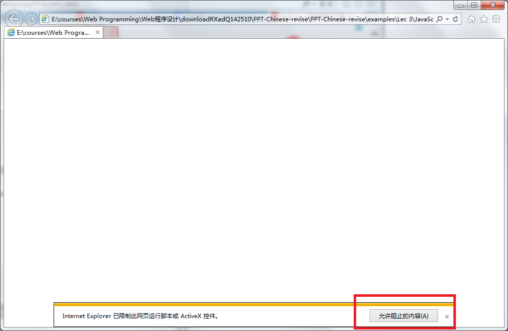
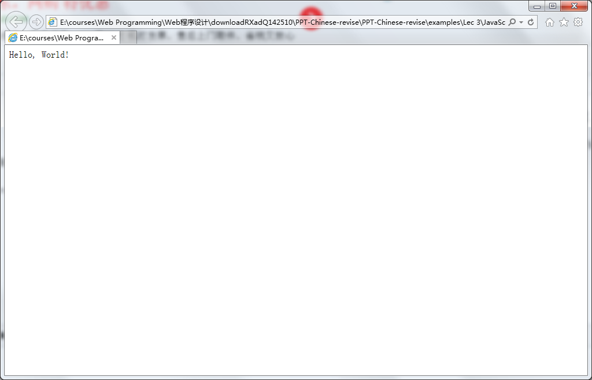

<!-- slide: 8 -->

## JavaScript：对事件作出反应

- alert() 函数在 JavaScript 中并不常用，但它对于代码测试非常方便。
- onclick 事件只是JavaScript中众多事件之一。
- 
- HTML
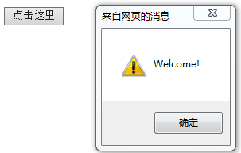

<!-- slide: 9 -->

## JavaScript：改变 HTML 内容

- 以后会经常看到 document.getElementByID("some id")。这个方法是 HTML DOM 中定义的。
- DOM（文档对象模型）是用以访问 HTML 元素的正式 W3C 标准。
- 
- HTML

<!-- slide: 10 -->

## JavaScript：改变 HTML 图像

- 
- 
- HTML

<!-- slide: 11 -->

## JavaScript：改变 HTML 样式

- 

- JavaScript 能改变 HTML 元素的样式。
- 

- 
- <button type=“button” onclick=“myFunction()”>点击这里</button>
- HTML

<!-- slide: 12 -->

## JavaScript 的使用

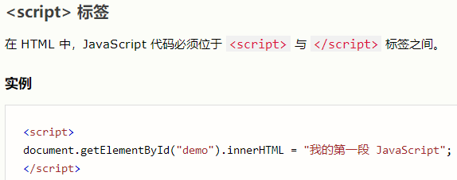
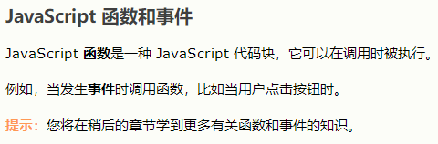
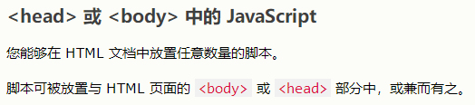

<!-- slide: 13 -->

## JavaScript 的使用

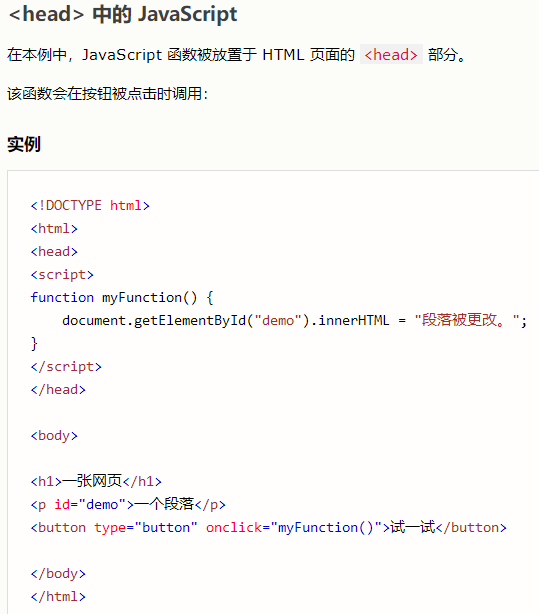
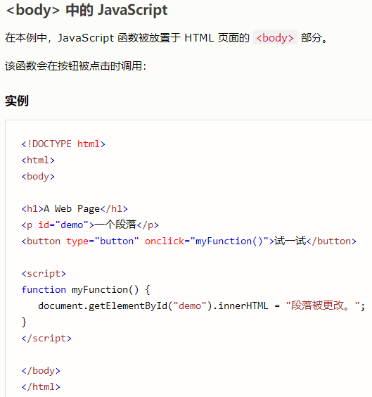

<!-- slide: 14 -->

## JavaScript 的使用

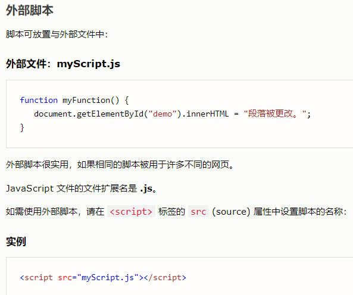

<!-- slide: 15 -->

## JavaScript 的使用

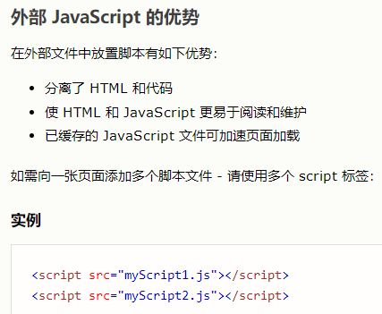
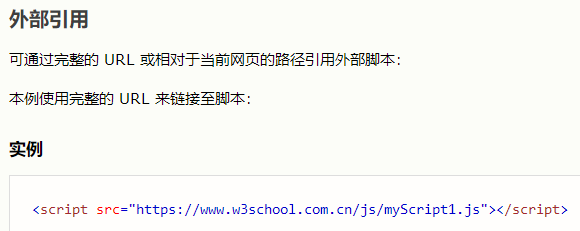

<!-- slide: 16 -->

## JavaScript 的使用

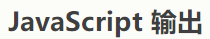
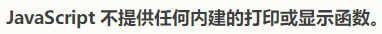
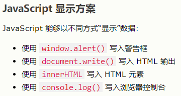
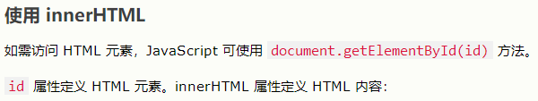
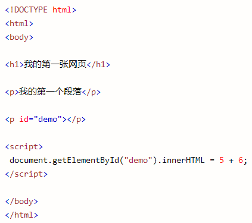

<!-- slide: 17 -->

## JavaScript 的使用

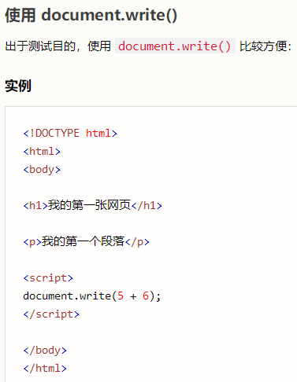
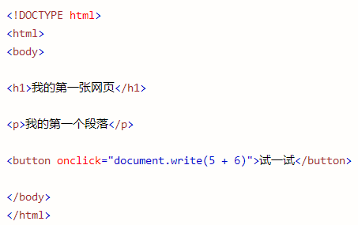

<!-- slide: 18 -->

## JavaScript 的使用

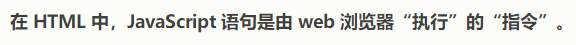
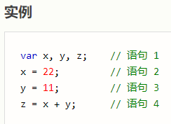
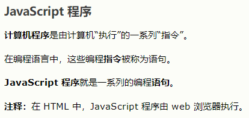
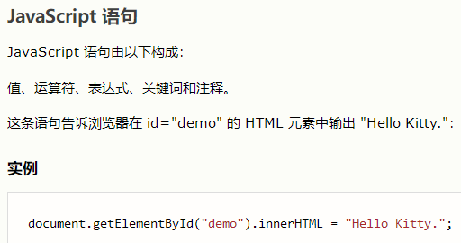
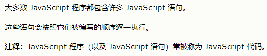

<!-- slide: 19 -->

## JS能做什么？

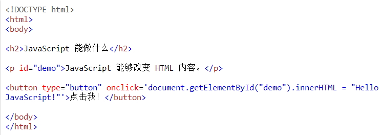
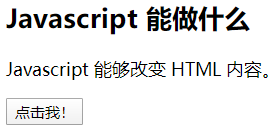
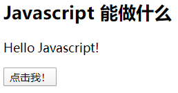
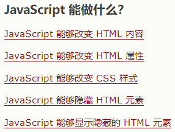

<!-- slide: 20 -->

## JS能做什么？

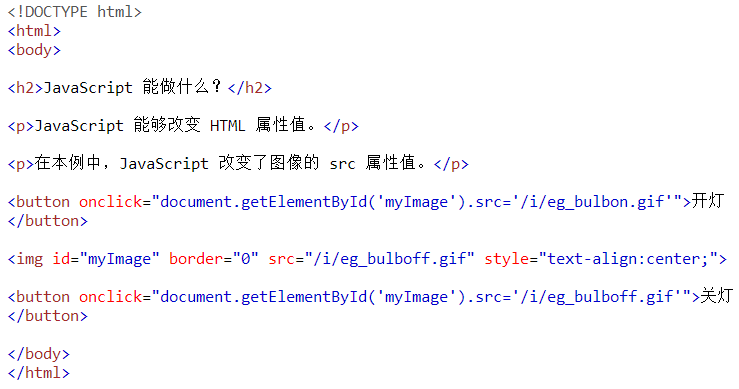
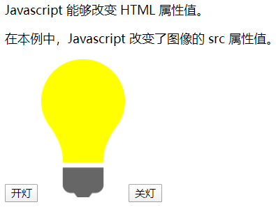

<!-- slide: 21 -->

## JS能做什么？

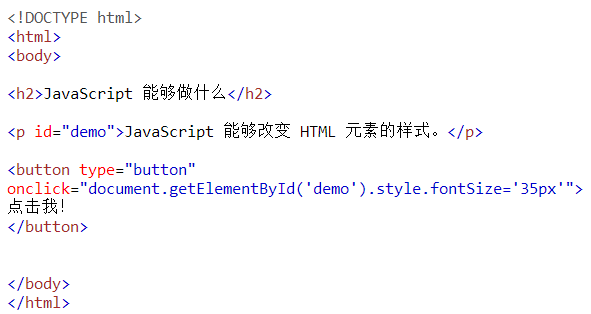
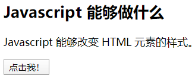
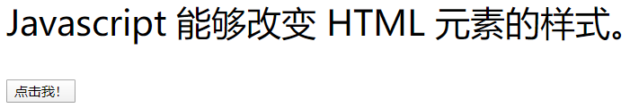

<!-- slide: 22 -->

## JS能做什么？

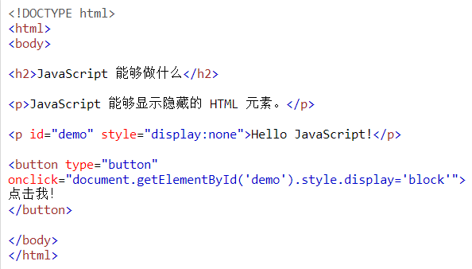
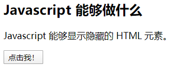
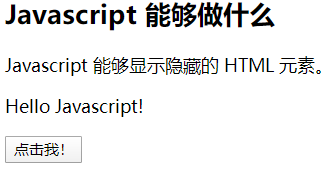

<!-- slide: 23 -->

## JS能做什么？

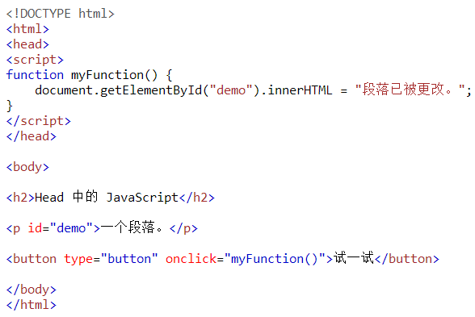

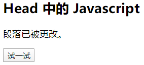

<!-- slide: 24 -->

## JS能做什么？

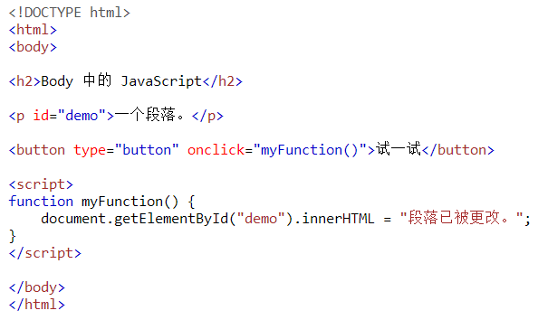
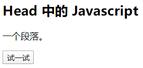

<!-- slide: 25 -->

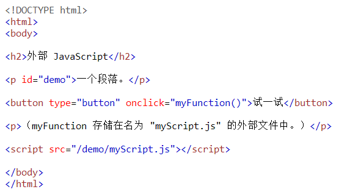
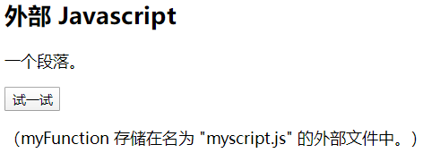
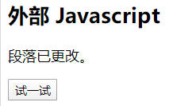

<!-- slide: 26 -->

## JavaScript编程案例-根据日期动态改变

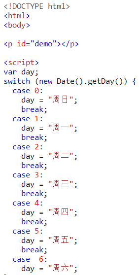
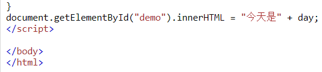
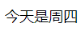

<!-- slide: 27 -->

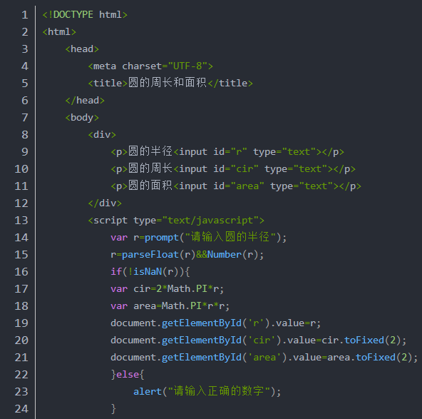
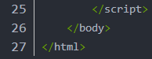

- 园的半径在JS代码中输入，并把周长和面积结果显示在页面的一个div中
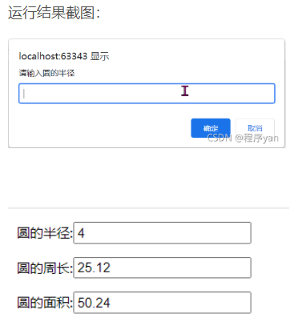
- JavaScript编程案例-用户互动输入

<!-- slide: 28 -->

## 总结

- JavaScript基础

<!-- slide: 29 -->

## 练习题

- 练习今天所讲的JavaScript基础

<!-- slide: 30 -->

- Thank you!
