# Lecture 7 Basic JavaScript

<!-- slide: 1 -->

## Lecture 7基础JavaScript 2

<!-- slide: 2 -->

## JavaScript 对象

- JavaScript 中的所有事物都是对象：字符串、数字、数组、日期，等等。
- 在 JavaScript 中，对象是拥有属性和方法的数据。

<!-- slide: 3 -->

## JavaScript 对象

- 属性和方法
- 属性是与对象相关的值。
- 方法是能够在对象上执行的动作。
- 举例：汽车就是现实生活中的对象。
- 汽车的属性：
- 汽车的方法：
- car.name=Fiat
- car.model=500
- car.weight=850kg
- car.color=white
- car.start()
- car.drive()
- car.brake()

<!-- slide: 4 -->

## 创建 JavaScript 对象

- JavaScript 中的几乎所有事务都是对象：字符串、数字、数组、日期、函数，等等。
- 你也可以创建自己的对象。
- 本例创建名为 "person" 的对象，并为其添加了四个属性：
- person=new Object();
- person.firstname="Bill";
- person.lastname="Gates";
- person.age=56;
- person.eyecolor="blue";

<!-- slide: 5 -->

## 创建 JavaScript 对象

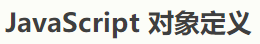
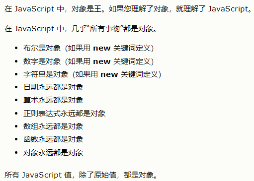
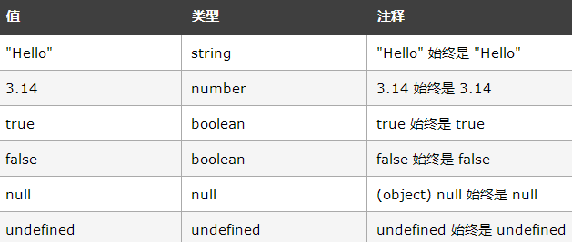
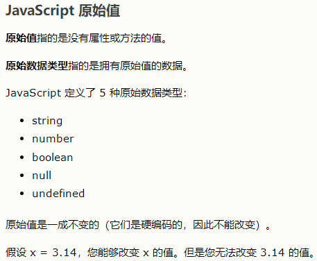

<!-- slide: 6 -->

## 创建 JavaScript 对象

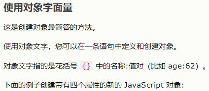
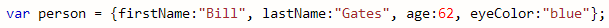
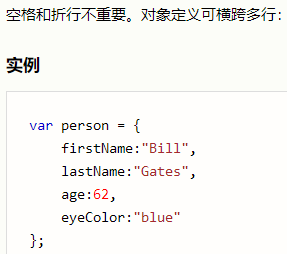
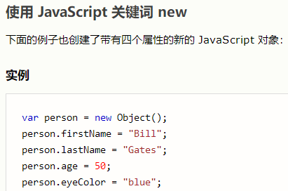
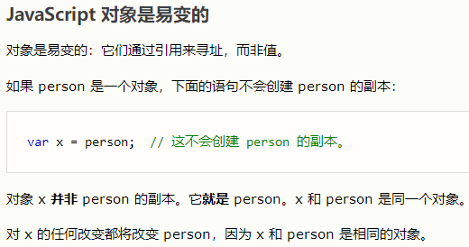
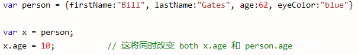

<!-- slide: 7 -->

## 创建 JavaScript 对象

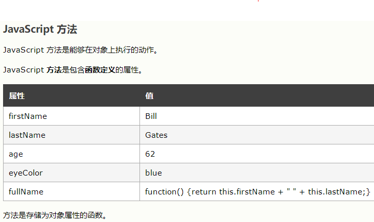
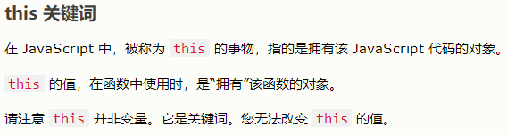
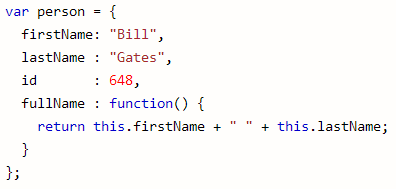
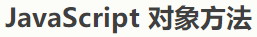

<!-- slide: 8 -->

## 创建 JavaScript 对象

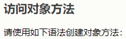
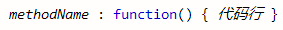
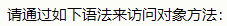
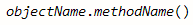
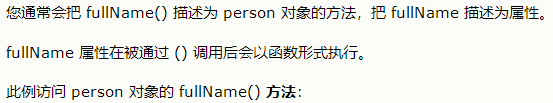
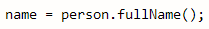
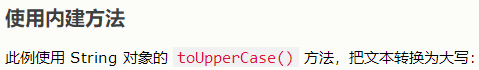
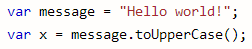
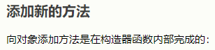
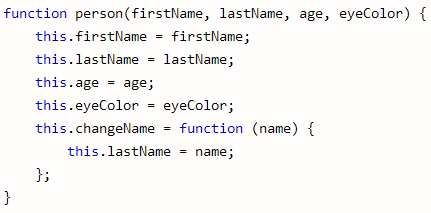
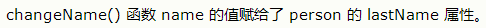

<!-- slide: 9 -->

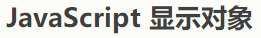
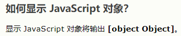
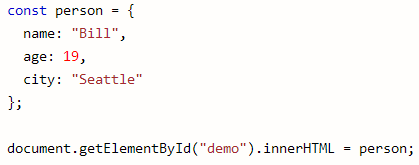
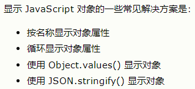
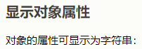
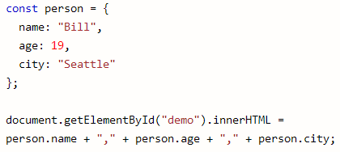
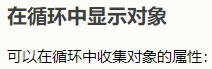
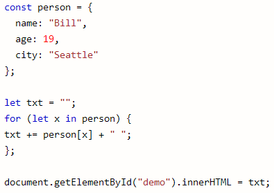
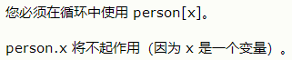

<!-- slide: 10 -->

## 调用带参数的函数

- 在调用函数时，您可以向其传递值，这些值被称为参数。
- 这些参数可以在函数中使用。
- 可以发送任意多的参数，由逗号 (,) 分隔：
- <button onclick="myFunction('Bill Gates','CEO')">点击这里</button>
- 

<!-- slide: 11 -->

## 带有返回值的函数

- 希望函数将值返回调用它的地方。
- 通过使用 return 语句就可以实现。
- 在使用 return 语句时，函数会停止执行，并返回指定的值。
- 注意：整个 JavaScript 并不会停止执行，仅仅是函数。JavaScript 将继续执行代码，从调用函数的地方。
- function myFunction()
- {
- var x=5;
- return x;
- }

<!-- slide: 12 -->

- 实例:计算两个数字的乘积，并返回结果
- 在您仅仅希望退出函数时 ，也可使用 return 语句。
- function myFunction(a,b)
- {
- return a*b;
- }
- document.getElementById("demo").innerHTML=myFunction(4,3);
- function myFunction(a,b)
- {
- if (a>b)
- {
- return;
- }
- x=a+b
- }

<!-- slide: 13 -->

## 局部和全局

- 局部 JavaScript 变量：在 JavaScript 函数内部声明的变量（使用 var）是局部变量，所以只能在函数内部访问它。（该变量的作用域是局部的）。
- 全局 JavaScript 变量：在函数外声明的变量是全局变量，网页上的所有脚本和函数都能访问它。

<!-- slide: 14 -->

## JavaScript 运算符

- JavaScript 算术运算符：给定 y=5，下面的表格解释了这些算术运算符：
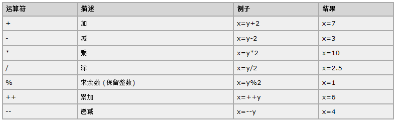

<!-- slide: 15 -->

## JavaScript 运算符

- JavaScript 赋值运算符：给定 x=10 和 y=5，下面的表格解释了赋值运算符：
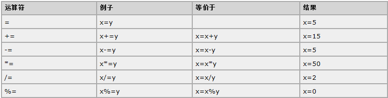

<!-- slide: 16 -->

## JavaScript 运算符

- 用于字符串的 + 运算符：+ 运算符用于把文本值或字符串变量加起来（连接起来）。
- 对字符串和数字进行加法运算：如果把数字与字符串相加，结果将成为字符串。
- x="5"+5;
- document.write(x);

<!-- slide: 17 -->

## JavaScript 比较和逻辑运算符

- 比较运算符：给定 x=5，下面的表格解释了比较运算符
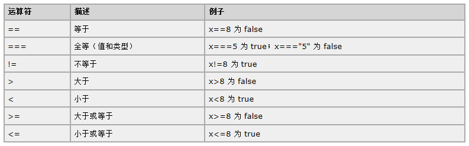

<!-- slide: 18 -->

## JavaScript 比较和逻辑运算符

- 逻辑运算符用于测定变量或值之间的逻辑：给定 x=6 以及 y=3，下表解释了逻辑运算符
- 条件运算符
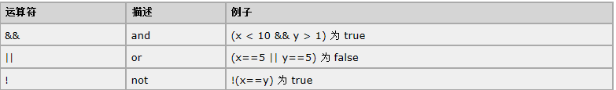
- greeting=(visitor=="PRES")?"Dear President ":"Dear ";

<!-- slide: 19 -->

## JavaScript If...Else 语句

- 在 JavaScript 中，我们可使用以下条件语句：
  - if 语句 - 只有当指定条件为 true 时，使用该语句来执行代码
  - if...else 语句 - 当条件为 true 时执行代码，当条件为 false 时执行其他代码
  - if...else if....else 语句 - 使用该语句来选择多个代码块之一来执行
  - switch 语句 - 使用该语句来选择多个代码块之一来执行
- if (time<10)  {
- x="Good morning";
- }
- else if (time<20)  {
- x="Good day";
- }
- else  {
- x="Good evening";
- }

<!-- slide: 20 -->

## JavaScript Switch 语句

- 请使用 switch 语句来选择要执行的多个代码块之一
- switch(n)
- {
- case 1:
- 执行代码块 1
- break;
- case 2:
- 执行代码块 2
- break;
- default:
- n 与 case 1 和 case 2 不同时执行的代码
- }

<!-- slide: 21 -->

## JavaScript For 循环

- 语法
- 例子
- for (语句 1; 语句 2; 语句 3)
- {
- 被执行的代码块
- }
- for (var i=0; i<5; i++)
- {
- x=x + "The number is " + i + " ";
- }

<!-- slide: 22 -->

## JavaScript For 循环

- JavaScript for/in 语句循环遍历对象的属性
- var person={fname:"John",lname:"Doe",age:25};
- for (x in person)
- {
- txt=txt + person[x];
- }

<!-- slide: 23 -->

## JavaScript While 循环

- 语法：
- 实例：
- while (条件)
- {
- 需要执行的代码
- }
- while (i<5)
- {
- x=x + "The number is " + i + " ";
- i++;
- }

<!-- slide: 24 -->

## JavaScript While 循环

- do/while 循环
- 实例：
- do
- {
- 需要执行的代码
- }
- while (条件);
- do
- {
- x=x + "The number is " + i + " ";
- i++;
- }
- while (i<5);

<!-- slide: 25 -->

## JavaScript Break 和 Continue 语句

- break 语句用于跳出循环。
- continue 用于跳过循环中的一个迭代。
- for (i=0;i<10;i++)
- {
- if (i==3)
- {
- break;
- }
- x=x + "The number is " + i + " ";
- }
- for (i=0;i<=10;i++)
- {
- if (i==3) continue;
- x=x + "The number is " + i + " ";
- }

<!-- slide: 26 -->

## JavaScript Break 和 Continue 语句

- JavaScript 标签语法
- 实例
- label:
- 语句
- cars=["BMW","Volvo","Saab","Ford"];
- list:
- {
- document.write(cars[0] + " ");
- document.write(cars[1] + " ");
- document.write(cars[2] + " ");
- break list;
- document.write(cars[3] + " ");
- document.write(cars[4] + " ");
- document.write(cars[5] + " ");
- }

<!-- slide: 27 -->

## JavaScript异常处理

- try 语句测试代码块的错误。
- catch 语句处理错误。
- throw 语句创建自定义错误。
- try - catch语法：
- try
- {
- //在这里运行代码
- }
- catch(err)
- {
- //在这里处理错误
- }

<!-- slide: 28 -->

## JavaScript异常处理

- try – catch 实例
- 

<!-- slide: 29 -->

## JavaScript异常处理

- Throw 语句
- throw 语句允许我们创建自定义错误。
- 正确的技术术语是：创建或抛出异常（exception）。
- 如果把 throw 与 try 和 catch 一起使用，那么您能够控制程序流，并生成自定义的错误消息。
- 语法
- throw exception

<!-- slide: 30 -->

## JavaScript异常处理

- throw 实例
- function myFunction()
- {
- try
- {
- var x=document.getElementById("demo").value;
- if(x=="")    throw "empty";
- if(isNaN(x)) throw "not a number";
- if(x>10)     throw "too high";
- if(x<5)      throw "too low";
- }
- catch(err)
- {
- var y=document.getElementById("mess");
- y.innerHTML="Error: " + err + ".";
- }
- }

<!-- slide: 31 -->

## 总结

- JavaScript基础
  - 对象
  - 函数
  - 运算符
  - 比较
  - 循环
  - 异常处理

<!-- slide: 32 -->

## 练习题

- 练习今天所讲的JavaScript基础，并用JavaScript编写一个快速排序算法，要求在页面上输出原始输入应对列及排序后的结果

<!-- slide: 33 -->

- Thank you!
