# Lecture 8 Object-Oriented JavaScript

<!-- slide: 1 -->

## Lecture 8 面向对象的JavaScript

<!-- slide: 2 -->

## 概要

- 学习工具
- 对象和函数
- 构造函数和原型
- 基础
- 多态

<!-- slide: 3 -->

## 学习工具– Firebug

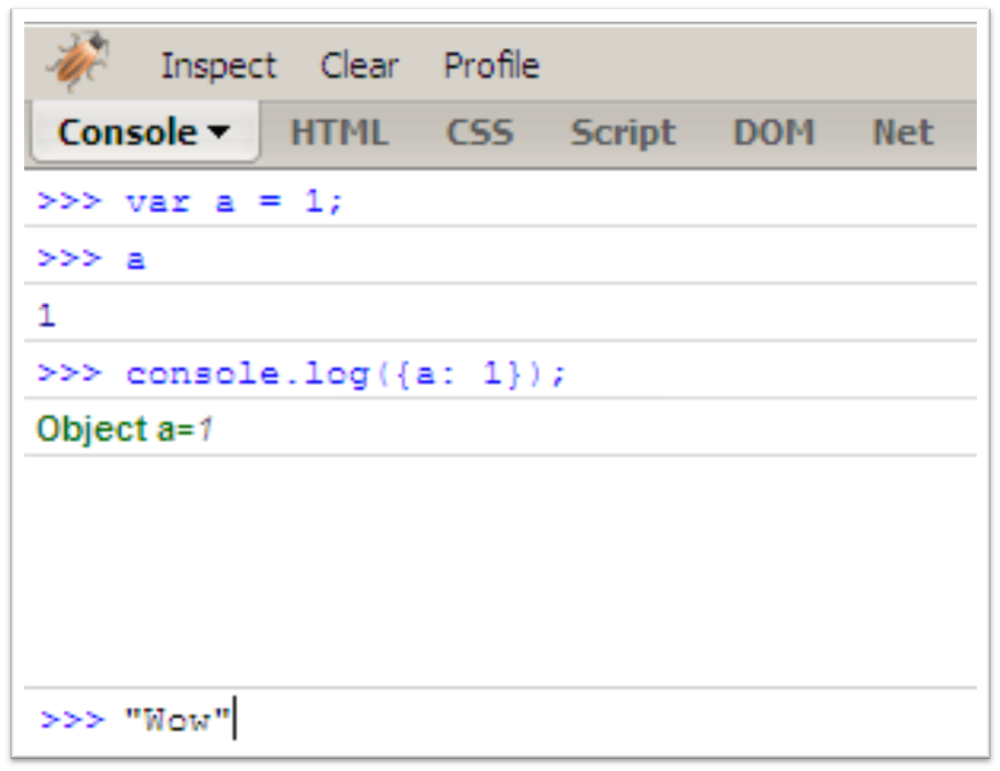

<!-- slide: 4 -->

## 学习工具– JavaScript shell

- 使用书签版本的shell: 命令会在所打开的页面中执行
  - https://www.squarefree.com/bookmarklets/webdevel.html
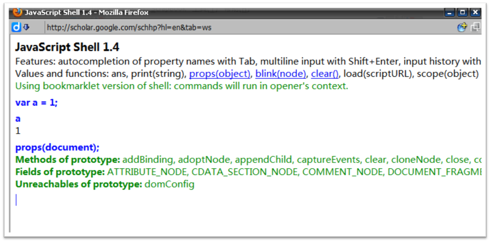

<!-- slide: 5 -->

## 概要

- 学习工具
- 对象和函数
- 构造函数和原型
- 继承
- 多态

<!-- slide: 6 -->

## JavaScript != Java

- 类似C语言的语法
- 类（Classes）          
- 数据类型:
  - 原始的:
    - 数字类型– 1, 3, 1001, 11.12, 2e+3
    - 字符串– "a", "stoyan", "0"
    - 布尔类型– true | false
    - 空（null）
    - 未定义
  - 对象: 一切都是对象 …

<!-- slide: 7 -->

## 对象

- 每一个对象实际上都是一个内部哈希表 (键: 值)
- 当一个属性是函数时我们称之为方法
- var obj = {};
- obj.name = 'my object';
- obj.shiny = true;
- var obj = {
- shiny: true,
- isShiny: function() {
- return this.shiny;
- }
- };
- obj.isShiny(); // true

<!-- slide: 8 -->

## 对象字面量

- 键-值对 (Key-value)
- 用逗号分隔
- 被花括号包裹
- {a: 1, b: "test"}

<!-- slide: 9 -->

## 数组

- 数组也是对象
- 自动增加属性
- 一些有用的方法
- 数组字面量
- >>> var a = [1,3,2];
- >>> a[0]
- 1
- >>> typeof a
- "object"
- var array = [
- "Square",
- "brackets",
- "wrap",
- "the",
- "comma-delimited",
- "elements"
- ];

<!-- slide: 10 -->

## JavaScript对象表示法(JSON)

- 对象字面量+ 数组字面量
- 对象序列化 ,  在保存跟传送对象 时很有用
- 一个 JSON 字符串可以通过eval() 函数实例化
- {"num": 1, "str": "abc", "arr": [1,2,3]}
- var jsonStr = '{"num": 1, "str": "abc", "arr": [1,2,3]}‘;
- obj = eval(jsonStr);

<!-- slide: 11 -->

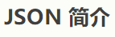
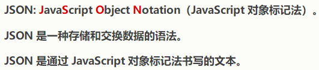
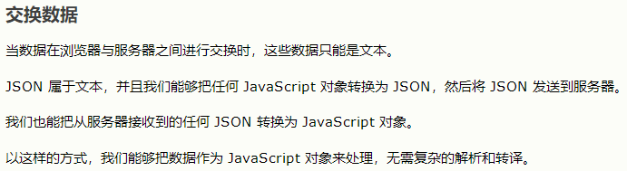
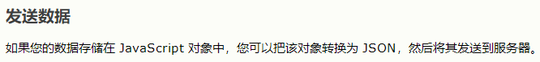
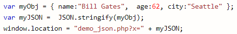
- JSON

<!-- slide: 12 -->

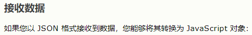
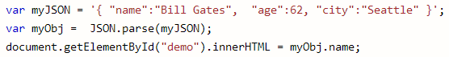
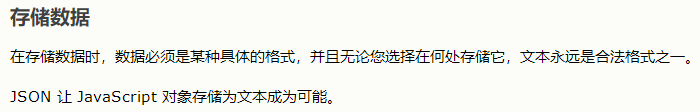
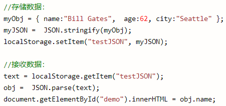
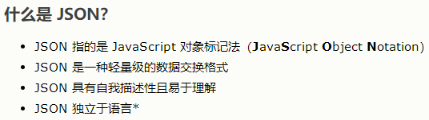
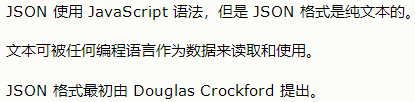
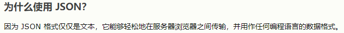
- JSON

<!-- slide: 13 -->

## 函数

- 函数是对象
  - 拥有属性
  - 拥有方法
  - 可以被复制，删除，扩充...
  - 特征 : 可调用（invokable）
- function say(what) {
- return what;
- }
- var say = function(what) {
- return what;
- };
- var say = function say(what) {
- return what;
- };

<!-- slide: 14 -->

## 函数是对象

- >>> say.length
- 1
- >>> say.name
- "boo"
- >>> var tell = say;
- >>> tell("doodles")
- "doodles"
- >>> tell.call(null, "moo!");
- "moo!"

<!-- slide: 15 -->

## 返回值

- 所有的函数总是返回一个值
- 如果函数没有显式返回一个值, 它返回的是未定义值(undefined)
- 函数可以返回对象,包括其它函数

<!-- slide: 16 -->

## 概要

- 学习工具
- 对象和函数
- 构造函数和原型
- 继承
- 多态

<!-- slide: 17 -->

## 构造函数

- 当使用 new创建时, 函数将返回一个this对象
- 在它返回之前，你可以修改  this 对象
- 命名约定 : 	  构造函数： MyConstructor ；
- 函数：	myFunction  .
- var Person = function(name) {
- this.name = name;
- this.getName = function() {
- return this.name;
- };
- };
- var me = new Person("Stoyan");
- me.getName(); // "Stoyan"

<!-- slide: 18 -->

## 构造函数属性

- >>> function Person(){};
- >>> var jo = new Person();
- >>> jo.constructor === Person
- true
- >>> var o = {};
- >>> o.constructor === Object
- true
- >>> [1,2].constructor === Array
- true

<!-- slide: 19 -->

## 内置构造函数

- Object
- Array
- Function
- RegExp ：RegExp 对象表示正则表达式，它是对字符串执行模式匹配的强大工具。
- Number
- String
- Boolean
- Date
- Error, SyntaxError, ReferenceError…

<!-- slide: 20 -->

## 约定

| 使用这个方法 | 而不是这种方法 |
|---|---|
| var o = {}; | var o = new Object(); |
| var a = []; | var a = new Array(); |
| var re = /[a-z]/gmi; | var re = new RegExp(     '[a-z]', 'gmi'); |
| var fn = function(a, b){   return a + b; } | var fn = new Function( 'a, b','return a+b'); |

<!-- slide: 21 -->

## 原型

- prototype 是函数对象的一个特殊属性
- prototype 不是指我们使用的JavaScript 工具包
- 扩充 prototype
- 重写 prototype
- >>> var boo = function(){};
- >>> typeof boo.prototype
- "object"
- >>> boo.prototype.a = 1;
- >>> boo.prototype.sayAh = function(){};
- >>> boo.prototype ={a: 1, b: 2};

<!-- slide: 22 -->

## prototype属性的使用

- 当一个函数被调用时， prototype 作为构造函数被使用
- var Person = function(name) {
- this.name = name;
- };
- Person.prototype.say = function(){
- return this.name;
- };
- >>> var dude = new Person('dude');
- >>> dude.name;
- "dude"
- >>> dude.say();
- "dude"
- say() 是 prototype对象的一个属性，但它却像dude对象的属性一样被使用

<!-- slide: 23 -->

## 自带属性 vs. prototype包含的属性

- isPrototypeOf()
- >>> dude.hasOwnProperty('name');
- true
- >>> dude.hasOwnProperty('say');
- false
- >>> Person.prototype.isPrototypeOf(dude);
- true
- >>> Object.prototype.isPrototypeOf(dude);
- true

<!-- slide: 24 -->

## __proto__

- 对象有一个隐式链接，链接到创建它们的对象的构造函数的 prototype
- >>> dude.__proto__.hasOwnProperty('say')
- true
- >>> dude.prototype
- ??? // Trick question
- >>> dude.__proto__.__proto__.hasOwnProperty('toString')
- true

<!-- slide: 25 -->

## __proto__ 链

- >>> typeof dude.numlegs
- "undefined"
- >>> Person.prototype.numlegs = 2;
- >>> dude.numlegs
- 2
- 这是一条生存链
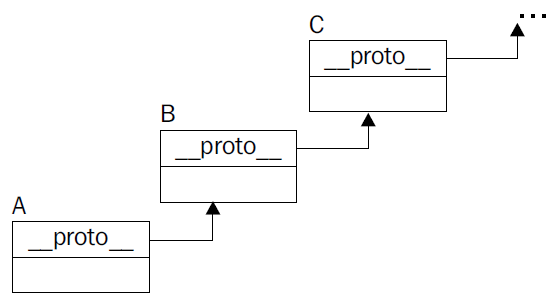

<!-- slide: 26 -->

## 概要

- 学习工具
- 对象和函数
- 构造函数和原型
- 继承
- 多态

<!-- slide: 27 -->

## 怎样实现?

- function NormalObject() { //  父构造函数
- this.name = 'normal';
- this.getName = function() {
- return this.name;
- };
- }
- function PreciousObject(){ //  子构造函数
- this.shiny = true;
- this.round = true;
- }
- /***  我们如何实现下面这个? ***/
- var crystal_ball = new PreciousObject();
- crystal_ball.name = 'Crystal Ball.';
- crystal_ball.round; // true
- crystal_ball.getName(); // "Crystal Ball."

<!-- slide: 28 -->

## 通过复制实现对象的继承

- //  两个对象
- var shiny = {
- shiny: true,
- round: true
- };
- var normal = {
- name: 'name me',
- getName: function() {
- return this.name;
- }
- };
- // 继承功能函数
- function extend(parent, child){
- for (var i in parent) {
- child[i] = parent[i];
- }
- }
- // 通过复制的继承
- extend(normal, shiny);
- shiny.getName(); // "name me”

<!-- slide: 29 -->

## 原型的继承

- function object(o) {
- function F(){}
- F.prototype = o;
- return new F();
- }
- >>> var parent = {a: 1};
- >>> var child = object(parent);
- >>> child.a;
- 1
- >>> child.hasOwnProperty(a);
- false
- 产生对象

<!-- slide: 30 -->

## 概要

- 学习工具
- 对象和函数
- 构造函数 和原型
- 继承
- 多态

<!-- slide: 31 -->

## JavaScript 是面向对象的语言?

- 肯定是!
- 面向对象 不是 面向类
  - 封装
  - 继承
  - 多态 – 因为JavaScript 是一种动态语言, 多态很容易实现也很常见 .
  - 两种常见的多态:
    - 运行时替换
    - 载入时分支
- 它比Java 和C++这些编译型语言更具有动态性

<!-- slide: 32 -->

## 载入时分支

- var getXHR = function () {
- if (window.XMLHttpRequest) {
- return function () {
- // 返回一个标准的XHR实例
- };
- }
- else {
- return function () {
- // 返回一个浏览器的XHR实例
- };
- }
- }(); // 注意: 父对象触发自我调用

<!-- slide: 33 -->

## 运行时替换

- var documentListFactory = function () {
- var out = []; // 只是一个简单的数组
- // 重写默认的.push()方法
- out.push = function (document) {
- Array.prototype.push.call(out, {
- document  : document,
- timestamp : new Date().getTime()
- });
- };
- return out;
- };

<!-- slide: 34 -->

## 总结

- 学习工具
  - Firebug
- 对象和函数
  - JavaScript != Java
  - 对象字面量, 数组字面量, JSON
  - 函数: 对象, 可调用, 返回值
- 构造函数和原型( Prototype)
  - 构造函数 , 构造函数属性
  - 内置构造函数 , 约定
  - 原型, __proto__ 链
- 继承
  - 通过复制, 原型的
- 多态
  - 载入时分支, 运行时替换

<!-- slide: 35 -->

## 练习

- 在Firebug控制台中用JavaScript编写代码定义Employee , Manager , 和Secretary 的类
  - 每个Employee拥有名字和薪水
  - 每个 Manager 都是 Employee, 并且管理一组其他的Employees
  - 每个 Secretary  都是Employee, 并为Manager 工作
- 给这些类添加方法
  - 每个Employee 有一个show()方法，以字符串的形式返回自己 的名字和薪水
  - 每个 Manager 有一个 getInferiors()方法，返回他的下属
  - 每个Secretary 有一个getSuperior()方法， 返回他的老板
- 尝试使用两种不同的继承方式, 复制和原型

<!-- slide: 36 -->

## 进阶阅读

- JavaScript介绍
- http://en.wikipedia.org/wiki/JavaScript
- W3Schools JavaScript 教程http://www.w3schools.com/js/default.asp
- Mozilla Developer Center JavaScript 文档https://developer.mozilla.org/en/javascript
- JavaScript面向对象编程 ，作者Mike Koss http://mckoss.com/jscript/object.htm
- JavaScript面向对象编程 Part 1 http://articles.sitepoint.com/article/oriented-programming-1
- JavaScript面向对象编程 Part 2 http://articles.sitepoint.com/article/oriented-programming-2

<!-- slide: 37 -->

- Thank you!
