# Lecture 9 More JavaScript and DOM(C)

<!-- slide: 1 -->

## 第9讲更多JavaScript和DOM

<!-- slide: 2 -->

## 概要

- 事件驱动JavaScript
- DOM 基础
- Prototype 与 DOM
- 计时器

<!-- slide: 3 -->

## 事件驱动编程

- 你从前习惯从main开始编程
- 相对从main开始,  有些程序则一直等待用户发出动作(称为事件), 并对这些动作做出响应
- 事件驱动编程: 编写由用户事件驱动的程序

<!-- slide: 4 -->

## <button>

- 按钮的文本在标签中; 也可以包含图片
- 创建一个能响应的按钮或者其它UI控件:
  - 选择控件(例如 button)和感兴趣的事件(例如 mouse click)
  - 写一个处理这个事件的JavaScript函数
  - 把这个函数绑定到控件的事件上
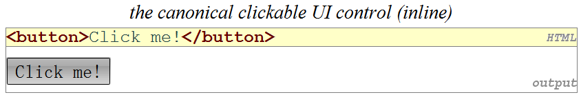

<!-- slide: 5 -->

## 事件句柄

- JavaScript 函数可以被用作事件处理函数
  - 当你与这个元素交互时, 这个函数会执行
- onclick 只是我们在众多HTML事件属性中用到的其中一个
- 直到它们要处理（响应）的事件发生，这些特定的事件处理函数才会被执行
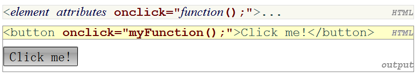

<!-- slide: 6 -->

## 概要

- 事件驱动JavaScript
- DOM 基础
- Prototype 与 DOM
- 计时器

<!-- slide: 7 -->

## 文档对象模型(DOM)

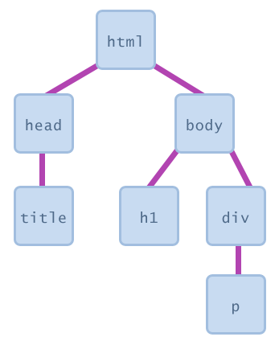
- 一系列JavaScript 对象，用来描述页面上每个元素
- 大部分JS 代码操作着HTML页面上的元素
- 我们可以遍历元素的状态
  - 例如 检查一个选项框是否被选中
- 我们可以改变状态
  - 例如 往一个div里面插入一些文本
- 我们可以改变样式
  - 例如 使一段文字变成红色

<!-- slide: 8 -->

## DOM 元素

- 事实上, 浏览器在运行时把网页转换成相应的DOM对象
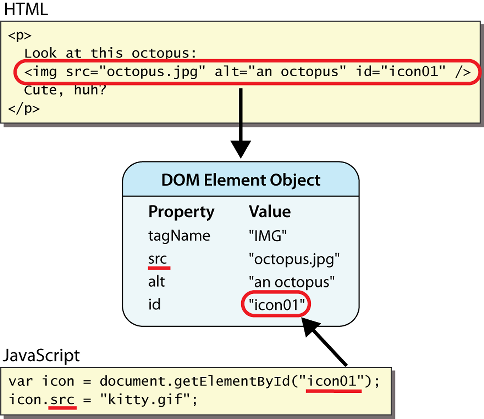
- 每一个页面上的元素都有一个相应的 DOM 对象
- 访问/修改DOM对象的属性 :
- objectName.attributeName

<!-- slide: 9 -->

## 访问元素: document.getElementById

- document.getElementById 返回给定 id 元素的 DOM 对象
- 可以通过设定 innerHTML 属性来改变大部分元素内部的文本
- 可以通过设定 value 属性来改变表单控件的文本
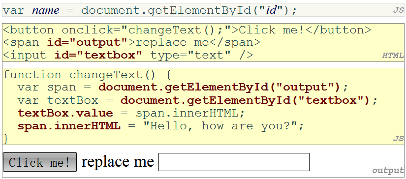

<!-- slide: 10 -->

## DOM 本质

- 由浏览器创建的对象, 并且开放它们的JS API
- 事实上, 浏览器开放的不仅是DOM对象
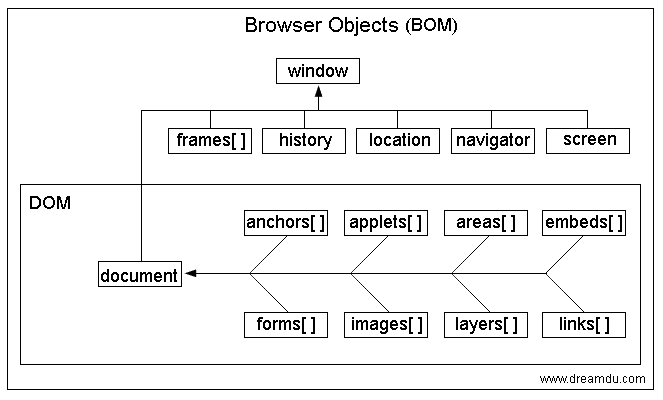

<!-- slide: 11 -->

## 概要

- 事件驱动JavaScript
- DOM 基础
- Prototype 与 DOM
- 计时器

<!-- slide: 12 -->

## JavaScript 的问题

- JavaScript 是一种强大的语言, 但它也有很多瑕疵:
- DOM使用起来很笨重
  - document.getElementById , 超过20个字符!
- 同样的代码在不同浏览器中运行起来并不总是相同
  - 在Firefox, Safari, ... 里运行得很好的代码, 在IE中并不好. 反之依然.
- 很多开发者通过侵入式编程来解决这些问题 (检查浏览器是不是 IE, 等.)

<!-- slide: 13 -->

## Prototype 框架

- Prototype JavaScript 库为 JavaScript 添加了很多有用的功能:
  - 大量有用的 DOM扩展
  - 增加 String, Array, Date, Number, Object 的方法
  - 提高事件驱动编程
  - 大量跨浏览器兼容性的修复
  - 使 Ajax编程 更容易 (稍后将会见到)
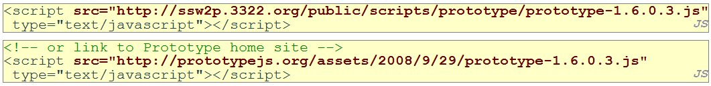

<!-- slide: 14 -->

## $ 函数

- 返回给定 id 所代表的元素的DOM 对象
- document.getElementById(“id”) 的缩写
- 通常用于编写更为紧凑的 DOM 代码:
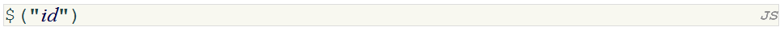
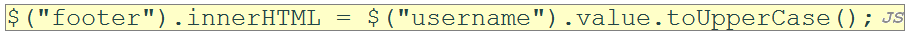

<!-- slide: 15 -->

## DOM 对象属性

| 属性 | 描述 | 例子 |
|---|---|---|
| tagName | 元素的HTML标签 | $("main").tagName is "DIV" |
| className | 元素的CSS 类 | $("main").className is "foo bar" |
| innerHTML | 元素的内容 | $("main").innerHTML is "\n 
Hello, <em>ve... |
| src | 图片的URL目标 | $("icon").src is "images/borat.jpg" |

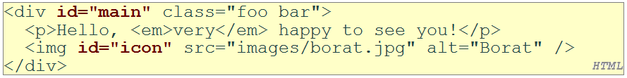

<!-- slide: 16 -->

## 表单控件的 DOM 属性

| 属性 | 描述 | 例子 |
|---|---|---|
| value | input 控件内的文本 | $(“sid”).value 是"1234567" |
| checked | 选项框是否被选中 | $(“frosh”).checked 为true |
| disabled | 控件是否失效(boolean) | $(“frosh”).disabled 为 false |
| readOnly | 文本框是否只读 | $(“sid”).readOnly 为false |

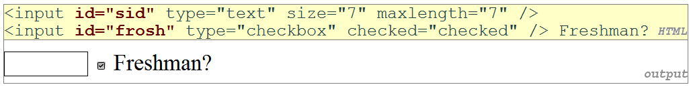

<!-- slide: 17 -->

## 滥用 innerHTML

- innerHTML 可以向页面注入任意HTML内容
- 然而, 这样容易导致bug和错误, 并且是糟糕的风格
- 我们禁止使用 innerHTML 注入 HTML 标签; 只注入简单的文本
  - (稍后, 我们将会看到更好地往HTML标签注入内容的方法)
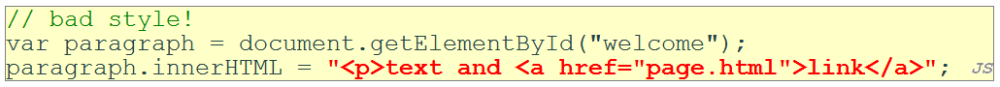

<!-- slide: 18 -->

## 通过 DOM 调整样式

- 包含跟CSS相同的属性, 但使用驼峰命名法. 例如: backgroundColor, borderLeftWidth, fontFamily
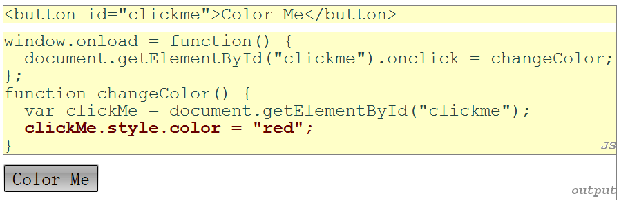

| 属性 | 描述 |
|---|---|
| style | 允许你为元素设定任意的CSS样式 |

<!-- slide: 19 -->

## 常见的 DOM 样式错误

- 当设定样式时, 很多学生忘记写 .style
- 样式属性应该写成 likeThis, 而不是 like-this
- 样式属性必须设定为字符串, 通常最后跟着单位
  - 跟在CSS里面一样, 但需要写上引号
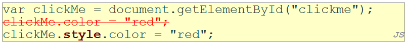
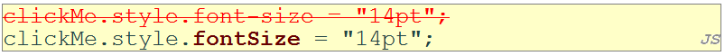
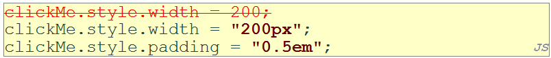

<!-- slide: 20 -->

## 不显眼的样式

- 风格好的 JavaScript 代码应该包含尽量少的 CSS
- 使用 JS 去设定元素的 CSS classes/IDs
- 在你的CSS文件中定义这些 classes/IDs 的样式
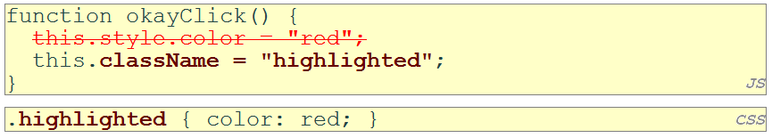

<!-- slide: 21 -->

## 概要

- 事件驱动JavaScript
- DOM 基础
- Prototype 与 DOM
- 计时器

<!-- slide: 22 -->

## Timer 事件

- setTimeout 和 setInterval 都返回一个代表该计时器的 ID
  - 这个 ID 可以传递给 clearTimeout/Interval 以停止该计时器

| 方法 | 描述 |
|---|---|
| setTimeout(function, delayMS); | 在指定的毫秒数后调用指定的函数 |
| setInterval(function, delayMS); | 每经过指定的毫秒数后重复调用指定的函数 |
| clearTimeout(timerID); clearInterval(timerID); | 停止给定的计时器, 使其不再调用函数 |

<!-- slide: 23 -->

## setTimeout 例子

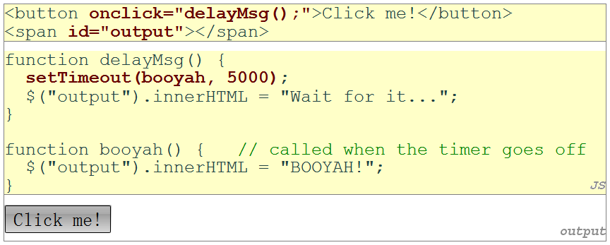

<!-- slide: 24 -->

## setInterval 例子

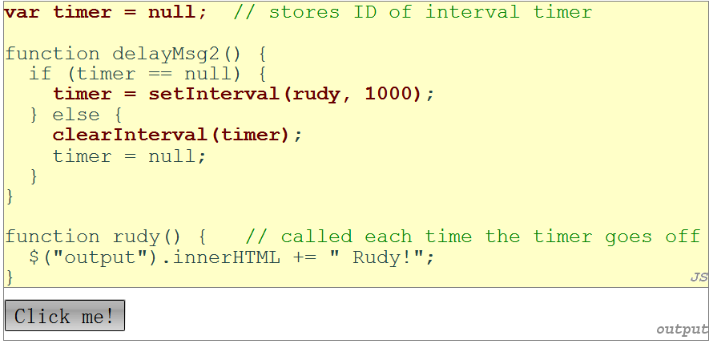

<!-- slide: 25 -->

## 传递参数给计时器

- 所有在延时参数之后的参数都会传递给计时器函数
  - IE6 无法使用; 必须创建一个中间函数去传递这些参数
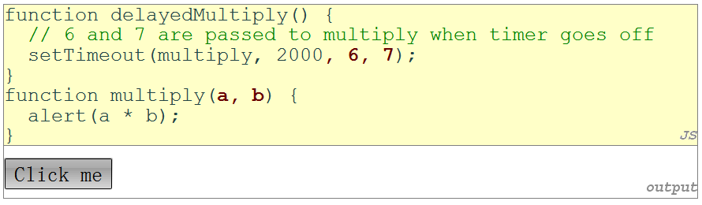

<!-- slide: 26 -->

- JavaScript事件驱动编程 - 高级事件
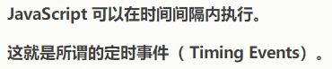
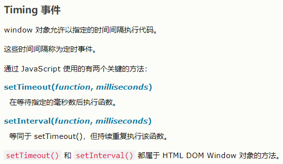
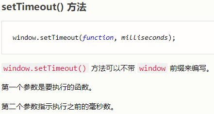
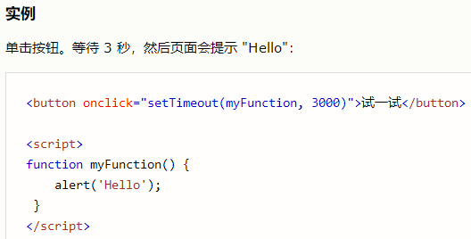
- 计时器事件

<!-- slide: 27 -->

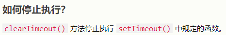
- JavaScript事件驱动编程 - 高级事件
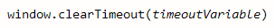
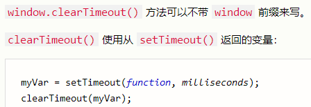
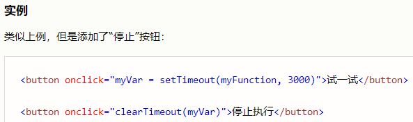
- 计时器事件

<!-- slide: 28 -->

- JavaScript事件驱动编程 - 高级事件
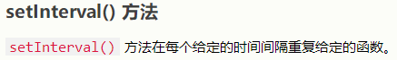
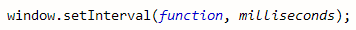
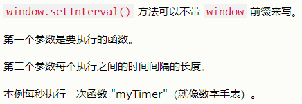
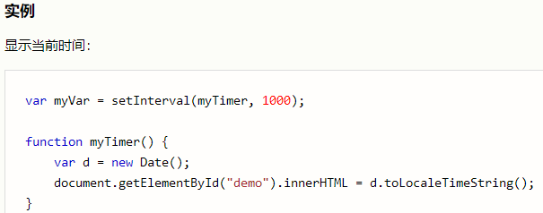
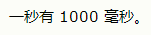
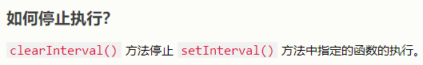
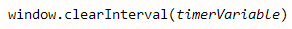
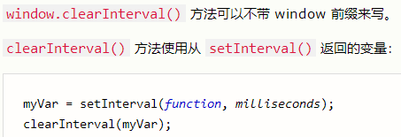
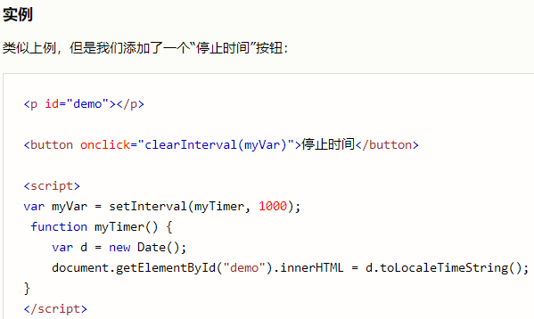
- 计时器事件

<!-- slide: 29 -->

## 常见计时器错误

- 当传递函数的时候, 很多学生会写上()
- 如果你写上(), 事实上浏览器会怎么做?
- 它会马上调用这个函数, 而不是等待到给定的时间
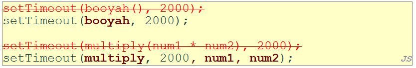

<!-- slide: 30 -->

## 总结

- 事件驱动JavaScript
  - EDP, button, 事件句柄
- DOM 基础
  - DOM, DOM 元素, 访问元素
  - BOM & DOM
- Prototype 和 DOM
  - JS 问题, prototype, $
  - DOM 对象属性(表单控件)
  - innerHTML, style, 常见错误
- 计时器
  - timer 事件, setTimeout, setInterval
  - 参数传递, 常见错误

<!-- slide: 31 -->

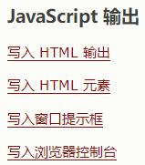
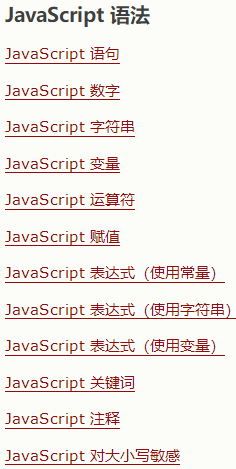
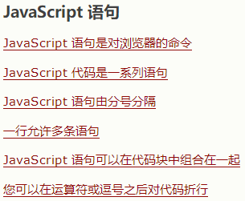
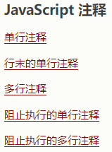
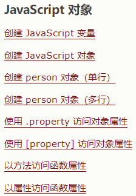
- JS主要内容

<!-- slide: 32 -->

- JS主要内容
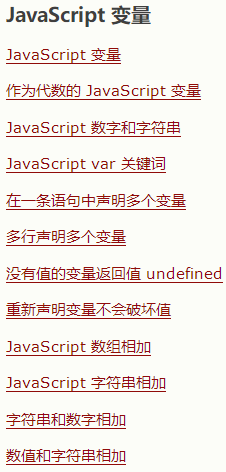
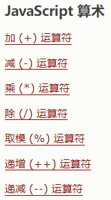
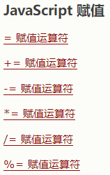
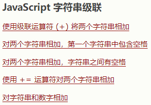
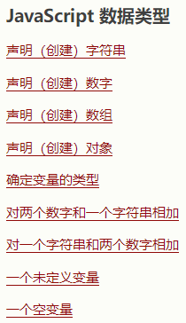

<!-- slide: 33 -->

- JS主要内容
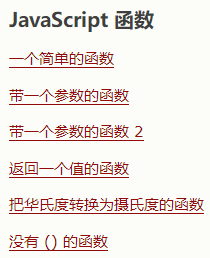
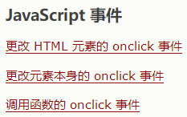

<!-- slide: 34 -->

- JS主要内容

<!-- slide: 35 -->

- JS主要内容

<!-- slide: 36 -->

## 练习

- 编写一个网页, 展示你最喜欢电影(最少3个)
- 使这些电影名字的颜色每隔10秒逐个从黑色变成红色
- 在网页上添加一个按钮.当点击该按钮时，它将电影列表上的电影名称进行反序处理，然后在消息对话框中弹出。
  - 使用 DOM 函数
  - 使用 Prototype.js 函数

<!-- slide: 37 -->

## 阅读材料

- W3School DOM 节点参考http://www.w3school.com/dom/dom_node.asp/
- W3School DOM 指南
- http://www.w3schools.com/htmldom/
- Quirksmode DOM 指南http://www.quirksmode.org/dom/intro.html
- Prototype Learning Center http://www.prototypejs.org/learn
- Prototype 如何扩展 DOM http://www.prototypejs.org/learn/extensions

<!-- slide: 38 -->

- 谢谢!
