# 2012－2013学年第2学期《概率论与数理统计》期末试题（A卷）

| 题号 | 一 | 二 | 三 | 四 | 五 | 六 | 七 | 八 | 总分 |
|---|---|---|---|---|---|---|---|---|---|
| 得分 |  |  |  |  |  |  |  |  |  |
| 评卷人 |  |  |  |  |  |  |  |  |  |

**注意：**

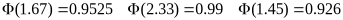

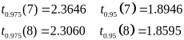

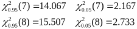

<!-- question: 1 -->

## 一、填空题（每空3分，共15分）

1. 设X服从参数为λ的泊松分布，且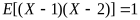，则=

   1

2. 设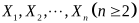为来自总体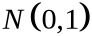的简单随机样本，为样本均值，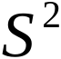为样本方差，则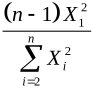服从的分布是 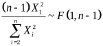

3. 设随机变量与相互独立，且均服从区间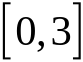上的均匀分布，则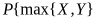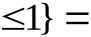1/9。

4. 设随机变量和的数学期望分别为-2和2，方差分别为1和4，而相关系数为-0.5，则根据契比雪夫不等式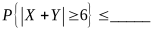

   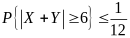

5. 设随机变量X1，X2，X3相互独立，其中X1在[0，6]上服从均匀分布，X2服从正态分布N（0，2²），X3服从参数为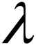=3的泊松分布，记Y=X1－2X2+3X3，则D（Y）=46。

<!-- question: 2 -->

## 二、（10分）

从5双尺码不同的鞋子中任取4只，求下列事件的概率：

（1）所取的4只中没有两只成对；（2）所取的4只中只有两只成对；（3）所取的4只都成对。

（1）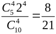（2）1-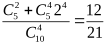（3）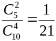

<!-- question: 3 -->

## 三、（10分）

玻璃杯成箱出售，每箱20只。已知任取一箱，箱中0、1、2只残次品的概率相应为0.8、0.1和0.1，某顾客欲购买一箱玻璃杯，在购买时，售货员随意取一箱，而顾客随机地察看4只，若无残次品，则买下该箱玻璃杯，否则退回。试求：（1）顾客买下该箱的概率；（2）在顾客买下的该箱中，没有残次品的概率。

解：设事件表示“顾客买下该箱”，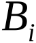表示“箱中恰好有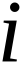件次品”，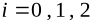。则

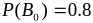，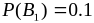，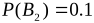，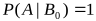，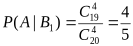，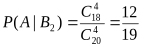。

由全概率公式得

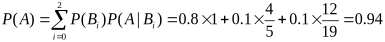

由贝叶斯公式

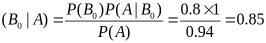

<!-- question: 4 -->

## 四、（15）

设二维随机变量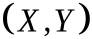的概率分布为

| X\Y | -1 | 0 | 1 |
|---|---:|---:|---:|
| -1 | a | 0 | 0.2 |
| 0 | 0.1 | b | 0.2 |
| 1 | 0 | 0.1 | c |

其中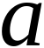、、为常数，且的数学期望，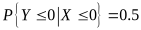，记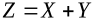。求（1）、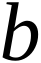、的值；（2）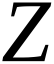的概率分布；（3）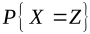。

解：（1）由概率分布的性质可知，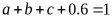，即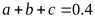。

由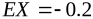，可得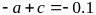。

再由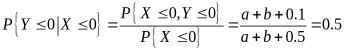，解得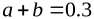。

解以上关于、、的三个方程可得，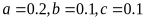。

（2）的所有可能取值为-2，-1，0，1，2。则

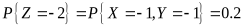

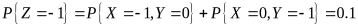

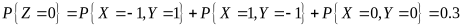

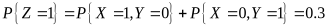

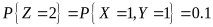

所以的概率分布为

| Z | -2 | -1 | 0 | 1 | 2 |
|---|---:|---:|---:|---:|---:|
| P | 0.2 | 0.1 | 0.3 | 0.3 | 0.1 |

（3）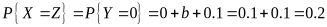。

<!-- question: 5 -->

## 五、（15）

设随机变量的概率密度为

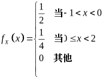

令，为二维随机变量的分布函数。

求（1）的密度函数；（2）；（3）。

解：（1）的分布函数为

当时，。

当时，

当时，

当时，。

所以的概率密度为

（2）

故

（3）

<!-- question: 6 -->

## 六、（10分）

设供电站供应某地区1000户居民用电，各户用电情况相互独立。已知每户每天用电量（单位：度）在[0，20]上服从均匀分布。现要以0.99的概率满足该地区居民供应电量的需求，问供电站每天至少需向该地区供应多少度电？

解：设第K户居民每天用电量为度，1000户居民每天用电量为度，10，=。再设供应站需供应L度电才能满足条件，则

即，则L=10425度。

<!-- question: 7 -->

## 七、（10分）

化肥厂用自动打包机装化肥，某日测得8包化肥的重量（斤）如下：

98.7　100.5　101.2　98.3　99.7　99.5　101.4　100.5

已知各包重量服从正态分布N（）

（1）是否可以认为每包平均重量为100斤（取）？

（2）求参数的90%置信区间。

解：需要检验的假设

检验统计量为，

计算可得：

，故接受原假设。

（2），n=8，查表得，

故置信区间为

<!-- question: 8 -->

## 八、（15分）

设总体的密度函数是，其中>0是参数。样本来自总体X。

（1）求的矩估计；

（2）求的最大似然估计；

（3）证明是的无偏估计，且是的相合估计（一致估计）。

解：（1），

，

或：，，

（2）似然函数：，，

，

令，，

（3）

，是的无偏估计，

，

，

，是的相合估计。
