# 2014春《概率论与数理统计》A卷答案

诚信应考，考试作弊将带来严重后果！

华南理工大学本科生期末考试

《概率论与数理统计》A卷

**注意事项：**

1. 开考前请将密封线内各项信息填写清楚；
2. 所有答案请直接答在试卷上；
3. 考试形式：闭卷；
4. 本试卷共八大题，满分100分，考试时间120分钟。

| 题号 | 一 | 二 | 三 | 四 | 五 | 六 | 七 | 八 | 总分 |
|---|---|---|---|---|---|---|---|---|---|
| 得分 |  |  |  |  |  |  |  |  |  |

**注意：** 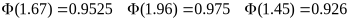

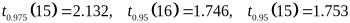

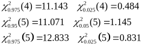

<!-- question: 1 -->

## 一、（12分）

设有n个人排成一行，甲与乙是其中的两个人，求这n个人的任意排列中，甲与乙之间恰有r个人的概率。如果这n个人围成一圈，试证明甲与乙之间恰有r个人的概率与r无关。(甲到乙是顺时针)
解：
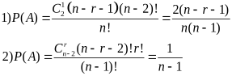

<!-- question: 2 -->

## 二、（10分）

甲、乙、丙三车间加工同一产品，加工量分别占总量的25%、35%、40%，次品率分别为0.03、0.02、0.01。现从所有的产品中抽取一个产品，试求
（1）该产品是次品的概率；
（2）若检查结果显示该产品是次品，则该产品是乙车间生产的概率是多少？
解：设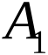，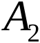，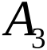表示甲乙丙三车间加工的产品，B表示此产品是次品。
（1）所求事件的概率为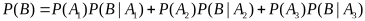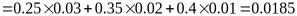
（2）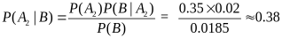

<!-- question: 3 -->

## 三、（10分）

假设一部机器在一天内发生故障的概率为0.2，机器发生故障时全天停止工作，若一周5个工作日里无故障，可获利润10万元；发生一次故障可获利润5万元；发生二次故障所获利润0元；发生三次或三次以上故障就要亏损2万元，求一周内期望利润是多少？
解 由条件知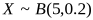，即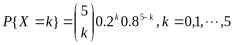
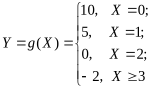

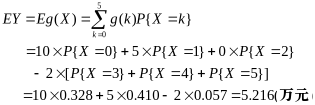

<!-- question: 4 -->

## 四、（15分）

设随机变量和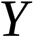的联合分布在以点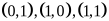为顶点的三角形区域上服从均匀分布,试求
(1) 关于X的边缘密度
(2) X和Y的协方差
(3) 随机变量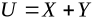的方差.
解三角形区域为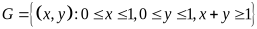;随机变量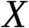和的联合密度为
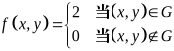

以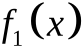表示的概率密度,则当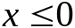或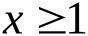时,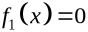;当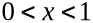时,有

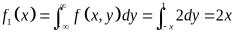

因此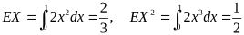

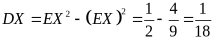

同理可得,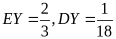.

现在求和的协方差

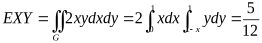

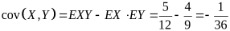

于是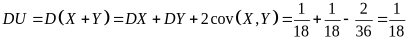

<!-- question: 5 -->

## 五、（12分）

向一目标射击，目标中心为坐标原点，已知命中点的横坐标和纵坐标相互独立，且均服从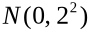分布. 求
（1）命中环形区域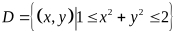的概率；
（2）命中点到目标中心距离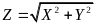的数学期望.

解： （1）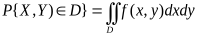

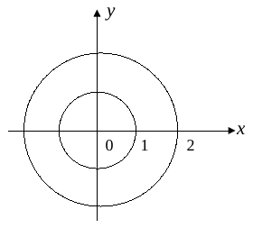

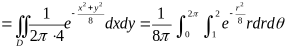

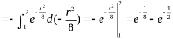

（2）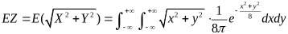

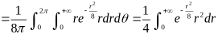

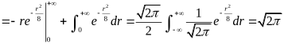.

<!-- question: 6 -->

## 六、（10分）

某种电子器件的寿命(小时)具有数学期望(未知),方差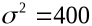.为了估计,随机地取只这种器件,在时刻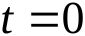投入测试(设测试是相互独立的)直到失败,测得寿命为,以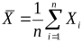作为的估计,为了使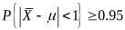,问至少为多少?
解、由于独立同分布,且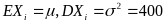.
由林德伯格-列维定理得
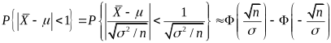

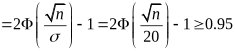

即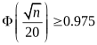,查表得,故.

因此至少为1537.

<!-- question: 7 -->

## 七、（10分）

(1)设某机器生产的零件长度（单位：cm），今抽取容量为16的样本，测得样本均值，样本方差. 求的置信度为0.95的置信区间.
(2)某涤纶厂的生产的维尼纶的纤度（纤维的粗细程度）在正常生产的条件下，服从正态分布N(1.405 , 0.0482)，某日随机地抽取5根纤维，测得纤度为
1.32　1.55　1.36　1.40　1.44
问一天涤纶纤度总体X的均方差是否正常（α=0.05）?
解：（1）的置信度为下的置信区间为

所以的置信度为0.95的置信区间为（9.7868，10.2132）

(2)

<!-- question: 8 -->

## 八、（21分）

设总体的概率密度为

其中是未知参数,从总体中抽取简单随机样本,记

求:(1) 总体的分布函数;(2)统计量的分布函数;(3)如果用作为的估计量,讨论它是否具有无偏性. (4)计算的方差.

解(1)
(2)

(3)的概率密度为

因为

所以作为的估计量不具有无偏性.

(4)

