# 2016春季《概率论与数理统计》A卷答案

<!-- question: 1 -->

## 一、填空题（每小题3分，共18分）

1．设随机变量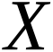和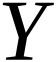的数学期望分别为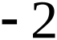和2,方差分别为1和4,而相关系数为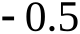,则根据契比雪夫不等式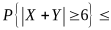1/12 .
解因为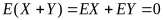
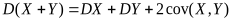

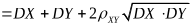

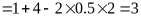

根据契比雪夫不等式

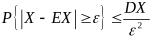

所以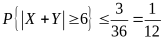

2．设总体服从正态分布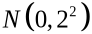,而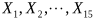是来自总体的简单随机样本,则随机变量

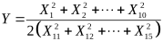

服从 F 分布,参数为 (10, 5) ..

3．设总体的概率密度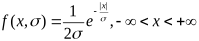，其中参数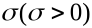未知，若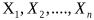是来自总体的简单随机样本，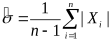是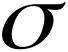的估计量，则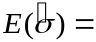_____________

解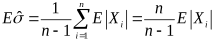

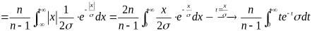

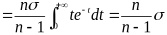

4．设二维随即变量服从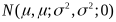，则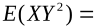_____.

解 因为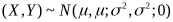，则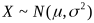，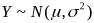，从而有

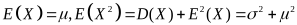

又由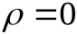知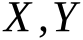相互独立，于是与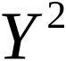也独立；故

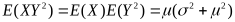.

5．设随机变量的分布函数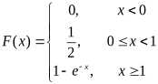，则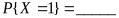.

解 由概率值与分布函数的定义知：

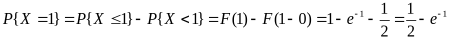.

6．设随机变量服从参数为1的泊松分布，则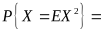.

解 由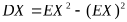，得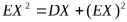，又因为服从参数为1的泊松分布，所以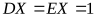，所以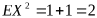，所以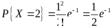.

<!-- question: 2 -->

## 二、单项选择题（每小题3分，共18分）

1． 设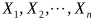为总体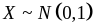的一个样本,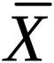与分别为样本均值和样本方差,则( )成立.
(A)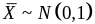(B)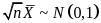
(C)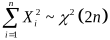(D)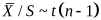
解：因为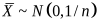,所以A项不正确,B项正确.
因为独立,,所以,因此C项也不正确.
; 当,时,,所以D项也不正确.

2．设随机变量和都服从标准正态分布,则( ).[C]

(A)服从正态分布 (B)服从分布

(C)和都服从分布 (D)服从分布

3．设随机事件A，B满足且，则必有（ ）

（A）（B）

（C）（D）

解 因为，，有，，故

故选（B）.
4．设是总体的样本,是样本方差,则( ).
(A)(B)(C)(D)
解：因为是正态分布,且,故
由分布的性质可知,即.故D项正确.
5．随机变量，且相关系数，则（ ）
..
..
解 用排除法. 设，由，知道正相关，得，排除、；由，得所以
因此. 排除. 故选择
6．某人向同一目标独立重复射击，每次射击命中目标的概率为，则此人第4次射击恰好第2次命中目标的概率为
（A）（B）
（C）（D）
解 第4次一定要命中，则对前3次使用伯努列概型：，加上第4次命中，概率为＝.故选（C）.

<!-- question: 3 -->

## 三、（10分）

箱中装有6个球，其中红、白、黑球的个数分别是1，2，3个，现从箱中随机地取出2个球，记为取出的红球个数，为取出的白球个数.
（Ⅰ）求随机变量的概率分布；（Ⅱ）求.
解 （Ⅰ）是二维离散型随机变量，只能取0和1，而可以取0，1，2各值，由于，，
，，，；于是得的联合概率分布：

|   | 0 | 1 | 2 |  |
|---|---:|---:|---:|---:|
| 0 | 1/5 | 2/5 | 1/15 | 2/3 |
| 1 | 1/5 | 2/15 | 0 | 1/3 |
|  | 2/5 | 8/15 | 1/15 |   |

（Ⅱ）根据的联合概率分布表可以计算出，

于是有.

<!-- question: 4 -->

## 四、（8分）

已知男子中有5%是色盲患者，女子中有0.25%是色盲患者，若从男女人数相等的人群中随机地挑选一人，恰好是色盲患者，问此人是男性的概率是多少？
解设={抽到一名男性}；={抽到一名女性}；={抽到一名色盲患者}，由全概率公式得

由贝叶斯公式得

<!-- question: 5 -->

## 五、（12分）

设随机变量的概率密度为，令为二维随机变量的分布函数.
(Ⅰ)求的概率密度;(Ⅱ)；(Ⅲ).
解（I） 设的分布函数为，即，则

当时，；

当时，

.

当时，

.

当，. 所以

.
（II），而
，，
，所以.
(Ⅲ)

.

<!-- question: 6 -->

## 六、（8分）

某地某种商品在一家商场中的月消费额ξ～N(*μ*,σ2),且已知σ=100元。现商业部门要对该商品在商场中的平均月消费额*μ*进行估计，且要求估计的结果须以不小于95%的把握保证估计结果的误差不超过20元，问至少需要随机调查多少家商场？

解：求n，s.t.

=0.975 n=96.04 至少调查97家

<!-- question: 7 -->

## 七、（16分）

设总体服从的均匀分布,是来自的样本.
(1)求的矩估计量; (2)求的最大似然估计; (3)证明,和均是的无偏估计量。
解(1)
令,得的矩估计量为.
(2)似然函数为

又因为,所以关于单调减,故当时,取得最大值,因此,的最大似然估计量是

(3)

所以是的无偏估计量.

的密度函数为

故

所以是的无偏估计量.

的密度函数为

故

所以也是的无偏估计量.

<!-- question: 8 -->

## 八、（10分）

化肥厂用自动打包机装化肥，某日测得8包化肥的重量（斤）如下：
98.7　100.5　101.2　98.3　99.7　99.5　101.4　100.5
已知各包重量服从正态分布N（）
（1）是否可以认为每包平均重量为100斤（取）？
（2）求参数的90%置信区间。
可能用到的分位点：

解、

检验统计量为，的拒绝域为

计算可得：

，故接受原假设。

（2），n=8 查表得，

故置信区间为

