# 2016—2017学年第二学期《概率论与数理统计》A卷答案及评分标准

诚信应考，考试作弊将带来严重后果！

华南理工大学本科生期末考试
2016-2017学年第二学期《概率论与数理统计》A卷
注意事项：1. 开考前请将密封线内各项信息填写清楚；
2. 所有答案请直接答在试卷上；
3．考试形式：闭卷；
4. 本试卷共八大题，满分100分，考试时间120分钟。

| 题 号 | 一 | 二 | 三 | 四 | 五 | 六 | 七 | 八 | 总分 |
|---|---|---|---|---|---|---|---|---|---|
| 得 分 | | | | | | | | | |

<!-- question: 1 -->

## 一、填空题（每小题3分，共18分）

设随机变量服从参数为的Poisson分布，且已知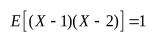，则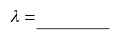。
2．随机变量*X*的概率密度函数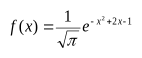，则*E*(*X*)= 。
设随机变量*X*服从以*n*,*p*为参数的二项分布，且*EX*=15，*DX*=10，则*n*= 。
甲乙二人独立地同时破译密码，甲破译的概率为，乙破译的概率为，则该密码被破译的概率为_______。
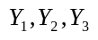独立且均服从分布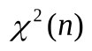，则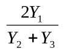服从_____________分布。
设总体，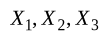为来自的样本，则当常数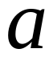=_________时，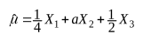是未知参数的无偏估计。
答案:
1 2．1 3．45 4．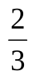5．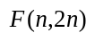6．

<!-- question: 2 -->

## 二、单项选择题（每小题3分，共18分）

设随机变量服从参数为3的泊松分布，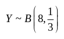，且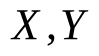相互独立，则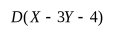=（ ）。
（A）（B）15 （C）19 （D）23
有个球，随机地放在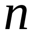个盒子中（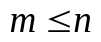），则某指定的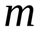个盒子中各有一球的概率为( ).
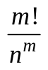B.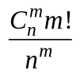C.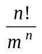D.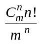
设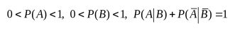，则事件与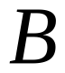（ ）
互不相容 B. 互相对立 C. 互不独立 D. 相互独立
随机变量的概率密度函数为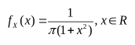，则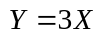的密度函数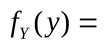( )
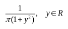B.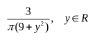
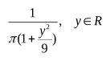D.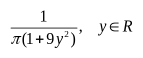
设随机变量服从正态分布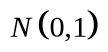,对给定的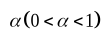,数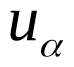满足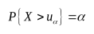.若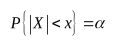,则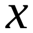等于( ).
(A)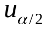(B)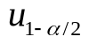(C)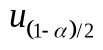(D)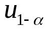
设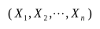为总体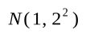的一个样本，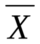为样本均值，则下列结论中正确的是（ ）。
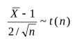； B.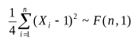；
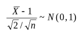； D.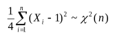；

答案：
C 2. A； 3. D； 4. B；5. C；6. D；

<!-- question: 3 -->

## 三、(10分）

某人去参加某课程的笔试和口试，笔试及格的概率为，若笔试及格则口试及格的概率也为，若笔试不及格则口试及格的概率为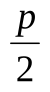。
(1) 如果笔试和口试中至少有一个及格，则他能取得某种资格。求他能取得该资格的概率。
(2) 如果已知他口试已经及格，求他笔试及格的概率.
解：用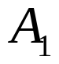、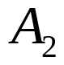分别表示某人参加“笔试”和“口试”的事件，表示“他能取得该种资格”。
由已知条件得，，，.
所求概率为
(1)
(5分)
(2)
(10分)

<!-- question: 4 -->

## 四、（16分）

设二维随机变量的概率密度为
.
(1) 确定常数； (2) 求分布函数；
(3) 求； (4) 判断与是相互否独立。

解 (1) 由，有

所以，. （2分）

(2)

（5分）

(3)

（10分）

(4)与的边缘密度分别为

（12分）

（14分）

显然，，所以与相互独立. （16分）

<!-- question: 5 -->

## 五、（10分）

设二维离散型随机变量（）的联合分布列

|   | 0 1 |
|---|---|
| 0 1 |  0 |

求（1）； （2）

解、0 1-1 0 1

-1 0 1

(2分)

（4分）

=

（5分）

（8分）

（10分）

<!-- question: 6 -->

## 六、（8分）

有一批种子，其中良种占，从中任取180粒，问能以0.99的概率保证其中良种的比例与相差多少？

解：令（1分）

则（2分）

（5分）

2

（7分）

（8分）

<!-- question: 7 -->

## 七、（10分）

⑴ 设总体等可能地取值，，，，，其中是未知的正整数。是取自该总体中的一个样本．试求的最大似然估计量．（7分）
⑵ 某单位的自行车棚内存放了辆自行车，其编号分别为1，2，3，…，，假定职工从车棚中取出自行车是等可能的。某人连续12天记录下他观察到的取走的第一辆自行车的编号为
12， 203， 23， 7， 239， 45， 73， 189， 95， 112， 73， 159。
试求在上述样本观测值下，的最大似然估计值．（3分）
解： ⑴ 总体的分布列为 ， ．
所以似然函数为 ， ．……..3分
当越小时，似然函数越大；另一方面，还要满足：，即．
所以，的最大似然估计量为．……..7分
⑵ 由上面的所求，可知的最大似然估计值为．……..10分

<!-- question: 8 -->

## 八、（10分）

已知多名实习生相互独立地测量同一块土地的面积，设每名实习生得到的测量数据(平方米)服从正态分布，从这些测量数据中随机抽取7个，经计算，其平均面积为125平方米，修正标准差为平方米.
(1) 求的置信度为90%的置信区间；
(2)能否认为这块土地的平均面积为124平方米（显著性水平）？

解 （1）的置信度为下的置信区间为

其中，表示样本均值，表示样本修正标准差，表示样本容量，又

所以的置信度为90%的置信区间为（123，127）. (5分)

（2）本问题是在下检验假设

由于正态总体的方差未知，所以选择统计量， (6分)

由已知得统计量的观测值，临界值，

因为，所以接受原假设，即在显著性水平下，可以认为这块土地的平均面积为124平方米. (10分)
