# 2018—2019学年第二学期《概率论与数理统计》A卷答案

诚信应考，考试作弊将带来严重后果！

华南理工大学本科生期末考试
2018-2019-2学期《概率论与数理统计》A卷
注意事项：1. 开考前请将密封线内各项信息填写清楚；
2. 所有答案请直接答在试卷上；
3．考试形式：闭卷；
4. 本试卷共八大题，满分100分， 考试时间120分钟。

| 题 号 | 一 | 二 | 三 | 四 | 五 | 六 | 七 | 八 | 总分 |
|---|---|---|---|---|---|---|---|---|---|
| 得 分 | | | | | | | | | |

<!-- question: 1 -->

## 一、选择题（共6题，每题3分，共18分）

1、设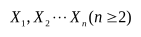为来自总体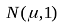的简单随机样本，记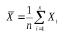，则下列结论中不正确的是( )。
（A）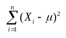服从分布 （B）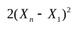服从分布
（C）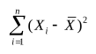服从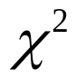分布 （D）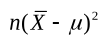服从分布

2、设随机变量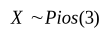,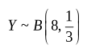，且相互独立，则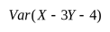=( )。
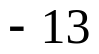B. 15 C. 19 D. 23
3、设一个盒子中有5件产品，其中有3件是正品，2件次品。从盒子中任取两件，则取出的两件产品中至少有一件次品的概率为( )。
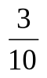B.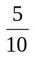C.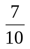D.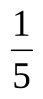
4、随机变量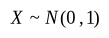，对于给定的，数满足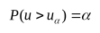，
若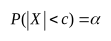，则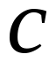等于（ ）。
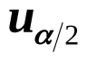B.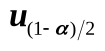C.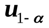D.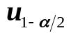
5．设随机变量与均服从正态分布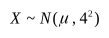，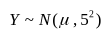，而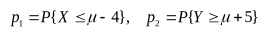，则（ ）
对任何实数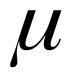，都有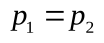． B. 对任何实数，都有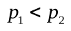．
只对的个别值，才有． D. 对任何实数，都有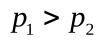．
设*X*~Pios(*λ*)，且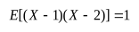，则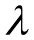=（ ）。
1 B. 2 C. 3 D. 0

答案：1. B 2. C 3. C 4. B 5. A 6.A

<!-- question: 2 -->

## 二、填空题（共6题，每题3分，共18分）。

1、设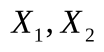是来自于总体的样本，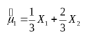，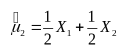为总体均值的无偏估计，则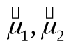中较有效的是 。
2、设随机变量*X*与*Y*独立且都服从[0, 3]上的均匀分布，则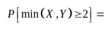。
设随机变量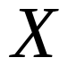的分布函数为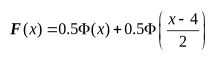，其中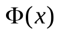为标准正态分布函数，则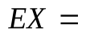_______。
设随机变量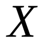和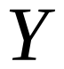的数学期望分别为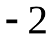和2,方差分别为1和4,而相关系数为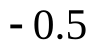,则根据契比雪夫不等式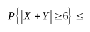。
设随机变量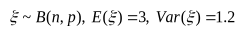，则*n*=________。
设总体服从正态分布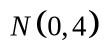,而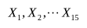是来自总体的简单随机样本，则

服从的分布是(包括分布参数)。

答案： 1.2.3. 2 4. 1/12 5. 5 6. F(10,5)

<!-- question: 3 -->

## 三、（10分）

某保险公司把被保险人分为三类：谨慎的、一般的、冒失的，统计资料表明，上述三种人在一年内发生事故的概率依次为0.05，0.15和0.30。如果谨慎的占总的被保人数的20%，一般的占50%，冒失的占30%。
(1)求某被保人在一年内发生事故的概率；
(2)若此人在一年内发生事故，则他是谨慎的客户的概率是多少。
解. 设事件*B*为 “被保险人在一年内出了事故” 这一事件；事件分别为“谨慎的、一般的、冒失的被保险人”，则根据全概率公式可得：
3分
=0.2×0.05+0.5×0.15+0.3×0.3=0.175 5分

8分

=10分

<!-- question: 4 -->

## 四、（10分）

设某次概率统计考试考生的成绩，从中随机地抽取 36 位考生的成绩，算得平均成绩为66.5分，修正标准差为15分。
(1) 在置信度为0.95时，求考生成绩数学期望的置信区间。
(2) 在显著性水平=0.05下，检验是否可以认为这次考试的平均成绩为70分。

解：（1），(4分)

学生成绩数学期望的置信区间：（61.42,71.58）(5分)

（2）

拒绝域：，（9分）

不拒绝原假设。可以认为这次考试的平均成绩为70分。（10分）

<!-- question: 5 -->

## 五、（10分）

某单位有400部内线电话，每时刻每部电话打外线的概率为10%，设各电话使用外线与否是相互独立的，估计在任一时刻有30～50部电话同时使用外线的概率。

解： 设X为任一时刻使用的终端数，则X~B(400, 0.1)

> 转换说明：原件在第五题与第七题之间未标注题号，以下内容按原顺序保留。

<!-- question: unnumbered_between_5_and_7 -->

## 原件未标注题号（位于第五题与第七题之间）

解：

<!-- question: 7 -->

## 七、(12分)

设随机变量和的联合分布在以点为顶点的三角形区域上服从均匀分布，求随机变量*U*=*X*+*Y*的方差.
解：三角形区域为;随机变量和的联合密度为
（3分）
以表示的概率密度,则当或时,;当时,有

因此（5分）

（6分）

同理可得,. （8分）

现在求和的协方差

（9分）

（10分）

于是（12分）

<!-- question: 8 -->

## 八、（12分）

设随机变量相互独立，且的概率分布为，的概率密度为
（1）求；
（2）求的概率密度。
解（1）由数字特征的计算公式可知：。
则。（5分）
（2）先求的分布函数，由分布函数的定义可知：。
由于为离散型随机变量，则由全概率公式可知

（其中为的分布函数：

（12分）
