# 2019—2020学年第二学期《概率论与数理统计》A卷答案

诚信应考，考试作弊将带来严重后果！

华南理工大学本科生期末考试
2019-2020-2学期《概率论与数理统计》试卷(A卷)
注意事项：1. 开考前请将密封线内各项信息填写清楚；
2. 所有答案请直接答在试卷上；
3．考试形式：闭卷；
4. 本试卷共八大题，满分100分，考试时间120分钟。

| 题 号 | 一 | 二 | 三 | 四 | 五 | 六 | 七 | 八 | 总分 |
|---|---|---|---|---|---|---|---|---|---|
| 得 分 | | | | | | | | | |

<!-- question: 1 -->

## 一、选择题（共6题，每题3分，共18分）

若*P*(*AB*)=0，则下述命题中正确的是（ B ）。
A．*A*与*B*互不相容； B.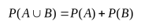；
*A*与*B*相互独立； D.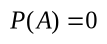或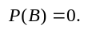
设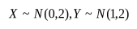,且*X*与*Y*相互独立，则（ D ）。
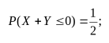B.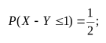
C．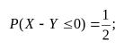D．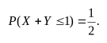
设总体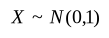，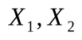是总体*X*的一个样本，令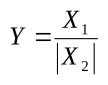，则*Y*服从( C )。
正态分布； B.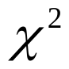分布； C.*t*分布； D.*F*分布.
设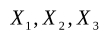独立同分布，分布函数为*F*(*x*),令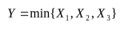，则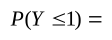（ B ）。
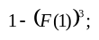B.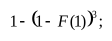C.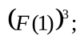D.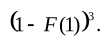
设随机变量的密度函数为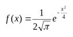，则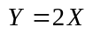的密度函数为（ B ）。
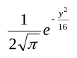； B.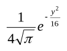； C.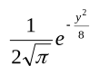； D.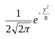.
设随机变量*X*服从*t*分布*t*(*n*)，对给定的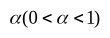，数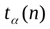满足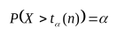，若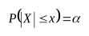，则*x*等于( A )。
A．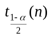; B.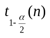; C. 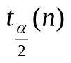; D.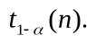

<!-- question: 2 -->

## 二、填空题（共6题，每题3分，共18分）。

设随机变量*X*和*Y*的期望分别为和1，方差分别为1和2，且
*X*和*Y*相互独立，用切比雪夫不等式估计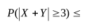。
设随机变量*X*的分布函数为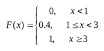，则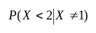＝ 0 。
若二维随机向量(*X*,*Y*)~*N*(1,2,4,9,0)，则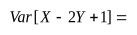40 。
设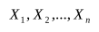是来自总体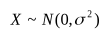的样本，若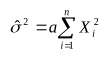是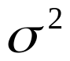的无偏估计，则*a*=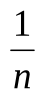。
设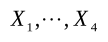是来自总体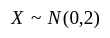的样本，令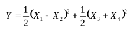，则*E*[*Y*]＝ 4 。
已知*X*,*Y*满足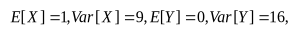相关系数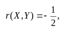设随机变量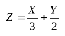，则*X*与*Z*的协方差Cov(*X*,*Z*)= 0 。

<!-- question: 3 -->

## 三、（10分）

在房间里有10个人，分别佩戴从1号到10号的纪念章，任选3人记录其纪念章的号码。试求：(1) 最大号码为5的概率；
(2) 如果已知记录的最大号码为5，求记录的三个号码中有3的概率？
解：(1)*A*={记录的最大号码为5}，

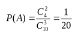； （5分）

（2）*B*={记录的号码中有3}，

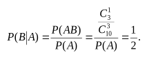（10分）

<!-- question: 4 -->

## 四、( 10分)

设某面粉厂采用自动流水线灌装面粉，装袋重量.从中随机地抽取36袋，经计算得平均重量为24.92kg，修正标准差kg.
(1) 在置信度为0.95时，求出面粉重量平均值的置信区间。
(2) 在显著性水平=0.05下，检验是否可以认为该流水线面粉的平均重量为每袋25kg。
解：（1）的置信度为0.95的置信区间为：

（2分）

得置信区间为[24.252,25.588].（5分）

(2)1. 提出假设
2. 构造统计量
求分位点（8分）
4. 求观测值
5. 作判断，接受，即认为平均重量为每袋25kg。
（10分）

<!-- question: 5 -->

## 五、（10分）

抽样检查产品质量时，如果发现有多于10个的次品，则拒绝接受这批产品.设某批产品的次品率为10%，试用中心极限定理来判断，至少应抽取多少个产品来检查，才能保证拒绝接受该产品的概率达到0.95？

解：设应抽*n*个产品来检查，.
，求*n*使得。
由中心极限定理知：近似服从正态分布，（2分）

（7分）
所以，
至少抽取164个产品来检查，才能保证拒绝接受该产品的概率达到0.95。

如果用来算的话，得到*n*=176.

（10分）

<!-- question: 6 -->

## 六、（10分）

设二维随机向量（）服从矩形区域上的均匀分布，且
.

求(1)(2)*U*，*V*的联合分布; (3)*W*=*UV*的分布列.

解：（因为（）是均匀分布，用面积来做更好做）
（1）（3分）
（2）

| *V* *U* | 0 | 1 |
|---|---|---|
|  |  | 0 |
| 1 |  |  |

（8分）

(3)

| *W*=*UV* | 0 | 1 |
|---|---|---|
| *P* |  |  |

（10分）

<!-- question: 7 -->

## 七、（12分）

设随机变量(*X*,*Y*)的概率密度函数为

（1）求*A*的值； （2）判断*X*，*Y*是否独立； （3）期望*E*[2*XY*].

解：（1）

所以，（3分）
（2）*X*的边缘密度，
.
*Y*的边缘密度，
.
由于所以*X*,*Y*独立。（8分）
（3）（由(2)知*X*，*Y*相互独立）

注意*Y*服从参数为2的分布，所以

由上计算知：

（若没有注意到*X*,*Y*的独立性，也可以直接计算）

（12分）

<!-- question: 8 -->

## 八、(12分)

设总体具有分布律

| *X* | 1 | 2 | 3 |
|---|---|---|---|
| *P* |  |  |  |

其中为未知参数.

求的矩估计量,并讨论的无偏性；

当样本观察值为时，求的极大似然估计值.

解：（1）

所以，是的无偏估计.（6分）
(2)似然函数：

取对数：
求导数：

所以，的极大似然估计值为（12分）
