# 2020—2021学年第二学期《概率论与数理统计》A卷答案

诚信应考，考试作弊将带来严重后果！

华南理工大学本科生期末考试
2020-2021-2学期《概率论与数理统计》试卷A
注意事项：1. 所有答案请答在答题卡上，答在试卷上无效；
2. 选择题请用2B铅笔涂黑；
3．考试形式：闭卷；
4. 本试卷共七道大题，满分100分，考试时间120分钟。

| 题 号 | 一 | 二 | 三 | 四 | 五 | 六 | 七 | 总分 |
|---|---|---|---|---|---|---|---|---|
| 得 分 | | | | | | | | |

<!-- question: 1 -->

## 一、选择题（共12题，每题3分，共36分）

设随机变量与相互独立，且均服从区间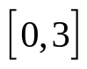上的均匀分布，则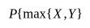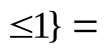( ).
(A)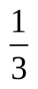(B)(C)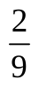(D)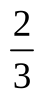
B
设*T*服从自由度为*n*的*t*分布，若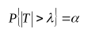，则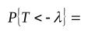（ ）.
(A)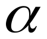(B)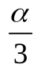(C)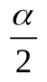(D)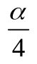
C
从总体中抽取简单随机样本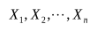，易证估计量
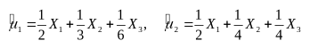

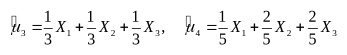

均是总体均值的无偏估计量，则其中最有效的估计量是( ).

(A)(B)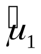(C)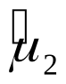(D)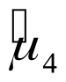
A 有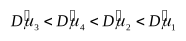.故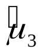最有效,所以A项正确.
设随机变量和的数学期望分别为-2和2，方差分别为1和4，而相关系数为-0.5，则根据切比雪夫不等式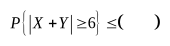.
(A)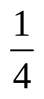(B)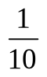(C)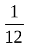(D)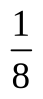
C
解因为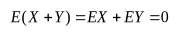
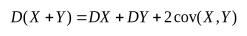

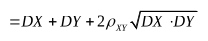

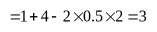

根据切比雪夫不等式

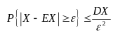

所以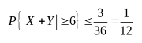
设 是随机事件， 互不相容,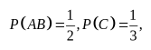则 .
(A)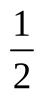(B)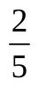(C)(D)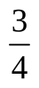
D
由于 互不相容，即
6. 设 为来自总体 的简单随机样本，则统计量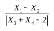的分布 ( ).
(A) (B) (C) (D)
B 解 从形式上，该统计量只能服从 分布。故选 。
证明如下:
由正态分布的性质可知， 与 均服从标准正态分布且相互独立, 可知

设随机变量 服从参数为 1 的泊松分布，则 ( ).
(A)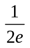(B)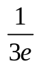(C)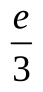(D)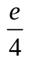
A
因为 服从参数为 1 的泊松分布，所以其概率布为
从而 于是，

设 为来自二项分布总体 的简单随机样本， 和 分别为样本均值和样本修正方差，记统计量, 则
(A)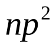(B)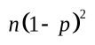(C)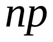(D)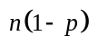
A
因为 , 故
因为 , 所以
设二维离散型随机变量X、Y的联合分布律如下，则联合分布函数值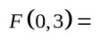( ).

| *Y* - *X* | 0 | 2 | 4 |
|---|---|---|---|
| 0 |  | 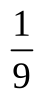 | 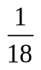 |
| 1 |  | 0 |  |

(A)(B)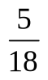(C)(D)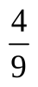
B
设 为两个分布函数, 其相应的概率密度 , 是连续函数, 则必为概率密度的是(
(A) (B) (C) (D)
D
由分布函数和概率密度的性质可得
,
.
从而有

所以 是概率密度,即正确选项为D
设二维随机变量 服从正态分布 , 则 ( ).
(A)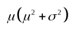(B)(C)(D)
A
因为 服从二维正态分布，所以
对二维正态随机变量, 所以 相互独立，从而 也相互独立，所以

设随机变量 , 且相关系数, 则( ).
(A) (B)
(C) (D)
D
因为 与 的相关系数 , 所以 与 正相关, 即存在常数 , 使得 , 且 , 排除(A)、(C) 因为

所以 从而

<!-- question: 2 -->

## 二、（10分）

甲、乙两人轮流投篮，甲先投。一般来说，甲、乙两人独立投篮的命中率分别为0.7和0.6。但由于心理因素的影响，如果对方在前一次投篮中投中，紧跟在后面投篮的这一方的命中率就会有所下降，甲、乙的命中率分别变为0.4和0.5。求：
(1) 乙在第一次投篮时投中的概率； (2) 甲在第二次投篮时投中的概率。
解：令表示事件“乙在第一次投篮时投中”，
令表示事件“甲在第*i*次投篮时投中”，
（1）
(5分）
（2）

(5分)

<!-- question: 3 -->

## 三、(10分)

有一批建筑房屋用的木柱,其中80%的长度不超过3m，现从这批木柱中随机地取出100根，问其中至少有30根超过3m的概率是多少？
附：
解(2分)
则,记,则. (2分)
由棣莫佛-拉普拉斯定理得
(2分)

(4分)

<!-- question: 4 -->

## 四、(10分)

设某机器生产的零件长度（单位：cm），今抽取容量为16的样本，测得样本均值，样本修正方差.
(1) 求的置信度为0.95的置信区间；(保留四位小数)
(2) 检验假设（显著性水平为0.05）。
附:

解：（1）的置信度为的置信区间:

所以的置信度为0.95的置信区间为（9.7869，10.2132） (5分)

(2)

因为，所以接受. (5分)

<!-- question: 5 -->

## 五、（10分）

设随机变量*X*的概率密度为令随机变量
(1) 求*Y*的分布函数； (2) 求概率 .
解 (1)
由 的概率分布知，当 时， ; (1分)
当 时, ; (1分)
当 时，
(2分)
综上(1分)
(2)

<!-- question: 6 -->

## 六、(10分)

设总体*X*的概率分布为

| *X* | 0 | 1 | 2 | 3 |
|---|---|---|---|---|
| *P* |  |  |  |  |

其中是未知参数，利用总体*X*的样本值：

3, 1, 3, 0, 3, 1, 2, 3.

求的矩估计和最大似然估计.

解

令，解得的矩估计. (5分)

对于给定的样本值,似然函数为

令,解得.因不合题意,所以的最大似然估计为. (5分)

<!-- question: 7 -->

## 七、(14分)

设随机变量 与 的概率分布分别为

| | 0 | 1 | | | | 0 | 1 |
|---|---|---|---|---|---|---|---|
| | | | | | | | |

且

求二维随机向量 的概率分布.
(2) 求 的数学期望E(*Z*).
(3) 求 与*Y*的相关系数.

解: (1) 由 可得
(2分)

所以

所以 的概率分布为 (4分)

| X Y Y Y | -1 | 0 | 1 |
|---|---|---|---|
| 0 | 0 | | 0 |
| 1 | | 0 | |

(2) 因为 的可能取值为 .

所以 , 从而可得 与 的相关系数为 (4分)
