# 2022级大学物理（一）期末试卷答案及评分标准（B卷）

20230710

## 一、选择题

<!-- question: 2022-B-Q1-Q10 -->

ACBAC CBBDD

## 二、填空题

<!-- question: 2022-B-Q11 -->

11. 0

<!-- question: 2022-B-Q12 -->

12. 360 或 356

<!-- question: 2022-B-Q13 -->

13. 33

<!-- question: 2022-B-Q14 -->

14. 1.5

<!-- question: 2022-B-Q15 -->

15. 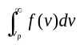 或 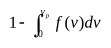

<!-- question: 2022-B-Q16 -->

16. 8310

<!-- question: 2022-B-Q17 -->

17. 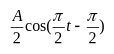 或 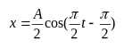 或 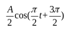

<!-- question: 2022-B-Q18 -->

18. 2A

<!-- question: 2022-B-Q19 -->

19. 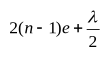 或 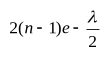 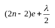

<!-- question: 2022-B-Q20 -->

20. 60000 或 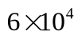

## 三、计算题

<!-- question: 2022-B-Q21 -->

### 21题

各物体的受力情况如图所示．

由转动定律、牛顿第二定律及运动学方程，可列出以下联立方程：

T₁R＝J₁β₁＝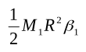（2分）

T₂r－T₁r＝J₂β₂＝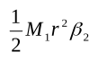（2分）

mg－T₂＝ma（1分）

a＝Rβ₁＝rβ₂（1分）

v²＝2ah 或 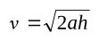（1分）

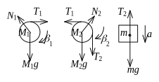

求解联立方程，得

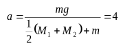 m/s²

＝2 m/s（1分）

T₂＝m(g－a)＝60 N（1分）

T₁＝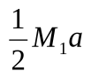＝50 N（1分）

<!-- question: 2022-B-Q22 -->

### 22题

解：

1. A→B：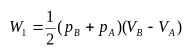＝200 J．（2分）
2. B→C 等体过程：Q₂＝ΔE₂＝νC_V(T_C－T_B)＝3(p_CV_C－p_BV_B)/2＝－600 J．（2分）
3. C→A 等压过程：W₃＝p_A(V_A－V_C)＝－100 J．（2分）
4. C→A 等压过程：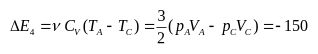 J．（2分）
5. Q＝W＝W₁＋W₃＝100 J．（2分）

<!-- question: 2022-B-Q23 -->

### 23题

解：

1. 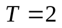 s，则 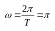（2分）

   根据旋转矢量法知 P 点的初相位为 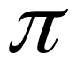

   P 处振动方程为 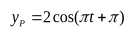（SI）（2分）

   或 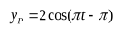

2. OP 相位差 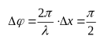

   O 处质点的振动方程为 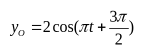（SI）（2分）

   或 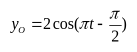

3. 选 O 点为参考点，则波动方程为

   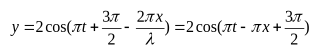（4分）

   或 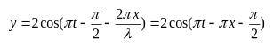

<!-- question: 2022-B-Q24 -->

### 24题

解：

1. 由光栅衍射主极大公式 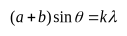

   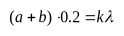

   

   得：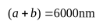（2分）

2. 由缺级公式 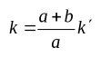

   得，在第四级缺级下，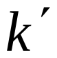取 1，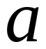取最小值

   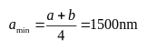

3. 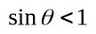，故 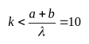

   又因为第四、八级缺级，

   所以实际呈现 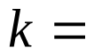0，±1，±2，±3，±5，±6，±7，±9 级明纹．
